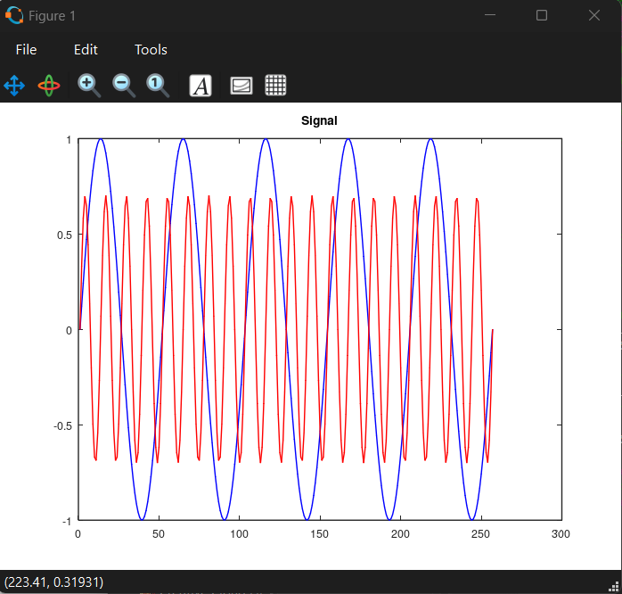

---
## Front matter
title: "Лабораторная работа № 1."
subtitle: "Методы кодирования и модуляция сигналов"
author: "Диана Алексеевна Садова"

## Generic otions
lang: ru-RU
toc-title: "Содержание"

## Bibliography
bibliography: bib/cite.bib
csl: pandoc/csl/gost-r-7-0-5-2008-numeric.csl

## Pdf output format
toc: true # Table of contents
toc-depth: 2
lof: true # List of figures
lot: true # List of tables
fontsize: 12pt
linestretch: 1.5
papersize: a4
documentclass: scrreprt
## I18n polyglossia
polyglossia-lang:
  name: russian
  options:
	- spelling=modern
	- babelshorthands=true
polyglossia-otherlangs:
  name: english
## I18n babel
babel-lang: russian
babel-otherlangs: english
## Fonts
mainfont: PT Serif
romanfont: PT Serif
sansfont: PT Sans
monofont: PT Mono
mainfontoptions: Ligatures=TeX
romanfontoptions: Ligatures=TeX
sansfontoptions: Ligatures=TeX,Scale=MatchLowercase
monofontoptions: Scale=MatchLowercase,Scale=0.9
## Biblatex
biblatex: true
biblio-style: "gost-numeric"
biblatexoptions:
  - parentracker=true
  - backend=biber
  - hyperref=auto
  - language=auto
  - autolang=other*
  - citestyle=gost-numeric
## Pandoc-crossref LaTeX customization
figureTitle: "Рис."
tableTitle: "Таблица"
listingTitle: "Листинг"
lofTitle: "Список иллюстраций"
lotTitle: "Список таблиц"
lolTitle: "Листинги"
## Misc options
indent: true
header-includes:
  - \usepackage{indentfirst}
  - \usepackage{float} # keep figures where there are in the text
  - \floatplacement{figure}{H} # keep figures where there are in the text
---

# Цель работы

Изучение методов кодирования и модуляции сигналов с помощью высокоуровнего языка программирования Octave. Определение спектра и параметров сигнала. Демонстрация принципов модуляции сигнала на примере аналоговой амплитудной модуляции. Исследование свойства самосинхронизации сигнала.

# Последовательность выполнения работы

## Построение графиков в Octave

### Постановка задачи

1. Построить график функции y = sin x + 1/3 sin3x + 1/5 sin5x  на интервале [−10; 10], используя Octave и функцию plot. График экспортировать в файлы формата .eps, .png.

2. Добавить график функции y = cos x + 1/3cos3x + 1/5cos5x на интервале [−10; 10]. График экспортировать в файлы формата .eps, .png.

### Порядок выполнения работы

1. Запустите в вашей ОС Octave с оконным интерфейсом.(рис. [-@fig:001]),(рис. [-@fig:002]),(рис. [-@fig:003]),(рис. [-@fig:004]).

{#fig:001 width=90%}

{#fig:002 width=90%}

{#fig:003 width=90%}

{#fig:004 width=90%}

2. Перейдите в окно редактора. Воспользовавшись меню или комбинацией клавиш ctrl + n создайте новый сценарий. Сохраните его в ваш рабочий каталог с именем, например, plot_sin.m.

3. В окне редактора повторите следующий листинг по построению графика функции y = sin x + 1/3 sin3x + 1/5 sin5x  на интервале [−10; 10]:
(рис. [-@fig:005]).

{#fig:005 width=90%}

В нашем случае имя test.m

4. Запустите сценарий на выполнение (воспользуйтесь соответствующим меню окна редактора или клавишей F5 ). В качестве результата выполнения кода должно открыться окно с построенным графиком (рис. 1.1) и в вашем рабочем каталоге должны появиться файлы с графиками в форматах .eps, .png.
(рис. [-@fig:006]).

{#fig:006 width=90%}

5. Сохраните сценарий под другим названием и измените его так, чтобы на одном графике располагались отличающиеся по типу линий графики функций y1 = sin x + 1/3 sin3x + 1/5 sin5x  , y2 = cos x + 1/3cos3x + 1/5cos5x , например как изображено (рис. [-@fig:007]).

{#fig:007 width=90%}

## Разложение импульсного сигнала в частичный ряд Фурье

### Постановка задачи

1. Разработать код m-файла, результатом выполнения которого являются графики меандра, реализованные с различным количеством гармоник.

### Порядок выполнения работы

1. Создайте новый сценарий и сохраните его в ваш рабочий каталог с именем, например, meandr.m.

2. В коде созданного сценария задайте начальные значения:(рис. [-@fig:008]).

{#fig:008 width=90%}

3. Разложение импульсного сигнала в форме меандра в частичный ряд Фурье. Гармоники, образующие меандр, имеют амплитуду, обратно пропорциональную номеру соответствующей гармоники в спектре:(рис. [-@fig:009]).

{#fig:009 width=90%}

4. Далее для построения в одном окне отдельных графиков меандра с различным количеством гармоник реализуем суммирование ряда с накоплением и воспользуемся функциями subplot и plot для построения графиков:(рис. [-@fig:010]).

{#fig:010 width=90%}

5. Экспортируйте полученный график в файл в формате .png.(рис. [-@fig:011]).

{#fig:011 width=90%}

6. Скорректируйте код для реализации меандра через синусы. Получите соответствующие графики.(рис. [-@fig:012]).

{#fig:012 width=90%}

## Определение спектра и параметров сигнала

### Постановка задачи

1. Определить спектр двух отдельных сигналов и их суммы.

2. Выполнить задание с другой частотой дискретизации. Пояснить, что будет, если взять частоту дискретизации меньше 80 Гц?

### Порядок выполнения работы

1. В вашем рабочем каталоге создайте каталог spectre1 и в нём новый сценарий с именем, spectre.m.

2. В коде созданного сценария задайте начальные значения:

3. Далее в коде задайте два синусоидальных сигнала разной частоты:

4. Постройте графики сигналов:(рис. [-@fig:013]),(рис. [-@fig:014]).

{#fig:013 width=90%}

{#fig:014 width=90%}

5. С помощью быстрого преобразования Фурье найдите спектры сигналов, добавив в файл spectre.m следующий код:(рис. [-@fig:015]).

{#fig:015 width=90%}

6. Учитывая реализацию преобразования Фурье, скорректируйте график спектра: отбросьте дублирующие отрицательные частоты, а также примите в расчёт то, что на каждом шаге вычисления быстрого преобразования Фурье происходит суммирование амплитуд сигналов. Для этого добавьте в файл spectre.m следующий код:(рис. [-@fig:016]),(рис. [-@fig:017]),(рис. [-@fig:018]).

{#fig:016 width=90%}

{#fig:017 width=90%}

{#fig:018 width=90%}

7. Найдите спектр суммы рассмотренных сигналов, создав каталог spectr_sum и файл в нём spectre_sum.m со следующим кодом:(рис. [-@fig:019]).

{#fig:019 width=90%}

В результате должен получится аналогичный предыдущему результат, т.е. спектр суммы сигналов должен быть равен сумме спектров сигналов, что вытекает из свойств преобразования Фурье.(рис. [-@fig:020]),(рис. [-@fig:021]).

{#fig:020 width=90%}

{#fig:021 width=90%}

8. Выполнить задание с другой частотой дискретизации. Пояснить, что будет, если взять частоту дискретизации меньше 80 Гц?

Это приведет к нарушению теоремы Котельникова. 

Наша максимальная частота – 40 Гц, это частота второго сигнала, - значит, частота дискретизации должна быть не менее 80 Гц (частота дискретизации должна быть минимум в два раза выше, чем максимальная частота в сигнале)

Если мы возьмем частоту дискретизации меньше 80 Гц, то произойдет наложение спектров. Более высокие частоты в сигнале будут "складываться" в более низкие частоты, искажая спектр и сам сигнал.

## Амплитудная модуляция

### Постановка задачи

Продемонстрировать принципы модуляции сигнала на примере аналоговой амплитудной модуляции 

### Порядок выполнения работы

1. В вашем рабочем каталоге создайте каталог modulation и в нём новый сценарий с именем am.m.

2. Добавьте в файле am.m следующий код:(рис. [-@fig:022]).

{#fig:022 width=90%}

В результате получаем, что спектр произведения представляет собой свёртку спектров(рис. [-@fig:023]),(рис. [-@fig:024]).

{#fig:023 width=90%}

{#fig:024 width=90%}

## Кодирование сигнала. Исследование свойства самосинхронизации сигнала

### Постановка задачи

По заданных битовых последовательностей требуется получить кодированные сигналы для нескольких кодов, проверить свойства самосинхронизуемости кодов, получить спектры.

### Порядок выполнения работы

1. В вашем рабочем каталоге создайте каталог coding и в нём файлы main.m, maptowave.m, unipolar.m, ami.m, bipolarnrz.m, bipolarrz.m, manchester.m, diffmanc.m, calcspectre.m.

2. В окне интерпретатора команд проверьте, установлен ли у вас пакет расширений signal:
(рис. [-@fig:025]).

{#fig:025 width=90%}

3. В файле main.m подключите пакет signal и задайте входные кодовые последовательности:(рис. [-@fig:026]).

{#fig:026 width=90%}

Затем в этом же файле пропишите вызовы функций для построения графиков модуляций кодированных сигналов для кодовой последовательности data:(рис. [-@fig:027]).

{#fig:027 width=90%}

Затем в этом же файле пропишите вызовы функций для построения графиков модуляций кодированных сигналов для кодовой последовательности data_sync:(рис. [-@fig:028]).

{#fig:028 width=90%}

Далее в этом же файле пропишите вызовы функций для построения графиков спектров:(рис. [-@fig:029]).

{#fig:029 width=90%}

4. В файле maptowave.m пропишите функцию, которая по входному битовому потоку строит график сигнала:(рис. [-@fig:030]).

{#fig:030 width=90%}

5. В файлах unipolar.m, ami.m, bipolarnrz.m, bipolarrz.m, manchester.m, diffmanc.m пропишите соответствующие функции преобразования кодовой последовательности data с вызовом функции maptowave для построения соответствующего графика.

Униполярное кодирование:(рис. [-@fig:031]).

{#fig:031 width=90%}

Кодирование AMI:(рис. [-@fig:032]).

{#fig:032 width=90%}

Кодирование NRZ:(рис. [-@fig:033]).

{#fig:033 width=90%}

Кодирование RZ:(рис. [-@fig:034]).

{#fig:034 width=90%}

Манчестерское кодирование:(рис. [-@fig:035]).

{#fig:035 width=90%}

Дифференциальное манчестерское кодирование:(рис. [-@fig:036]).

{#fig:036 width=90%}

6. В файле calcspectre.m пропишите функцию построения спектра сигнала:(рис. [-@fig:037]).

{#fig:037 width=90%}

7. Запустите главный скрипт main.m. В каталоге signal должны быть получены файлы с графиками кодированного сигнала, в каталоге sync — файлы с графиками, иллюстрирующими свойства самосинхронизации, в каталоге spectre — файлы с графиками спектров сигналов.(рис. [-@fig:038]),(рис. [-@fig:039]),(рис. [-@fig:040]),(рис. [-@fig:041]),(рис. [-@fig:042]),(рис. [-@fig:043]),(рис. [-@fig:044]),(рис. [-@fig:045]),(рис. [-@fig:046]),(рис. [-@fig:047]),(рис. [-@fig:048]),(рис. [-@fig:049]),(рис. [-@fig:050]),(рис. [-@fig:051]),(рис. [-@fig:052]),(рис. [-@fig:053]),(рис. [-@fig:054]),(рис. [-@fig:055]).

{#fig:038 width=90%}

{#fig:039 width=90%}

{#fig:040 width=90%}

{#fig:041 width=90%}

{#fig:042 width=90%}

{#fig:043 width=90%}

{#fig:044 width=90%}

{#fig:045 width=90%}

{#fig:046 width=90%}

{#fig:047 width=90%}

{#fig:048 width=90%}

{#fig:049 width=90%}

{#fig:050 width=90%}

{#fig:051 width=90%}

{#fig:052 width=90%}

{#fig:053 width=90%}

{#fig:054 width=90%}

{#fig:055 width=90%}

# Выводы

Изучили методы кодирования и модуляции сигналов с помощью высокоуровнего языка программирования Octave. Поняли определения спектра и параметров сигнала. Продемонстрировали понимание принципов модуляции сигнала на примере аналоговой амплитудной модуляции. Исследовали свойства самосинхронизации сигнала.

# Список литературы{.unnumbered}

::: {#refs}
:::
