---
## Front matter
lang: ru-RU
title: Лабораторная работа № 2.
subtitle: Расчёт сети Fast Ethernet
author:
  - Cадова Д. А.
institute:
  - Российский университет дружбы народов, Москва, Россия

## i18n babel
babel-lang: russian
babel-otherlangs: english
## Fonts
mainfont: PT Serif
romanfont: PT Serif
sansfont: PT Sans
monofont: PT Mono
mainfontoptions: Ligatures=TeX
romanfontoptions: Ligatures=TeX
sansfontoptions: Ligatures=TeX,Scale=MatchLowercase
monofontoptions: Scale=MatchLowercase,Scale=0.9

## Formatting pdf
toc: false
toc-title: Содержание
slide_level: 2
aspectratio: 169
section-titles: true
theme: metropolis
header-includes:
 - \metroset{progressbar=frametitle,sectionpage=progressbar,numbering=fraction}
 - '\makeatletter'
 - '\beamer@ignorenonframefalse'
 - '\makeatother'
---

# Информация

## Докладчик

:::::::::::::: {.columns align=center}
::: {.column width="70%"}

  * Садова Диана Алексеевна
  * студент бакалавриата
  * Российский университет дружбы народов
  * [113229118@pfur.ru]
  * <https://DianaSadova.github.io/ru/>

:::
::::::::::::::

# Вводная часть

## Актуальность

- Научится просщитывать работоспособность сетей 
- Узнать какие факторы влияют на ее работоспособность

## Цели и задачи

- Цель данной работы — изучение принципов технологий Ethernet и Fast Ethernet и практическое освоение методик оценки работоспособности сети, построенной на базе технологии Fast Ethernet.

## Материалы и методы

- Текст лабороторной работы № 2
- Интернет для исправления ошибок 

## Задание для выполнения
Требуется оценить работоспособность 100-мегабитной сети Fast Ethernet в соответствии с первой и второй моделями.

Конфигурации сети приведены в табл. 2.4. Топология сети представлена на рис. 2.4. 

##

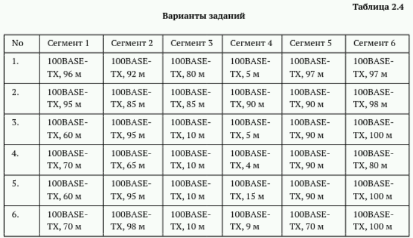

##

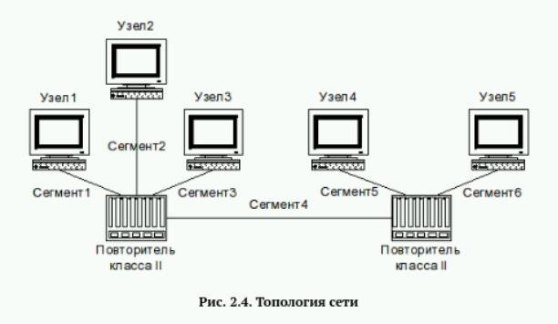

##

Разберем сначала все варианты для первой модели:

Главными условиями являются: длина каждого сегмента витой пары должна быть меньше 100 м и повторители класса II немедленно передают полученные сигналы без всякого преобразования, поэтому к ним можно подключать только сегменты, использующие одинаковые способы кодирования данных; можно использовать неболее двух повторителей класса II в одном домене коллизий.

Информацию о повторителях мы получаем из топологии сети. Их ровно 2.

##

Разберем данные из таблиц. Варианты 1,2,4: Сеть соответствует первой модели. Все длины сигментов менее 100 метров.

##

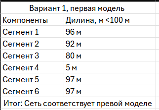{#fig:003 width=90%}

##

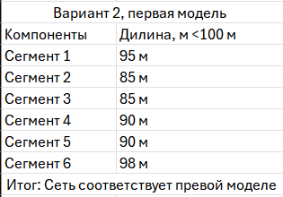{#fig:004 width=90%}

##

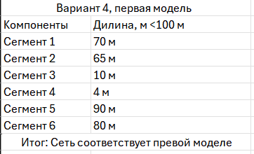{#fig:005 width=90%}

##

Варианты 3,5,6: Сеть не соответствует первой модели. Все длины сигментов более 100 метров.

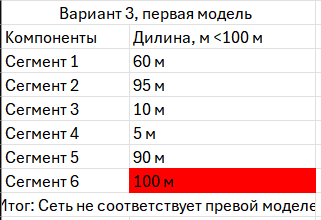

##

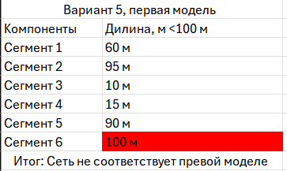

##

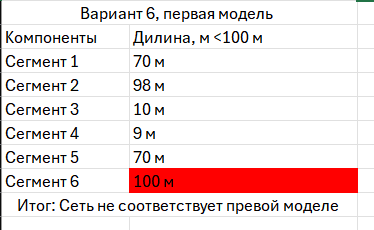

##

Разберем все варианты для второй модели:

Для вычисления времени двойного оборота нужно умножить длину сегмента на величину удельного времени двойного оборота соответствующего сегмента. Определив времена двойного оборота для всех сегментов наихудшего пути, к ним нужно прибавить задержку, вносимую парой оконечных узлов и повторителями. Для учёта непредвиденных задержек к полученному результату рекомендуется добавить ещё 4 битовых интервала (би) и сравнить результат с числом 512. Если полученный результат не превышает 512 би, то сеть считается работоспособной.

##

Разберем данные из таблиц. Варианты 1,3,4: Сеть работоспособна. В сумме передача данных по самому худщему маршруту не привышает 512 би.

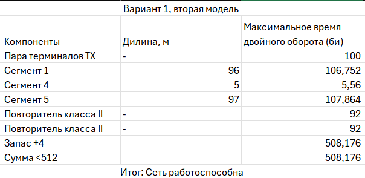

##

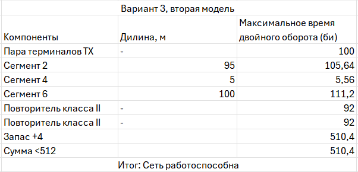

##

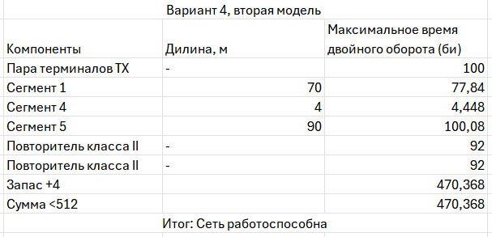

##

Разберем данные из таблиц. Варианты 2,5,6: Сеть не работоспособна. В сумме передача данных по самому худщему маршруту привышает 512 би.

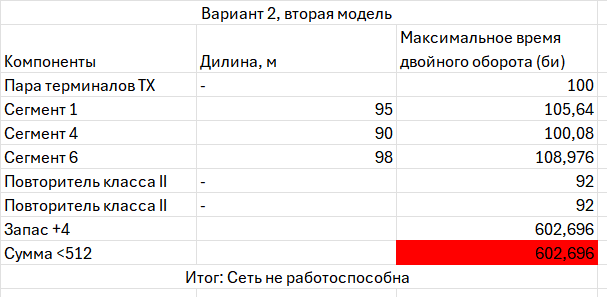

##

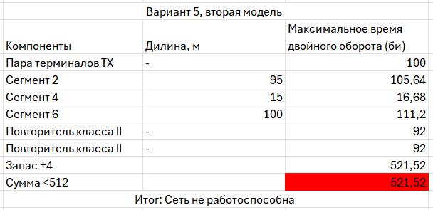

##

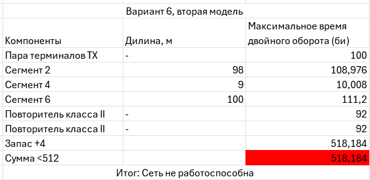

## Результаты

- Изучили принципы технологий Ethernet и Fast Ethernet и на практике освояли методику оценки работоспособности сети, построенной на базе технологии Fast Ethernet.

