---
## Front matter
title: "Лабораторная работа № 2."
subtitle: "Расчёт сети Fast Ethernet"
author: "Диана Алексеевна Садова"

## Generic otions
lang: ru-RU
toc-title: "Содержание"

## Bibliography
bibliography: bib/cite.bib
csl: pandoc/csl/gost-r-7-0-5-2008-numeric.csl

## Pdf output format
toc: true # Table of contents
toc-depth: 2
lof: true # List of figures
lot: true # List of tables
fontsize: 12pt
linestretch: 1.5
papersize: a4
documentclass: scrreprt
## I18n polyglossia
polyglossia-lang:
  name: russian
  options:
	- spelling=modern
	- babelshorthands=true
polyglossia-otherlangs:
  name: english
## I18n babel
babel-lang: russian
babel-otherlangs: english
## Fonts
mainfont: PT Serif
romanfont: PT Serif
sansfont: PT Sans
monofont: PT Mono
mainfontoptions: Ligatures=TeX
romanfontoptions: Ligatures=TeX
sansfontoptions: Ligatures=TeX,Scale=MatchLowercase
monofontoptions: Scale=MatchLowercase,Scale=0.9
## Biblatex
biblatex: true
biblio-style: "gost-numeric"
biblatexoptions:
  - parentracker=true
  - backend=biber
  - hyperref=auto
  - language=auto
  - autolang=other*
  - citestyle=gost-numeric
## Pandoc-crossref LaTeX customization
figureTitle: "Рис."
tableTitle: "Таблица"
listingTitle: "Листинг"
lofTitle: "Список иллюстраций"
lotTitle: "Список таблиц"
lolTitle: "Листинги"
## Misc options
indent: true
header-includes:
  - \usepackage{indentfirst}
  - \usepackage{float} # keep figures where there are in the text
  - \floatplacement{figure}{H} # keep figures where there are in the text
---

# Цель работы

Цель данной работы — изучение принципов технологий Ethernet и Fast Ethernet и практическое освоение методик оценки работоспособности сети, построенной на базе технологии Fast Ethernet.

# Последовательность выполнения работы

## Задание для выполнения
Требуется оценить работоспособность 100-мегабитной сети Fast Ethernet в соответствии с первой и второй моделями.

Конфигурации сети приведены в табл. 2.4. Топология сети представлена на рис. 2.4. (рис. [-@fig:001]), (рис. [-@fig:002]).

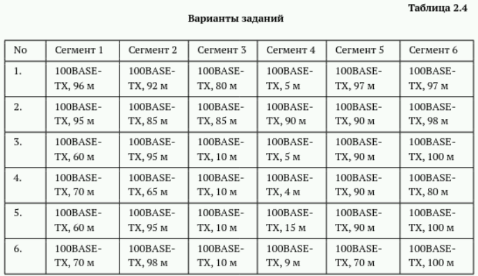{#fig:001 width=90%}

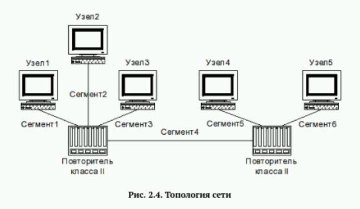{#fig:002 width=90%}

Разберем сначала все варианты для первой модели:

Главными условиями являются: длина каждого сегмента витой пары должна быть меньше 100 м и повторители класса II немедленно передают полученные сигналы без всякого преобразования, поэтому к ним можно подключать только сегменты, использующие одинаковые способы кодирования данных; можно использовать неболее двух повторителей класса II в одном домене коллизий.

Информацию о повторителях мы получаем из топологии сети. Их ровно 2.

Разберем данные из таблиц. Варианты 1,2,4: Сеть соответствует первой модели. Все длины сигментов менее 100 метров.(рис. [-@fig:003]), (рис. [-@fig:004]),(рис. [-@fig:005])

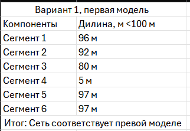{#fig:003 width=90%}

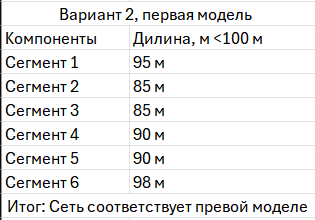{#fig:004 width=90%}

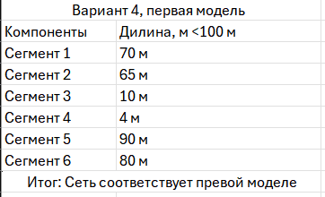{#fig:005 width=90%}

Варианты 3,5,6: Сеть не соответствует первой модели. Все длины сигментов более 100 метров.(рис. [-@fig:006]), (рис. [-@fig:007]),(рис. [-@fig:008])

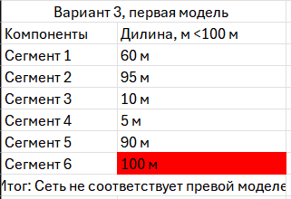{#fig:006 width=90%}

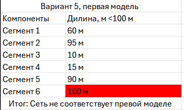{#fig:007 width=90%}

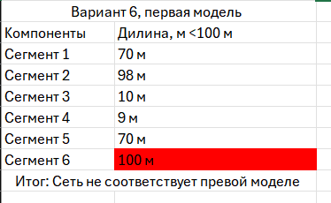{#fig:008 width=90%}

Разберем все варианты для второй модели:

Для вычисления времени двойного оборота нужно умножить длину сегмента на величину удельного времени двойного оборота соответствующего сегмента. Определив времена двойного оборота для всех сегментов наихудшего пути, к ним нужно прибавить задержку, вносимую парой оконечных узлов и повторителями. Для учёта непредвиденных задержек к полученному результату рекомендуется добавить ещё 4 битовых интервала (би) и сравнить результат с числом 512. Если полученный результат не превышает 512 би, то сеть считается работоспособной.

Разберем данные из таблиц. Варианты 1,3,4: Сеть работоспособна. В сумме передача данных по самому худщему маршруту не привышает 512 би.(рис. [-@fig:009]), (рис. [-@fig:010]),(рис. [-@fig:011])

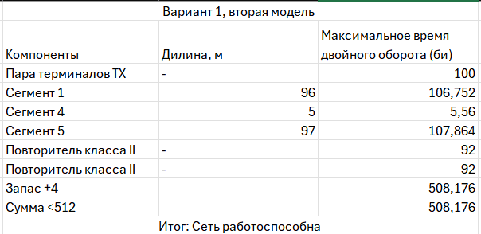{#fig:009 width=90%}

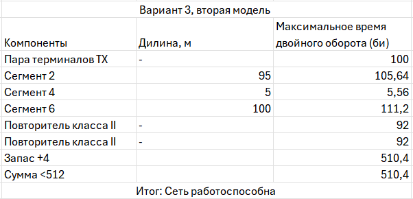{#fig:010 width=90%}

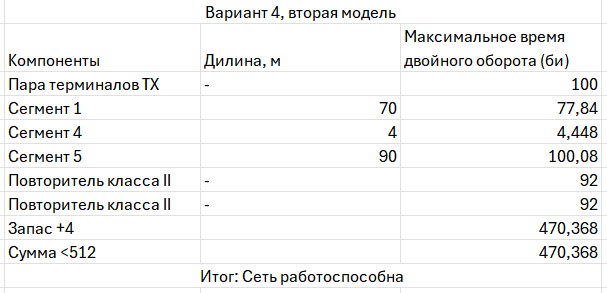{#fig:011 width=90%}

Разберем данные из таблиц. Варианты 2,5,6: Сеть не работоспособна. В сумме передача данных по самому худщему маршруту привышает 512 би.(рис. [-@fig:012]), (рис. [-@fig:013]),(рис. [-@fig:014])

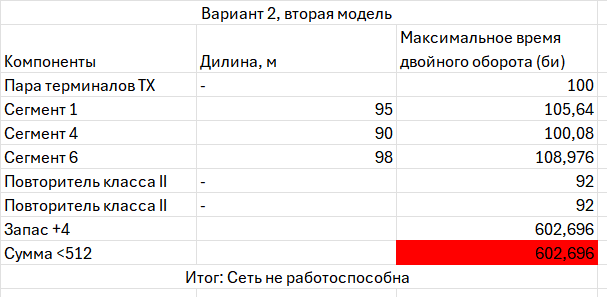{#fig:012 width=90%}

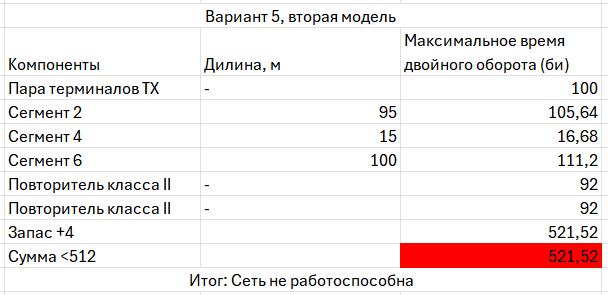{#fig:013 width=90%}

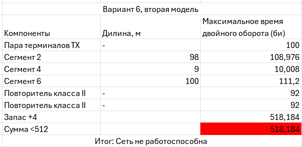{#fig:014 width=90%}

# Выводы

Изучили принципы технологий Ethernet и Fast Ethernet и на практике освояли методику оценки работоспособности сети, построенной на базе технологии Fast Ethernet.

# Список литературы{.unnumbered}

::: {#refs}
:::
