---
## Front matter
lang: ru-RU
title: Лабораторная работа № 3.
subtitle: Анализ трафика в Wireshark
author:
  - Cадова Д. А.
institute:
  - Российский университет дружбы народов, Москва, Россия

## i18n babel
babel-lang: russian
babel-otherlangs: english
## Fonts
mainfont: PT Serif
romanfont: PT Serif
sansfont: PT Sans
monofont: PT Mono
mainfontoptions: Ligatures=TeX
romanfontoptions: Ligatures=TeX
sansfontoptions: Ligatures=TeX,Scale=MatchLowercase
monofontoptions: Scale=MatchLowercase,Scale=0.9

## Formatting pdf
toc: false
toc-title: Содержание
slide_level: 2
aspectratio: 169
section-titles: true
theme: metropolis
header-includes:
 - \metroset{progressbar=frametitle,sectionpage=progressbar,numbering=fraction}
 - '\makeatletter'
 - '\beamer@ignorenonframefalse'
 - '\makeatother'
---

# Информация

## Докладчик

:::::::::::::: {.columns align=center}
::: {.column width="70%"}

  * Садова Диана Алексеевна
  * студент бакалавриата
  * Российский университет дружбы народов
  * [113229118@pfur.ru]
  * <https://DianaSadova.github.io/ru/>

:::
::::::::::::::

# Вводная часть

## Актуальность

- Изучить работу Wireshark
- Научится использовать простейшие команды 
- Изучить какую информацию может выводить Wireshark

## Цели и задачи

- Изучение посредством Wireshark кадров Ethernet, анализ PDU протоколов транспортного и прикладного уровней стека TCP/IP.

## Материалы и методы

- Текст лабороторной работы № 3
- Интернет для исправления ошибок 

# MAC-адресация

## Постановка задачи

1. Изучение возможностей команды ipconfig для ОС типа Windows (ifconfig для систем типа Linux).

2. Определение MAC-адреса устройства и его типа.

## Порядок выполнения работы

1. С помощью команды ipconfig для ОС типа Windows или ifconfig для систем типа Linux выведите информацию о текущем сетевом соединении. Используйте разные опции команды. В отчёте поясните детально полученную в каждом случае при выводе информацию. Подтвердите свой ответ скриншотами.

Обычная команда ipconfig - выдает базовую информацию о текущем сетевом соединении

##

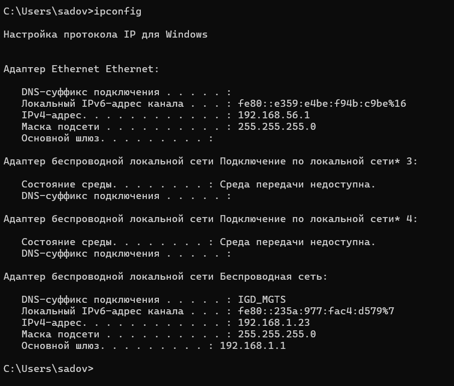

##

Команда ipconfig /all - выдает более полную (расширеную) информацию о текущем сетевом соединении

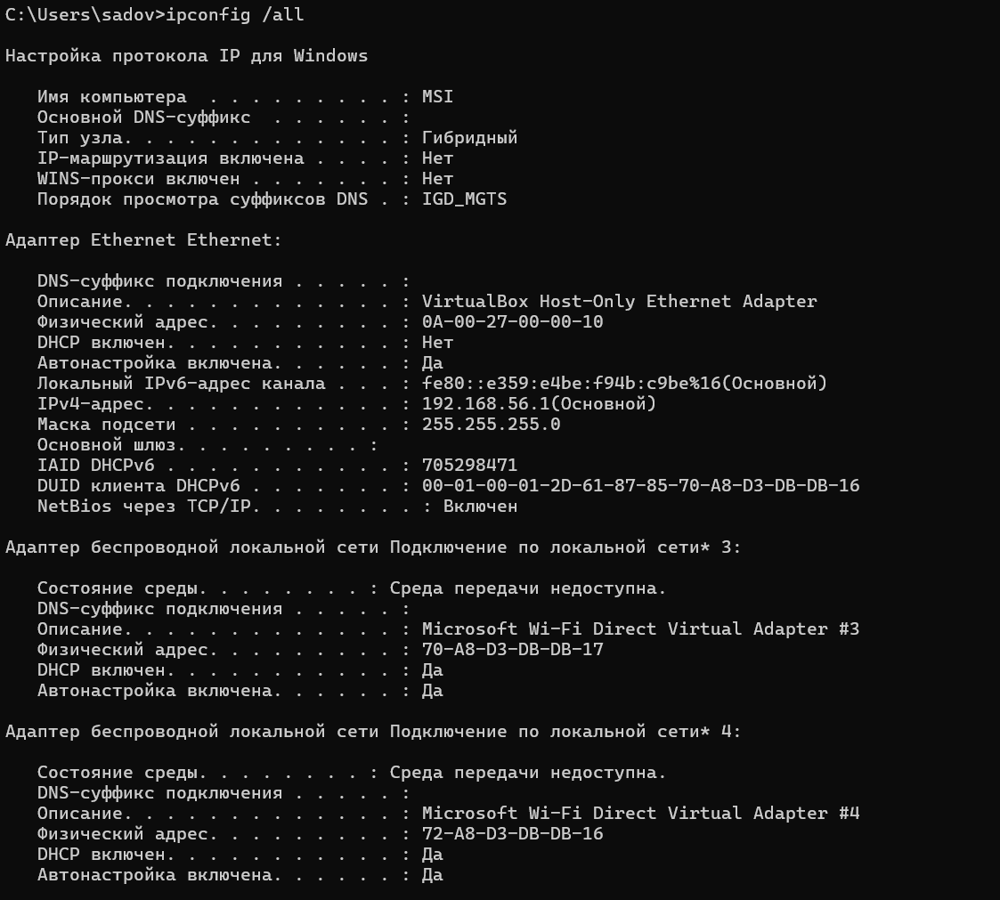{#fig:002 width=90%}

##

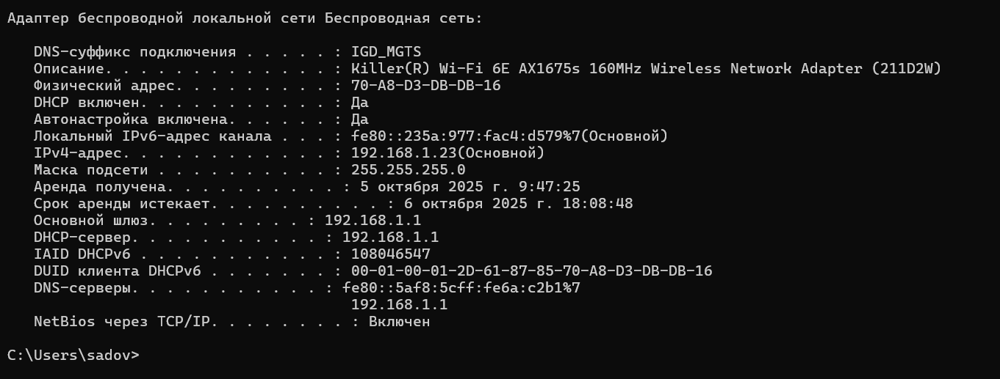{#fig:003 width=90%}

##

Команда ipconfig /renew - обновляет IP текущего сетевого соединении

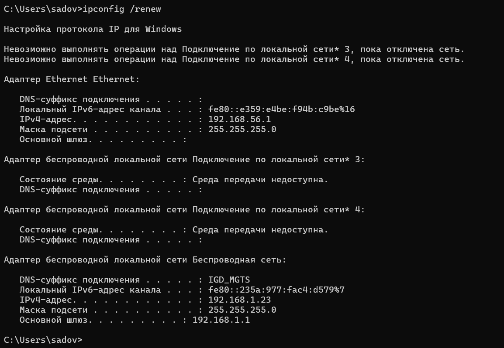{#fig:004 width=90%}

##

2. Определите MAC-адреса сетевых интерфейсов на вашем компьютере. Подтвердите свой ответ скриншотом.

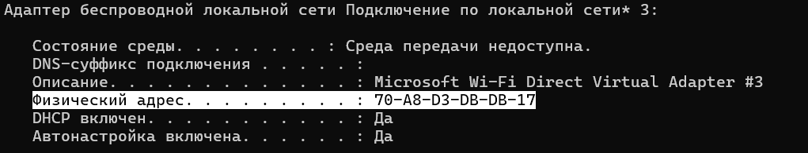

##

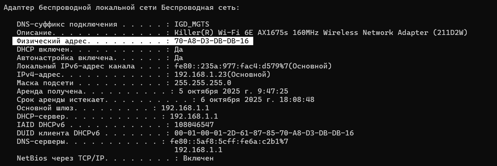

##

3. Опишите структуру MAC-адресов вашего устройства. Какая часть адреса идентифицирует производителя? Какая часть адреса идентифицирует сетевой интерфейс? Определите, каким является адрес — индивидуальным или групповым, глобально администрируемым или локально администрируемым. Поясните свой ответ. Используйте шестнадцатеричную запись MAC-адреса для пояснения.

Адрес 70:A8:D3:DB:DB:17 является индивидуальным (Unicast) и глобально администрируемым (UAA)

# Анализ кадров канального уровня в Wireshark

## Постановка задачи

1. Установить на домашнем устройстве Wireshark.

2. С помощью Wireshark захватить и проанализировать пакеты ARP и ICMP в части кадров канального уровня.

## Порядок выполнения работы

1. Установите на вашем устройстве Wireshark.
2. Запустите Wireshark. Выберите активный на вашем устройстве сетевой интерфейс. Убедитесь, что начался процесс захвата трафика.

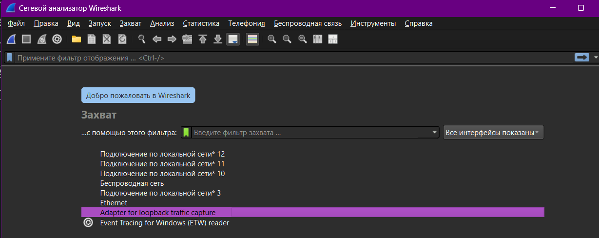

##

3. На вашем устройстве в консоли определите с помощью команды ipconfig для ОС типа Windows или ifconfig для систем типа Linux IP-адрес вашего устройства и шлюз по умолчанию (default gateway).

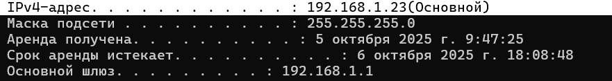

##

4. На вашем устройстве в консоли с помощью команды ping адрес_шлюза пропингуйте шлюз по умолчанию. Для остановки процесса используйте комбинацию клавиш Ctrl + c или изначально при помощи параметров команды ping задайте число сообщений эхо-запроса.

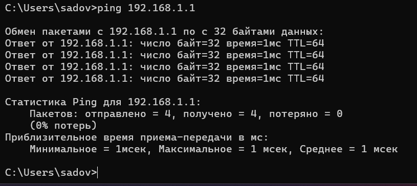

##

5. В Wireshark остановите захват трафика. В строке фильтра пропишите фильтр arp or icmp. Убедитесь, что в списке пакетов отобразятся только пакеты ARP или ICMP, в частности пакеты, которые были сгенерированы с помощью команды ping, отправленной с вашего устройства на шлюз по умолчанию.

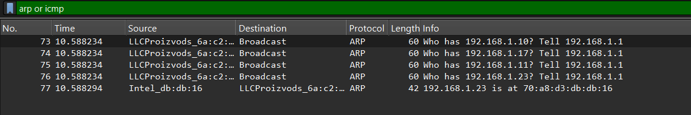

##

##

6. Изучите эхо-запрос и эхо-ответ ICMP в программе Wireshark:

- На панели списка пакетов (верхний раздел) выберите первый указанный кадр ICMP — эхо-запрос. Изучите информацию на панели сведений о пакете в средней части экрана. В отчёте укажите длину кадра, к какому типу Ethernet относится кадр, определите MAC-адреса источника и шлюза, определите тип MAC-адресов.

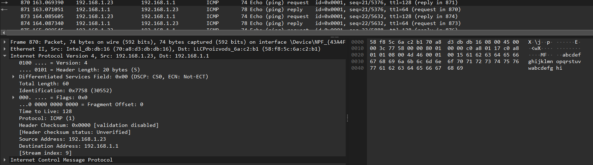

##

Длина кадра (Frame Length) - 74 байта

Типу Ethernet - Ethernet II

MAC-адреса источника - 70:a8:d3:db:db:16

Шлюз (Destination): MAC-адрес маршрутизатора (шлюза) с IP 192.168.1.1.
Фактический MAC-адрес шлюза нужно посмотреть в захвате трафика Wireshark в поле "Destination" раздела "Ethernet II". Например, это может быть адрес вида a4:b3:c2:d1:e0:f9.

##

Тип MAC-адресов:

- MAC-адрес источника (70:a8:d3:db:db:16): Индивидуальный (Unicast): Младший бит первого байта (70 = 01110000) равен 0. Глобально администрируемый (UAA): Второй младший бит первого байта равен 0.

- MAC-адрес назначения (шлюза a4:b3:c2:d1:e0:f9): Индивидуальный (Unicast): Младший бит первого байта (a4 = 10100100) равен 0. Глобально администрируемый (UAA): Второй младший бит первого байта равен 0.

##

- На панели списка пакетов (верхний раздел) выберите второй указанный кадр ICMP — эхо-ответ. Изучите информацию на панели сведений о пакете в средней части экрана. В отчёте укажите длину кадра, к какому типу Ethernet относится кадр, определите MAC-адреса источника и шлюза, определите тип MAC-адресов.

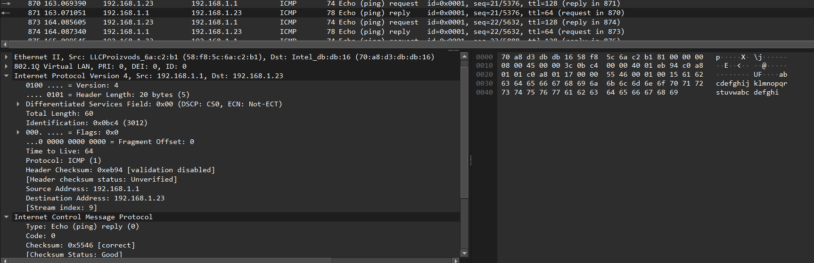

##

Длина кадра - 78 байт
	
Тип Ethernet - Ethernet II
	
MAC источника - 58:48:5c:6a:c2:b1
	
MAC назначения - 70:a8:d3:db:db:16
	
Тип адресов - Оба индивидуальные (Unicast) и глобальные (UAA)

##

7. Изучите кадры данных протокола ARP. Изучите данные в полях заголовка Ethernet II.

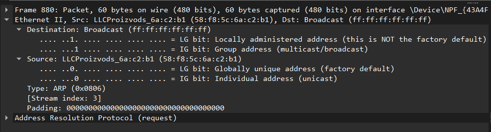

##

Длина кадра (Frame Length) - 60 bytes on wire (480 bits), 60 bytes captured (480 bits)

Типу Ethernet - Ethernet II

Broadcast ff:ff:ff:ff:ff:ff - Широковещательный адрес - кадр предназначен ВСЕМ устройствам в локальной сети

Source: LICProizvods_6a:c2:b1 (58:f8:5c:6a:c2:b1)

MAC-адрес источника: 58:f8:5c:6a:c2:b1

Производитель: OUI 58:f8:5c соответствует производителю LICProizvods

Type: ARP (0x0806)

Stream index: 3 - Индекс потока для отслеживания связанных пакетов

##

8. Начните новый процесс захвата трафика в Wireshark. На вашем устройстве в консоли пропингуйте по имени какой-нибудь известный вам адрес, например ping rudn.ru.

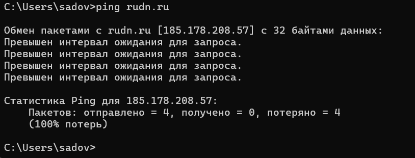

##

9. В Wireshark остановите захват трафика. Изучите запросы и ответы протоколов ARP и ICMP. Определите MAC-адреса источника и получателя, определите тип MAC-адресов.

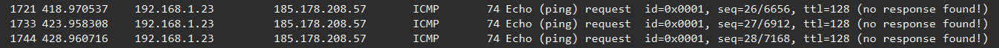{#fig:017 width=90%}

##

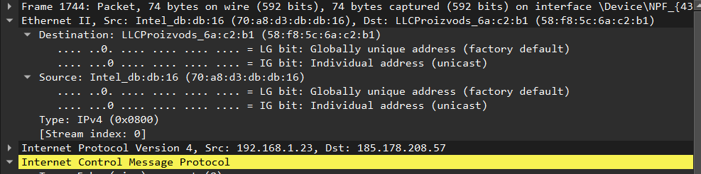{#fig:018 width=90%}

##

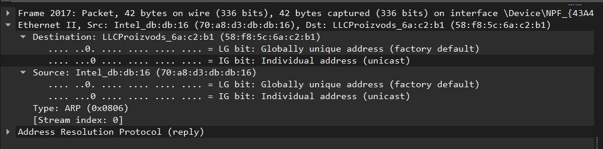{#fig:019 width=90%}

##

ARP Request (запрос)

MAC-адреса:

Источник (Source): 58:f8:5c:6a:c2:b1

- Тип: Индивидуальный (Unicast)

- Администрирование: Глобальное (UAA)

Получатель (Destination): ff:ff:ff:ff:ff:ff

- Тип: Групповой (Broadcast)

- Администрирование: Широковещательный адрес

##

ARP Reply (ответ)

MAC-адреса:

Источник (Source): 70:a8:d3:db:db:16

- Тип: Индивидуальный (Unicast)

- Администрирование: Глобальное (UAA)

Получатель (Destination): 58:f8:5c:6a:c2:b1

- Тип: Индивидуальный (Unicast)

- Администрирование: Глобальное (UAA)

# Анализ протоколов транспортного уровня в Wireshark

## Постановка задачи

С помощью Wireshark захватить и проанализировать пакеты HTTP, DNS в части заголовков и информации протоколов TCP, UDP, QUIC.

## Порядок выполнения работы

1. Запустите Wireshark. Выберите активный на вашем устройстве сетевой интерфейс. Убедитесь, что начался процесс захвата трафика.

2. На вашем устройстве в браузере перейдите на сайт, работающий по протоколу HTTP (например, на сайт CERN ). При необходимости получения большей информации для Wireshark поперемещайтесь по ссылкам или разделам сайта в браузере.

##

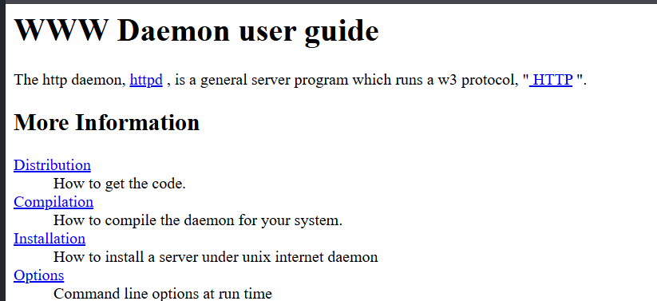

##

3. В Wireshark в строке фильтра укажите http и проанализируйте информацию по протоколу TCP в случае запросов и ответов. В отчёте приведите пояснение по информации, захваченной в Wireshark.

{#fig:021 width=90%}

##

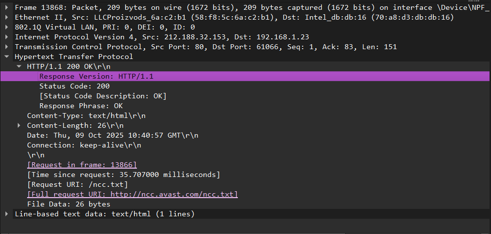{#fig:022 width=90%}

##

Анализ уровня приложений (HTTP):

Статус: 200 OK - успешное выполнение запроса

Версия протокола: 'HTTP/1.1'

Тип содержимого: "text/html"

Размер содержимого: 26 bytes

Cоединение: keep-alive (повторное использование TCP-соединения)

##

Контекст запроса:

Запрос был в кадре: 13866

Время обработки: 35.707 ms - быстрый ответ сервера

Запрашиваемый ресурс: '/ncc.txt'

Полный URL: "http://ncc.avast.com/ncc.txt"

Сервер: Сервер компании Avast (антивирусное ПО)

##

4. Wireshark в строке фильтра укажите dns и проанализируйте информацию по протоколу UDP в случае запросов и ответов. В отчёте приведите пояснение по информации, захваченной в Wireshark.

##

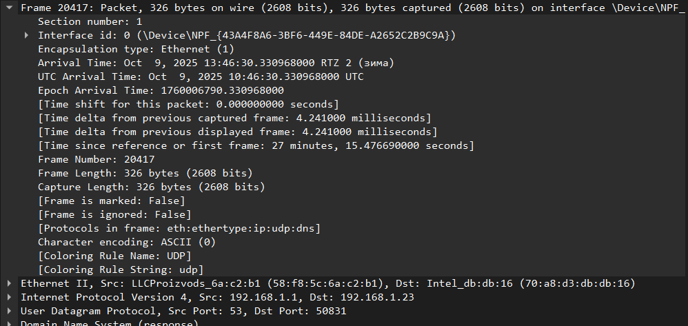

##

Анализ пакета

Номер кадра: 20417

Длина кадра: 326 байт

Протоколы в кадре: eth:ethertype:ip:udp:dns

Источник: 192.168.1.1 (вероятно, локальный DNS-сервер или маршрутизатор)

Назначение: 192.168.1.23 (клиентское устройство)

##

Порты:

- Src Port: 53 (стандартный порт DNS-сервера)

- Dst Port: 50831 (порт клиента, с которого был отправлен запрос)

##

5. Wireshark в строке фильтра укажите quic и проанализируйте информацию по протоколу quic в случае запросов и ответов. В отчёте приведите пояснение по информации, захваченной в Wireshark.

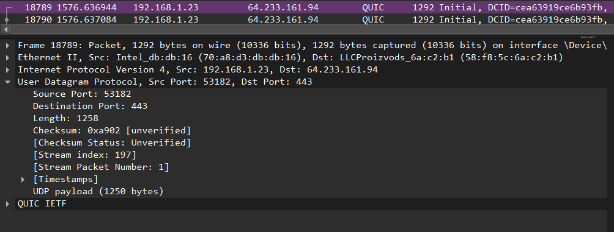{#fig:025 width=90%}

##

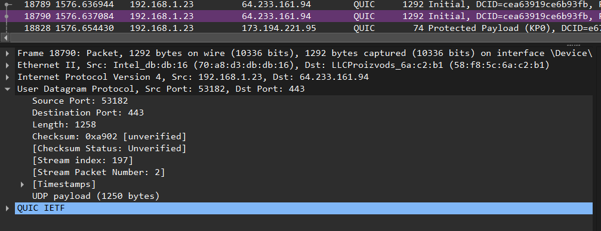{#fig:026 width=90%}

##

Анализ пакета

Номер кадра: 18790

Время: 1576.637084 секунд от начала захвата

Источник: 192.168.1.23 (клиент)

Назначение: 64.233.161.94 (сервер, принадлежит Google)

##

Порты:

- Src Port: 53182 (клиентский)

- Dst Port: 443 (HTTPS/QUIC)

Длина UDP-датаграммы: 1258 байт

Протоколы в кадре: eth:ip:udp:quic

##

6. Остановите захват трафика в Wireshark.

# Анализ handshake протокола TCP в Wireshark

## Постановка задачи

С помощью Wireshark проанализировать handshake протокола TCP.

## Порядок выполнения работы

1. Запустите Wireshark. Выберите активный на вашем устройстве сетевой интерфейс. Убедитесь, что начался процесс захвата трафика.

2. На вашем устройстве или используйте подсоединение по telnet или ssh к вашему маршрутизатору (например с помощью PUTTY или соответствующих команд в консоли), или соединение по HTTP с каким-то сайтом для захвата в Wireshark пакетов TCP.

##

3. В Wireshark проанализируйте handshake протокола TCP, в отчёте приведите пример с пояснениями изменения значений соответствующих сообщений при установлении соединения по TCP.

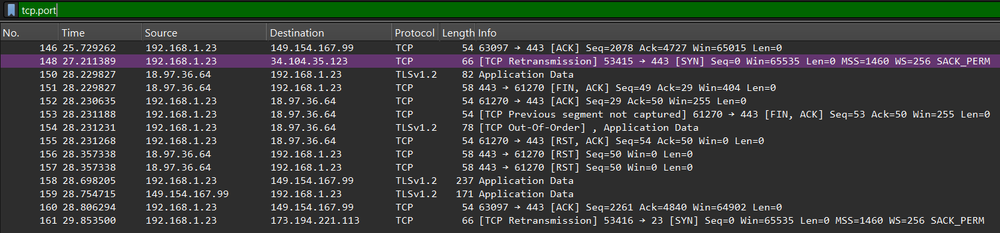

##

4. В Wireshark в меню «Статистика» выберете «График Потока». В отчёте приведите пояснения по изменениям значений соответствующих сообщений при установлении соединения по TCP.

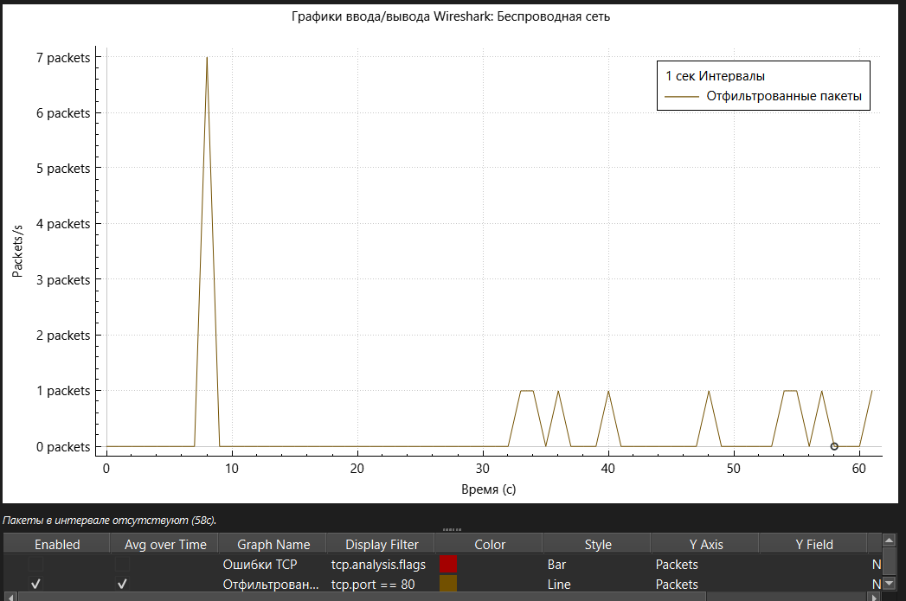

##

На участке "Пакеты в интервале отсутствуют (58с)" оба графика падают до нуля, что означает полное отсутствие TCP-трафика (включая ошибки) на порту 80 в течение 58 секунд.

После третьего пакета соединение установлено.

Анализируя Graph Flow, вы можете четко видеть всю жизненную цепочку TCP-сессии: от установления соединения (рукопожатие), через передачу данных с постоянно растущими номерами подтверждений (Ack), до корректного завершения соединения (обмен пакетами FIN/ACK). 

##

5. Остановите захват трафика в Wireshark.

## Результаты

- Изучили с помощью Wireshark кадры Ethernet, анализ PDU протоколов транспортного и прикладного уровней стека TCP/IP. Поработали с простейшими командами и фильтрами. Разобрались в выводимой информации Wireshark.

