---
## Front matter
lang: ru-RU
title: Лабораторная работа № 4.
subtitle: Подготовка экспериментального стенда GNS3
author:
  - Cадова Д. А.
institute:
  - Российский университет дружбы народов, Москва, Россия

## i18n babel
babel-lang: russian
babel-otherlangs: english
## Fonts
mainfont: PT Serif
romanfont: PT Serif
sansfont: PT Sans
monofont: PT Mono
mainfontoptions: Ligatures=TeX
romanfontoptions: Ligatures=TeX
sansfontoptions: Ligatures=TeX,Scale=MatchLowercase
monofontoptions: Scale=MatchLowercase,Scale=0.9

## Formatting pdf
toc: false
toc-title: Содержание
slide_level: 2
aspectratio: 169
section-titles: true
theme: metropolis
header-includes:
 - \metroset{progressbar=frametitle,sectionpage=progressbar,numbering=fraction}
 - '\makeatletter'
 - '\beamer@ignorenonframefalse'
 - '\makeatother'
---

# Информация

## Докладчик

:::::::::::::: {.columns align=center}
::: {.column width="70%"}

  * Садова Диана Алексеевна
  * студент бакалавриата
  * Российский университет дружбы народов
  * [113229118@pfur.ru]
  * <https://DianaSadova.github.io/ru/>

:::
::::::::::::::

# Вводная часть

## Актуальность

- В дальнейщем мы будеи разбирать как устроены сети из нутри. Для этого мы устанавливаем GNS3

## Цели и задачи

- Установка и настройка GNS3 и сопутствующего программного обеспечения.

## Материалы и методы

- Текст лабороторной работы № 4
- Интернет для исправления ошибок 

# Установка GNS3

## Постановка задачи

1. Установить GNS3-all-in-one, GNS3 VM, проверить корректность запуска.
2. Импортировать в GNS3 образ маршрутизатора FRR.
3. Импортировать в GNS3 образ маршрутизатора VyOS.

## Порядок выполнения работы. Установка GNS3-all-in-one

1. Загружаем с репридитирия установщик для GNS3-all-in-one версия 3.0.4. 

##

2. В процессе установки при выборе комплектации требуется отметить MSVC Runtime (отмечено по умолчанию), GNS3-Desktop, GNS3-VM, Tools.

##

3. В следующем окне требуется отметить тот тип виртуальной машины, через которую в дальнейшем вы будете работать с GNS3. Рекомендуется указать VirtualBox. 

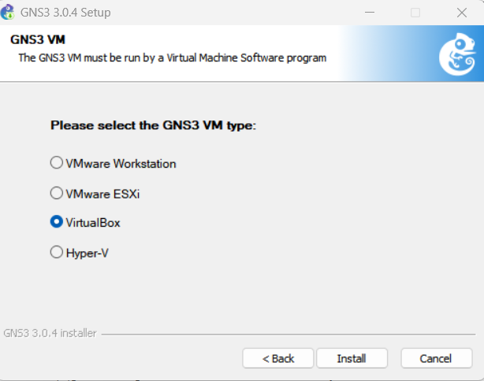

## Установка GNS3 VM для VirtualBox

1. Скачиваем подходящую версию GNS3 VM. 

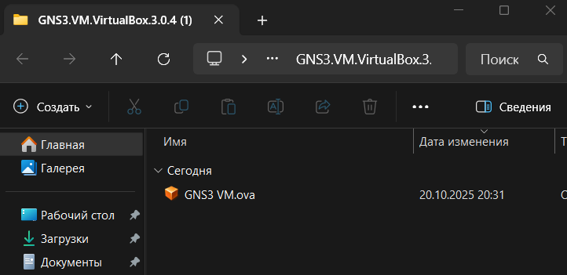

##

2. Запустите VirtualBox. Выберете меню Файл -> Импорт конфигураций. Укажите месторасположение распакованного образа GNS3 VM.ova. 

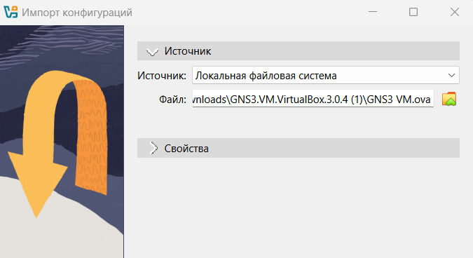

##

3. В следующем окне в параметрах импорта выберете в политике MAC-адреса «Сгенерировать новые MAC-адреса всех сетевых адаптеров».

##

4. Уточните параметры настройки виртуальной машины GNS3 VM в VirtualBox. Для этого в VirtualBox выберете импортированную виртуальную машину и перейдите в меню Машина Настроить . Перейдите к опции «Система». Если внизу этого окна есть сообщение об обнаружении неправильных настроек, то, следуя рекомендациям, внесите исправления. 

##

5. Перейдите к опции «Система» и вкладке «Процессор». Убедитесь, что нет возможности в графическом интерфейсе отметить флажок «Включить Nested VT-x/AMD-V». 

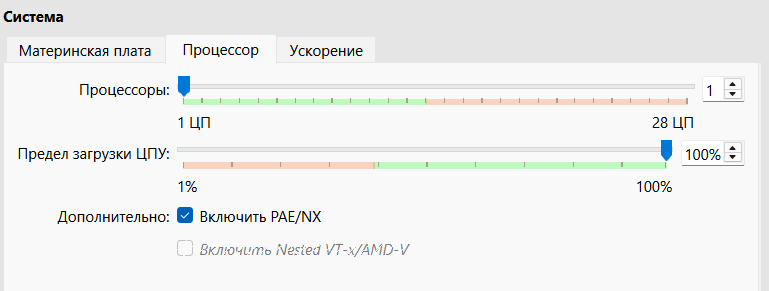

##

Для включения вложенной виртуализации воспользуйтесь командной строкой терминала и введите команду: 

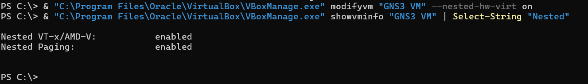

##

Проверяем результат 

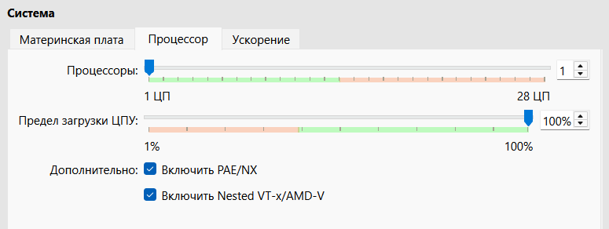

##

6. Настройте сетевой адаптер. Для этого в VirtualBox выберете импортированную виртуальную машину и перейдите в меню Машина -> Настроить . Перейдите к опции «Сеть» и во вкладке «Адаптер 1» тип подключения должен быть установлен как «Виртуальный адаптер»

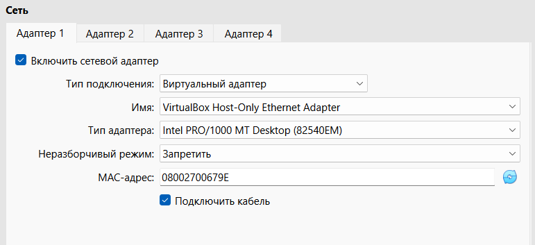

## Запуск экземпляра GNS3 в VirtualBox

1. Запустите GNS3 VM в VirtualBox.

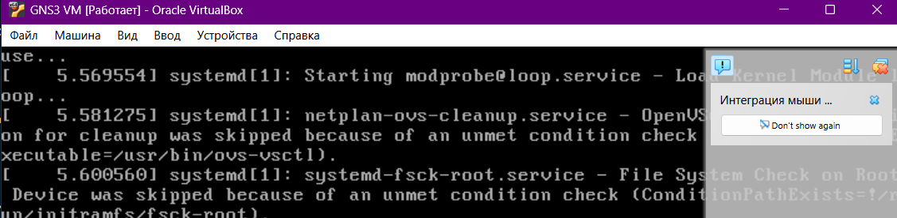

##

2. Затем в вашей основной операционной системе запустите приложение gns3. 

##

3. Настраиваем приложение gns3 по информации из нашей GNS3 VM в VirtualBox. У нас должен получится какой результат

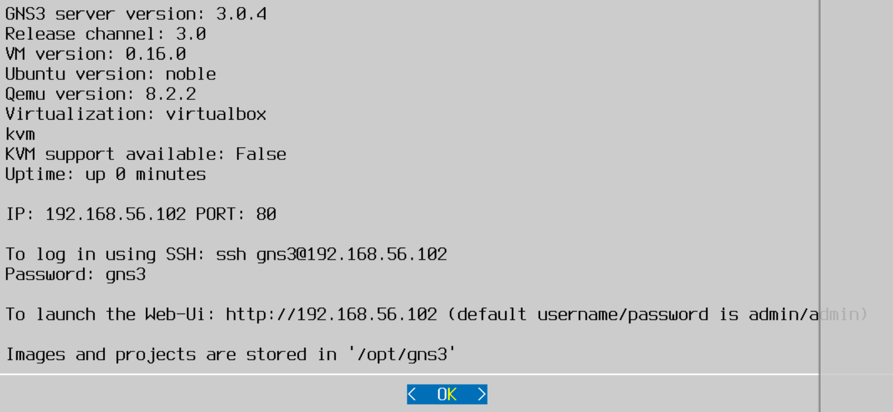

##

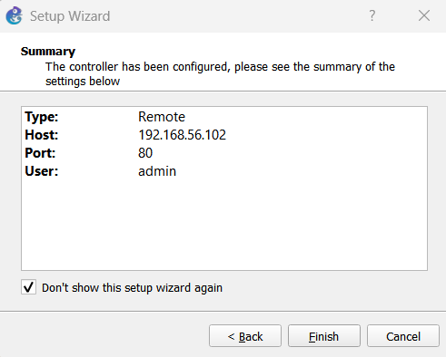

##

## Добавление образа маршрутизатора FRR

1. В рабочем пространстве GNS3 на левой боковой панели выберете просмотр маршрутизаторов (Browse Routers), затем нажмите на + New template. В открывшемся окне укажите рекомендуемое верхнее значение, а именно, устанавливать образ с GNS3-сервера, нажмите Next 

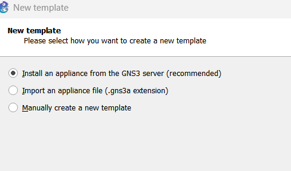

##

2. В следующем окне выберете Routers и образ FRR (FRRouting), нажмите Install 

##

3. Выбераем место установки образ с GNS3-сервера 

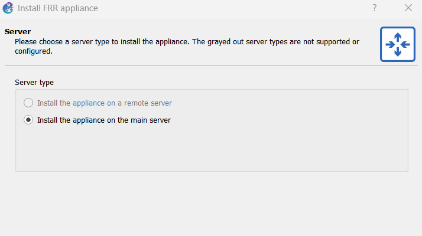

##

4. В следующем окне предлагается перечень файлов для скачивания и последующей установки. Выберете наиболее актуальную версию и нажмите Download

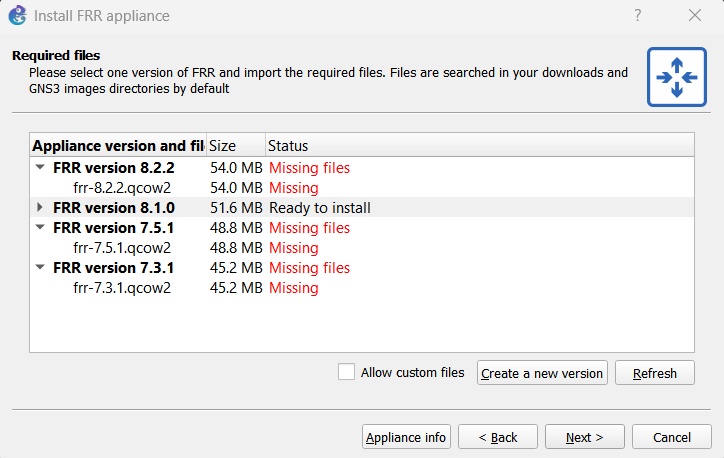

##

5. В рабочем пространстве на левой панели в списке маршрутизаторов появится образ устройства FRR.

##

6. В открывшемся окне необходимо во вкладке «General settings» в поле «On close» выбрать Send the shutdown signal (ACPI) . Во вкладке «HDD» необходимо поставить галочку «Automatically create a config disk on HDD».

##

## Добавление образа маршрутизатора VyOS

1. Как и в случае с добавлением образа FRR в рабочем пространстве GNS3 на левой боковой панели выберете просмотр маршрутизаторов (Browse Routers), затем нажмите на + New template. В открывшемся окне укажите, что образ следует устанавливать с GNS3-сервера. В следующем окне выберете Routers и образ VyOS, нажмите Install .

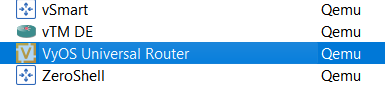

##

2. В следующем окне предлагается перечень файлов для скачивания и последующей установки. Заранее скаченый файл с образом VyOS из githab, ищем среди предложеных вариантов и устанавливаем. 

##

3. Проверяем что образ VyOS на месте 

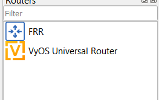

##

4. Далее необходимо настроить образ маршрутизатора. Правой кнопкой мыши щёлкните на образе устройства, в меню выберете Configure template . В открывшемся окне необходимо во вкладке «General settings» в поле «On close» выбрать Send the shutdown signal (ACPI) . Во вкладке «HDD» необходимо поставить галочку «Automatically create a config disk on HDD».

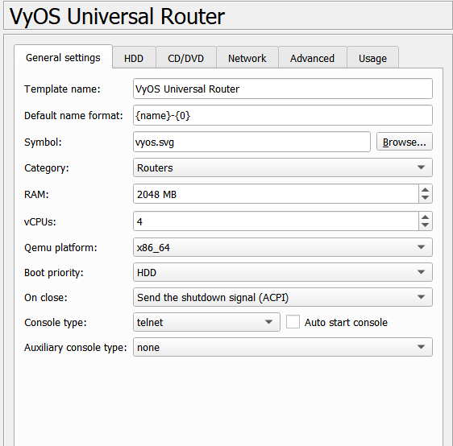

##

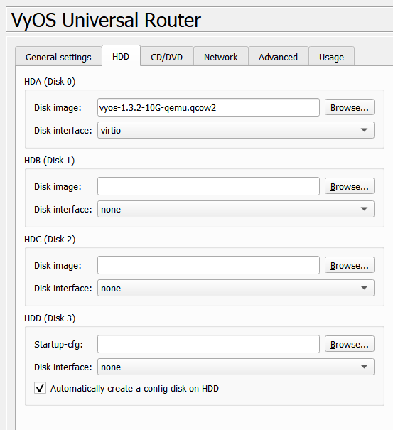

##

5. Также можно изменить отображаемый в GNS3 символ этого устройства: вкладка «General settings», поле «Symbol» и кнопка Browse... , в открывшемся окне выбрать, например, Classic и иконку Router.

##

## Результаты

- Мы смогли установить и настроить GNS3 для дальнейшей работы, а так же настроить сопутствующее программное обеспечение на работу.

