---
## Front matter
title: "Лабораторная работа № 4."
subtitle: "Подготовка экспериментального стенда GNS3"
author: "Диана Алексеевна Садова"

## Generic otions
lang: ru-RU
toc-title: "Содержание"

## Bibliography
bibliography: bib/cite.bib
csl: pandoc/csl/gost-r-7-0-5-2008-numeric.csl

## Pdf output format
toc: true # Table of contents
toc-depth: 2
lof: true # List of figures
lot: true # List of tables
fontsize: 12pt
linestretch: 1.5
papersize: a4
documentclass: scrreprt
## I18n polyglossia
polyglossia-lang:
  name: russian
  options:
	- spelling=modern
	- babelshorthands=true
polyglossia-otherlangs:
  name: english
## I18n babel
babel-lang: russian
babel-otherlangs: english
## Fonts
mainfont: PT Serif
romanfont: PT Serif
sansfont: PT Sans
monofont: PT Mono
mainfontoptions: Ligatures=TeX
romanfontoptions: Ligatures=TeX
sansfontoptions: Ligatures=TeX,Scale=MatchLowercase
monofontoptions: Scale=MatchLowercase,Scale=0.9
## Biblatex
biblatex: true
biblio-style: "gost-numeric"
biblatexoptions:
  - parentracker=true
  - backend=biber
  - hyperref=auto
  - language=auto
  - autolang=other*
  - citestyle=gost-numeric
## Pandoc-crossref LaTeX customization
figureTitle: "Рис."
tableTitle: "Таблица"
listingTitle: "Листинг"
lofTitle: "Список иллюстраций"
lotTitle: "Список таблиц"
lolTitle: "Листинги"
## Misc options
indent: true
header-includes:
  - \usepackage{indentfirst}
  - \usepackage{float} # keep figures where there are in the text
  - \floatplacement{figure}{H} # keep figures where there are in the text
---

# Цель работы

Установка и настройка GNS3 и сопутствующего программного обеспечения.

# Установка GNS3

## Постановка задачи

1. Установить GNS3-all-in-one, GNS3 VM, проверить корректность запуска.
2. Импортировать в GNS3 образ маршрутизатора FRR.
3. Импортировать в GNS3 образ маршрутизатора VyOS.

## Порядок выполнения работы

### Установка GNS3-all-in-one

1. Загружаем с репридитирия установщик для GNS3-all-in-one версия 3.0.4. (рис. [-@fig:001])

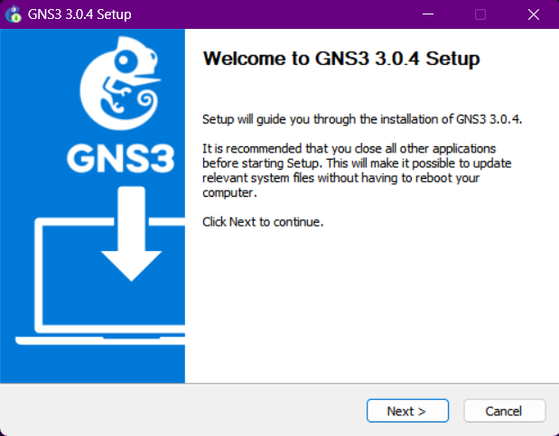{#fig:001 width=90%}

2. В процессе установки при выборе комплектации требуется отметить MSVC Runtime (отмечено по умолчанию), GNS3-Desktop, GNS3-VM, Tools.(рис. [-@fig:002])

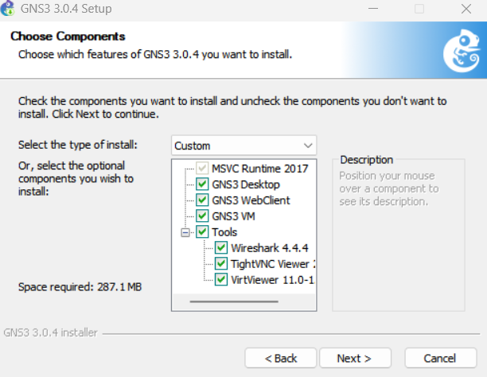{#fig:002 width=90%}

3. В следующем окне требуется отметить тот тип виртуальной машины, через которую в дальнейшем вы будете работать с GNS3. Рекомендуется указать VirtualBox. (рис. [-@fig:003])

{#fig:003 width=90%}

После завершения установки продолжаем работать.

### Установка GNS3 VM для VirtualBox

1. Скачиваем подходящую версию GNS3 VM. (рис. [-@fig:004])

{#fig:004 width=90%}

2. Запустите VirtualBox. Выберете меню Файл -> Импорт конфигураций. Укажите месторасположение распакованного образа GNS3 VM.ova. (рис. [-@fig:005])

{#fig:005 width=90%}

3. В следующем окне в параметрах импорта выберете в политике MAC-адреса «Сгенерировать новые MAC-адреса всех сетевых адаптеров».(рис. [-@fig:006])

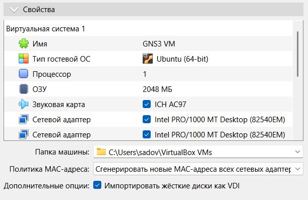{#fig:006 width=90%}

4. Уточните параметры настройки виртуальной машины GNS3 VM в VirtualBox. Для этого в VirtualBox выберете импортированную виртуальную машину и перейдите в меню Машина Настроить . Перейдите к опции «Система». Если внизу этого окна есть сообщение об обнаружении неправильных настроек, то, следуя рекомендациям, внесите исправления. (рис. [-@fig:007])

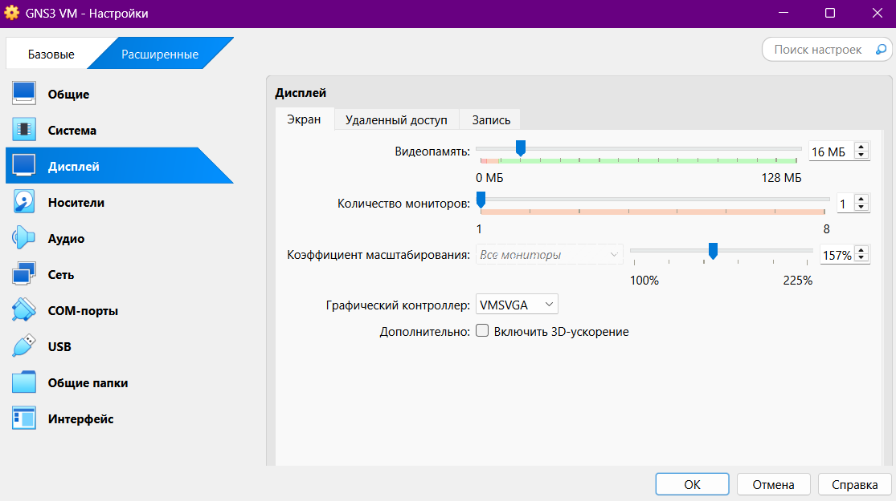{#fig:007 width=90%}

В моем случае, нужно было изменить настройки графического конртоллера на VMSVGA.

5. Перейдите к опции «Система» и вкладке «Процессор». Убедитесь, что нет возможности в графическом интерфейсе отметить флажок «Включить Nested VT-x/AMD-V». (рис. [-@fig:008])

{#fig:008 width=90%}

Для включения вложенной виртуализации воспользуйтесь командной строкой терминала и введите команду: (рис. [-@fig:009])

{#fig:009 width=90%}

Проверяем результат (рис. [-@fig:010])

{#fig:010 width=90%}

6. Настройте сетевой адаптер. Для этого в VirtualBox выберете импортированную виртуальную машину и перейдите в меню Машина -> Настроить . Перейдите к опции «Сеть» и во вкладке «Адаптер 1» тип подключения должен быть установлен как «Виртуальный адаптер»  (рис. [-@fig:011])

{#fig:011 width=90%}

### Запуск экземпляра GNS3 в VirtualBox

1. Запустите GNS3 VM в VirtualBox.  (рис. [-@fig:012])

{#fig:012 width=90%}

2. Затем в вашей основной операционной системе запустите приложение gns3. (рис. [-@fig:013])

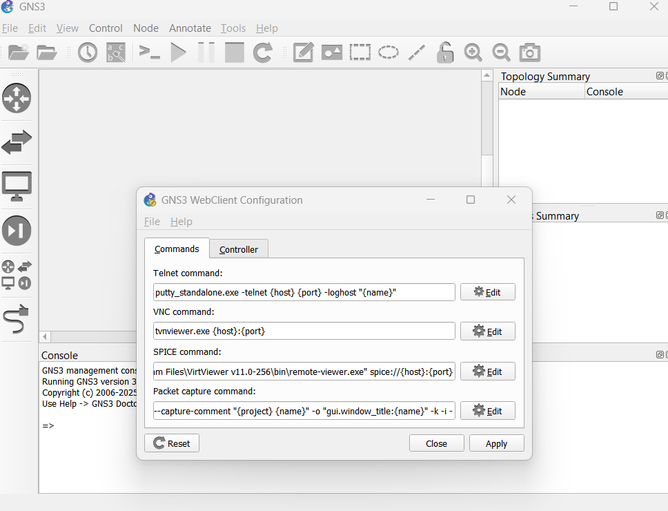{#fig:013 width=90%}

3. Настраиваем приложение gns3 по информации из нашей GNS3 VM в VirtualBox. У нас должен получится какой результат (рис. [-@fig:101]),(рис. [-@fig:015]),(рис. [-@fig:016])

{#fig:101 width=90%}

{#fig:015 width=90%}

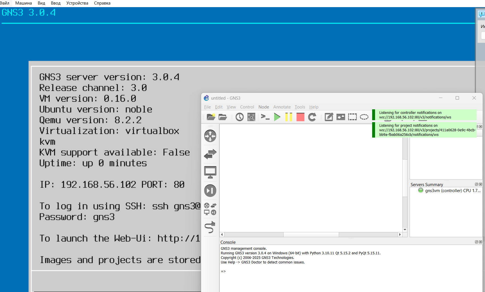{#fig:016 width=90%}

### Добавление образа маршрутизатора FRR

1. В рабочем пространстве GNS3 на левой боковой панели выберете просмотр маршрутизаторов (Browse Routers), затем нажмите на + New template. В открывшемся окне укажите рекомендуемое верхнее значение, а именно, устанавливать образ с GNS3-сервера, нажмите Next (рис. [-@fig:102])

{#fig:102 width=90%}

2. В следующем окне выберете Routers и образ FRR (FRRouting), нажмите Install (рис. [-@fig:103])

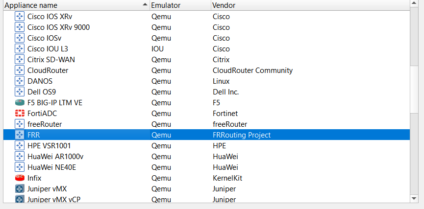{#fig:103 width=90%}

3. Выбераем место установки образ с GNS3-сервера (рис. [-@fig:104])

{#fig:104 width=90%}

4. В следующем окне предлагается перечень файлов для скачивания и последующей установки. Выберете наиболее актуальную версию и нажмите Download (рис. [-@fig:105])

{#fig:105 width=90%}

5. В рабочем пространстве на левой панели в списке маршрутизаторов появится образ устройства FRR.(рис. [-@fig:106])

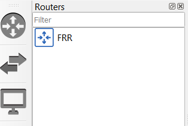{#fig:106 width=90%}

6. В открывшемся окне необходимо во вкладке «General settings» в поле «On close» выбрать Send the shutdown signal (ACPI) . Во вкладке «HDD» необходимо поставить галочку «Automatically create a config disk on HDD».(рис. [-@fig:107]),(рис. [-@fig:108])

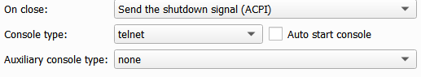{#fig:107 width=90%}

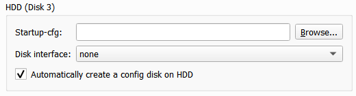{#fig:108 width=90%}

### Добавление образа маршрутизатора VyOS

1. Как и в случае с добавлением образа FRR в рабочем пространстве GNS3 на левой боковой панели выберете просмотр маршрутизаторов (Browse Routers), затем нажмите на + New template. В открывшемся окне укажите, что образ следует устанавливать с GNS3-сервера. В следующем окне выберете Routers и образ VyOS, нажмите Install . (рис. [-@fig:109])

{#fig:109 width=90%}

2. В следующем окне предлагается перечень файлов для скачивания и последующей установки. Заранее скаченый файл с образом VyOS из githab, ищем среди предложеных вариантов и устанавливаем. (рис. [-@fig:110])

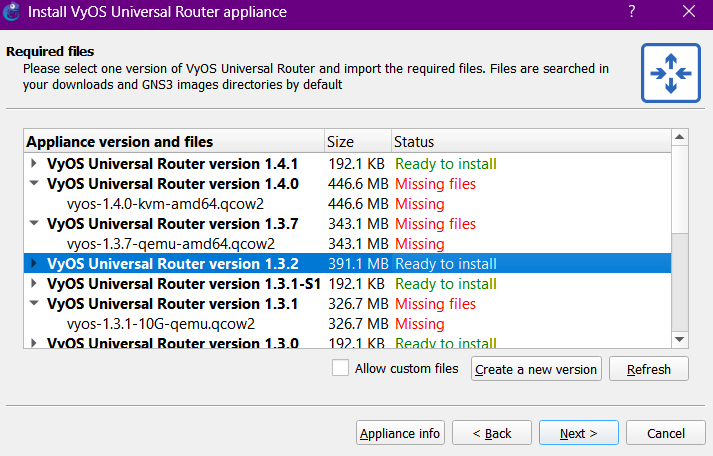{#fig:110 width=90%}

3. Проверяем что образ VyOS на месте (рис. [-@fig:111])

{#fig:111 width=90%}

4. Далее необходимо настроить образ маршрутизатора. Правой кнопкой мыши щёлкните на образе устройства, в меню выберете Configure template . В открывшемся окне необходимо во вкладке «General settings» в поле «On close» выбрать Send the shutdown signal (ACPI) . Во вкладке «HDD» необходимо поставить галочку «Automatically create a config disk on HDD».(рис. [-@fig:112]),(рис. [-@fig:113])

{#fig:112 width=90%}

{#fig:113 width=90%}

5. Также можно изменить отображаемый в GNS3 символ этого устройства: вкладка «General settings», поле «Symbol» и кнопка Browse... , в открывшемся окне выбрать, например, Classic и иконку Router.(рис. [-@fig:114]),(рис. [-@fig:115])

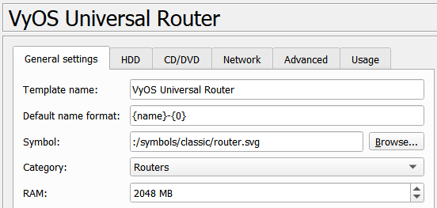{#fig:114 width=90%}

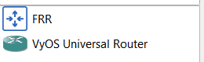{#fig:115 width=90%}

# Выводы

Мы смогли установить и настроить GNS3 для дальнейшей работы, а так же настроить сопутствующее программное обеспечение на работу.

# Список литературы{.unnumbered}

::: {#refs}
:::
