---
## Front matter
lang: ru-RU
title: Лабораторная работа № 5.
subtitle: Простые сети в GNS3. Анализ трафика
author:
  - Cадова Д. А.
institute:
  - Российский университет дружбы народов, Москва, Россия

## i18n babel
babel-lang: russian
babel-otherlangs: english
## Fonts
mainfont: PT Serif
romanfont: PT Serif
sansfont: PT Sans
monofont: PT Mono
mainfontoptions: Ligatures=TeX
romanfontoptions: Ligatures=TeX
sansfontoptions: Ligatures=TeX,Scale=MatchLowercase
monofontoptions: Scale=MatchLowercase,Scale=0.9

## Formatting pdf
toc: false
toc-title: Содержание
slide_level: 2
aspectratio: 169
section-titles: true
theme: metropolis
header-includes:
 - \metroset{progressbar=frametitle,sectionpage=progressbar,numbering=fraction}
 - '\makeatletter'
 - '\beamer@ignorenonframefalse'
 - '\makeatother'
---

# Информация

## Докладчик

:::::::::::::: {.columns align=center}
::: {.column width="70%"}

  * Садова Диана Алексеевна
  * студент бакалавриата
  * Российский университет дружбы народов
  * [113229118@pfur.ru]
  * <https://DianaSadova.github.io/ru/>

:::
::::::::::::::

# Вводная часть

## Актуальность

- Разобратся как строятся простейшие сети в GNS3

- Тренироватся анализировать трафик

## Цели и задачи

- Построение простейших моделей сети на базе коммутатора и маршрутизаторов FRR и VyOS в GNS3, анализ трафика посредством Wireshark.

## Материалы и методы

- Текст лабороторной работы № 5
- Интернет для исправления ошибок 

# Моделирование простейшей сети на базе коммутатора в GNS3

## Постановка задачи

1. Построить в GNS3 топологию сети, состоящей из коммутатора Ethernet и двух оконечных устройств (персональных компьютеров).

2. Задать оконечным устройствам IP-адреса в сети 192.168.1.0/24. Проверить связь.

## Порядок выполнения работы

1. Запустите GNS3 VM и GNS3. Создайте новый проект.

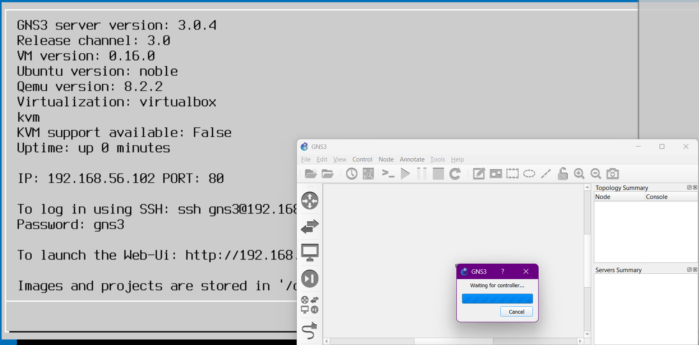

##

2. В рабочей области GNS3 разместите коммутатор Ethernet и два VPCS. Щёлкнув на устройстве правой кнопкой мыши выберете в меню Configure . Измените название устройства, включив в имя устройства имя учётной записи выполняющего работу студента. Коммутатору присвойте название msk-user-sw-01, где вместо user укажите имя вашей учётной записи. Соедините VPCS с коммутатором. Отобразите обозначение интерфейсов соединения 

##

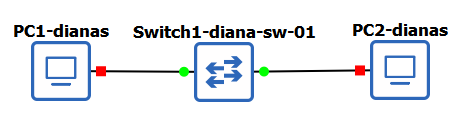

##

3. Задайте IP-адреса VPCS. Для этого с помощью меню, вызываемого правой кнопкой мыши, запустите Start , например, PC-1, затем вызовите его терминал Console . Для просмотра синтаксиса возможных для ввода команд наберите /? 

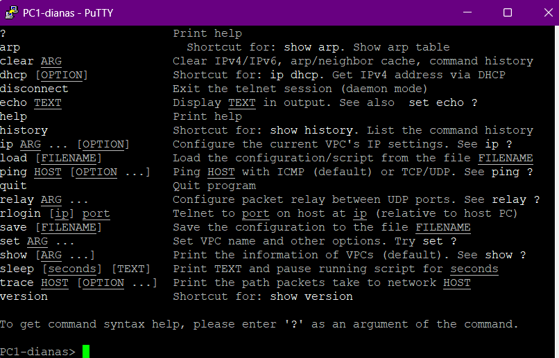

##

Для задания IP-адреса 192.168.1.11 в сети 192.168.1.0/24 введите 

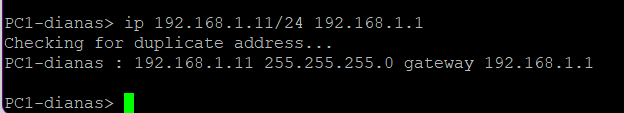

##

Здесь 192.168.1.1 — адрес шлюза. Для уточнения синтаксиса перед вводом можно ввести ip /?. Для сохранения конфигурации необходимо ввести команду save.

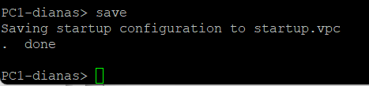

##

Аналогичным образом задайте IP-адрес 192.168.1.12 для PC-2.

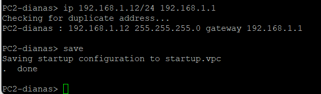

##

4. Проверьте работоспособность соединения между PC-1 и PC-2 с помощью команды ping.

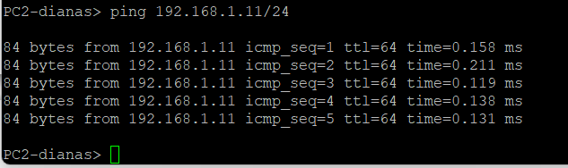

##

5. Остановите в проекте все узлы (меню GNS3 Control Stop all nodes ).

# Анализ трафика в GNS3 посредством Wireshark

## Постановка задачи

1. С помощью Wireshark захватить и проанализировать ARP-сообщения.
2. С помощью Wireshark захватить и проанализировать ICMP-сообщения.

## Порядок выполнения работы

1. Запустите на соединении между PC-1 и коммутатором анализатор трафика. Для этого щёлкните правой кнопкой мыши на соединении, выберете в меню Start capture , при необходимости можете скорректировать название DUMP-файла. Запустится Wireshark, а в проекте GNS3 на соединении появится значок лупы.

##

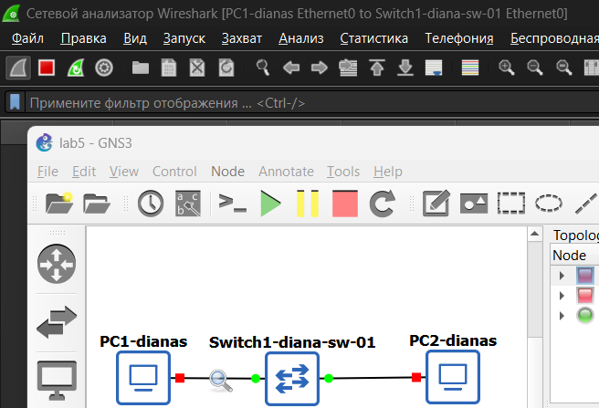

##

2. В проекте GNS3 стартуйте все узлы (меню GNS3 Control Start/Resume all nodes ). В окне Wireshark  отобразится информация по протоколу ARP. Проанализируйте полученную информацию, дайте пояснения в отчёте.

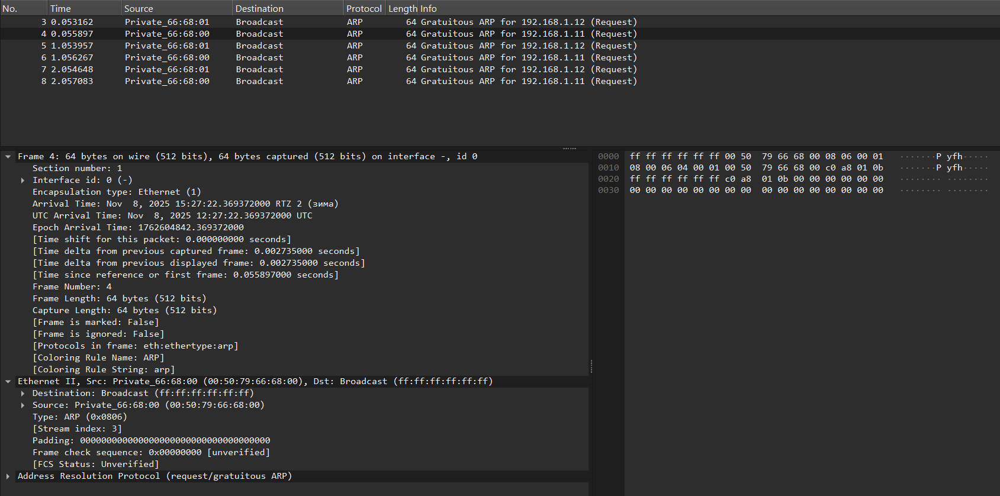

##

В захваченном сегменте сети наблюдается интенсивный обмен Gratuitous ARP (GARP) запросами. Это видно из списка пакетов с номерами 3-8. Два устройства с MAC-адресами 00:50:79:66:68:01 (IP 192.168.1.12) и 00:50:79:66:68:00 (IP 192.168.1.11) активно рассылают такие запросы.

На фотографии видно расщиренную информацию по ARP запросу, а именно время, сколько бит,покетов, сам тип, индекс в системе.

Время: Пакет был отправлен через 0.095397 секунд после начала захвата трафика.

Источник (Source): MAC-адрес 00:50:79:66:68:00 (в Wireshark отображается как производитель Private и уникальный идентификатор 66:68:00).

Назначение (Destination): Широковещательный адрес ff:ff:ff:ff:ff:ff, что означает, что пакет получат все узлы в локальной сети.

##

Протокол (Protocol): ARP (Address Resolution Protocol).

Длина (Length): 64 байта (стандартный размер Ethernet-фрейма минимальной длины).

Информация (Info): "Gratuitous ARP for 192.168.1.11 (Request)" — это прямо указывает на то, что это GARP-запрос для адреса 192.168.1.11.

##

3. В терминале PC-2 посмотрите информацию по опциям команды ping, введя ping /?. Затем сделайте один эхо-запрос в ICMP-моде к узлу PC-1. В окне Wireshark, проанализируйте полученную информацию, дайте пояснения в отчёте.

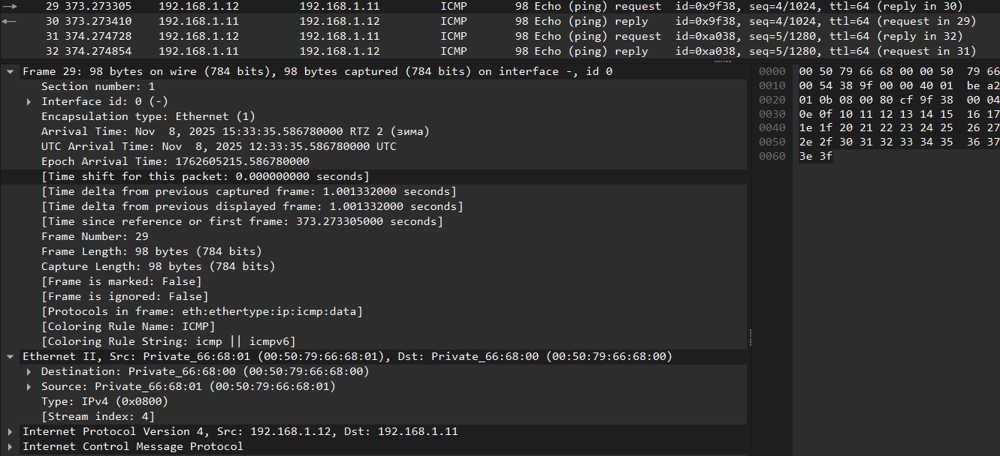

##

Время: Пакет был отправлен через 373.273305 секунд после начала захвата.

Источник (Source): 192.168.1.12 (PC-2)

Назначение (Destination): 192.168.1.11 (PC-1)

Протокол (Protocol): ICMP (Internet Control Message Protocol)

Длина (Length): 98 байт. Это полный размер кадра, включая заголовки Ethernet, IP и данные ICMP.

##

Информация (Info): Echo (ping) request id=0x9f38, seq=4/1024, ttl=64 — это очень информативная строка, которая говорит нам:
- id=0x9f38: Идентификатор процесса ping, который помогает соотнести запросы и ответы, особенно когда запущено несколько сессий ping.
- seq=4/1024: Порядковый номер пакета. В данном случае это 4-й по счету Echo-запрос в этой сессии. Число 1024 — это порядковый номер в байтах, который используется для проверки целостности данных.
- ttl=64: Time to Live (Время жизни). Это значение говорит о том, что пакет был отправлен с узла, работающего под управлением ОС, похожей на Linux (где часто TTL по умолчанию равен 64). Пакет может пройти через 64 маршрутизатора, прежде чем будет отброшен. В данной локальной сети он не уменьшался.

##

4. Сделайте один эхо-запрос в UDP-моде к узлу PC-1. В окне Wireshark? проанализируйте полученную информацию, дайте пояснения в отчёте.

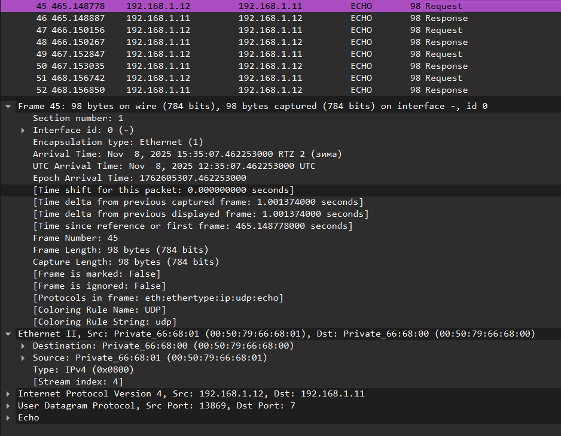

##

На фото виден успешный обмен UDP-пакетами между узлами PC-2 (192.168.1.12) и PC-1 (192.168.1.11). Строки 45-52 показывают последовательные пары "Request" и "Response". 

Источник и Назначение: PC-2 (192.168.1.12) отправляет запрос на PC-1 (192.168.1.11).

Протокол: В столбце "Protocol" указано ECHO. Wireshark распознает пакет как относящийся к службе Echo, но ниже уточняется, что это реализовано поверх UDP (eth:ethertype:ip:udp:echo).

Длина: 98 байт. Это полный размер кадра, включая все заголовки и данные.

##

Ethernet II: Используется прямая MAC-адресация (Private_66:68:01 -> Private_66:68:00), что подтверждает предварительное завершение ARP-процесса.

Internet Protocol Version 4: Стандартный IP-заголовок.

User Datagram Protocol (UDP): Ключевой элемент этого запроса.

- Src Port: 13869 — это исходный порт, случайно выбранный клиентом (PC-2) для получения ответа.

- Dst Port: 7 — это порт назначения. Порт 7 стандартно зарезервирован для службы Echo.

Echo (Data): Это полезная нагрузка пакета — сами данные, которые должны быть отправлены обратно.

##

5. Сделайте один эхо-запрос в TCP-моде к узлу PC-1. В окне Wireshark, проанализируйте полученную информацию, дайте пояснения в отчёте.

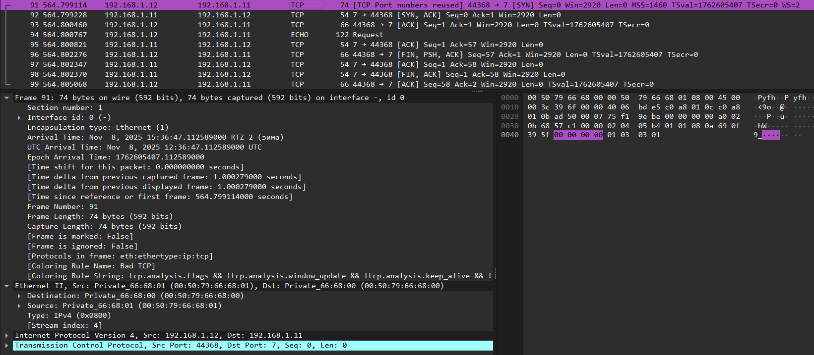

##

Пакет 91: [SYN] — PC-2 (порт 44368) инициирует установку соединения с PC-1 (порт 7, служба Echo). Отправлен SYN-пакет.

Пакет 92: [FIN, ACK] — Неожиданный ответ! Вместо ожидаемого [SYN, ACK] для завершения "трехстороннего рукопожатия", PC-1 сразу отправляет пакет с флагами [FIN, ACK]. Флаг FIN означает запрос на завершение соединения. Это говорит о том, что служба Echo на порту 7 у PC-1, работающая поверх TCP, возможно, не запущена, ведет себя нестандартно или соединение было принудительно сброшено.

##

Пакет 93: [ACK] — PC-2 подтверждает получение FIN от PC-1.

Пакет 94: ECHO Request — Несмотря на идущий процесс разрыва соединения, PC-2 пытается отправить эхо-запрос. Этот пакет помечен как ECHO и содержит данные.

##

Пакет 95: [ACK] — PC-1 подтверждает получение данных (Echo-запроса), но не отправляет содержимое обратно (нет ECHO Response).

Пакеты 96-99: Далее следует серия пакетов [FIN, ACK] и [ACK], которые завершают попытку установления соединения и окончательно его разрывают.

##

6. Остановите захват пакетов в Wireshark.

# Моделирование простейшей сети на базе маршрутизатора FRR в GNS3

## Постановка задачи

1. Построить в GNS3 топологию сети, состоящей из маршрутизатора FRR, коммутатора Ethernet и оконечного устройства.
2. Задать оконечному устройству IP-адрес в сети 192.168.1.0/24.
3. Присвоить интерфейсу маршрутизатора адрес 192.168.1.1/24
4. Проверить связь.

## Порядок выполнения работы

1. Запустите GNS3 VM и GNS3. Создайте новый проект.

##

2. В рабочей области GNS3 разместите VPCS, коммутатор Ethernet и маршрутизатор FRR 

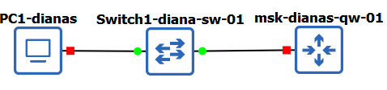

##

3. Измените отображаемые названия устройств. Коммутатору присвойте название по принципу msk-user-sw-0x, маршрутизатору — по принципу msk-user-gw-0x, VPCS — по принципу PCx-user, где вместо user укажите имя вашей учётной записи, вместо x — порядковый номер устройства.

##

4. Включите захват трафика на соединении между коммутатором и маршрутизатором.

5. Запустите все устройства проекта. Откройте консоль всех устройств проекта.

##

6. Настройте IP-адресацию для интерфейса узла PC1:

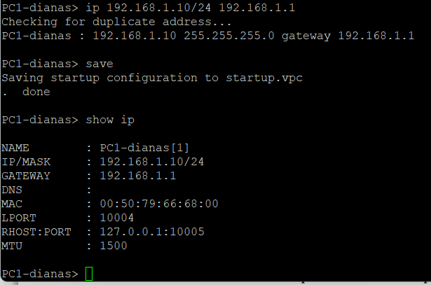

##

7. Настройте IP-адресацию для интерфейса локальной сети маршрутизатора:

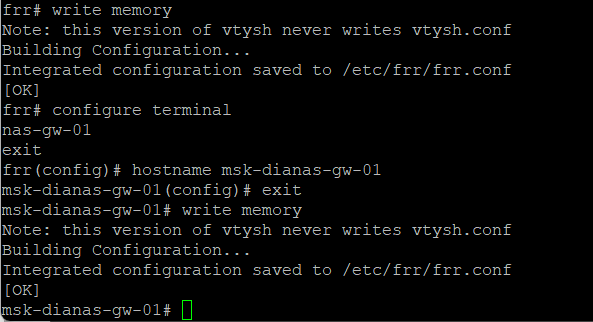

##

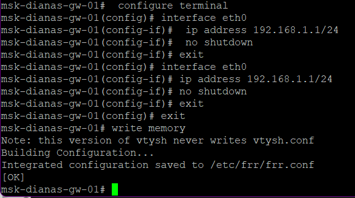

##

8. Проверьте конфигурацию маршрутизатора и настройки IP-адресации:

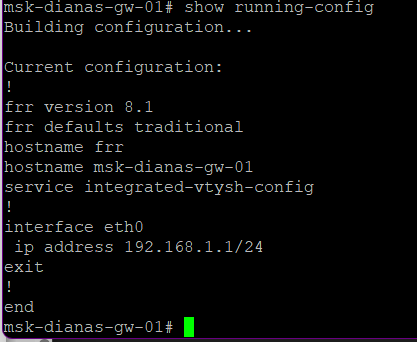

##

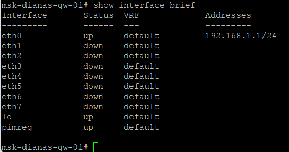

##

9. Проверьте подключение. Узел PC1 должен успешно отправлять эхо-запросы на адрес маршрутизатора 192.168.1.1.

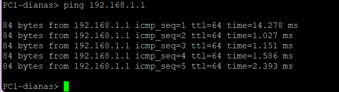

##

10. В окне Wireshark проанализируйте полученную информацию, дайте пояснения в отчёте.

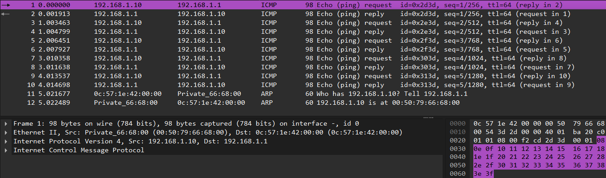

##

Источник: 192.168.1.10 (узел в локальной сети, вероятно, PC-1).

Назначение: 192.168.1.1 (IP-адрес шлюза по умолчанию для этой сети, скорее всего, интерфейс маршрутизатора).

Протокол: ICMP.

##

Информация: Видны последовательные пары "Echo request" и "Echo reply" с нарастающими порядковыми номерами (seq=1, seq=2 и т.д.). Это указывает на выполнение команды ping с интервалом примерно в 1 секунду.

Время задержки (RTT): Время между запросом и ответом крайне мало (около 0.001-0.002 секунды), что характерно для связи внутри одной локальной сети или прямого подключения к маршрутизатору.

TTL (Time to Live): Значение TTL=64 для запроса указывает на то, что исходный узел, вероятно, работает на ОС семейства Linux. Ответ от маршрутизатора также имеет TTL=64.

##

11. Остановите захват пакетов в Wireshark. Остановите все устройства в проекте.

# Моделирование простейшей сети на базе маршрутизатора VyOS в GNS3

## Постановка задачи

1. Построить в GNS3 топологию сети, состоящей из маршрутизатора VyOS, коммутатора Ethernet и оконечного устройства.
2. Задать оконечному устройству IP-адрес в сети 192.168.1.0/24.
3. Присвоить интерфейсу маршрутизатора адрес 192.168.1.1/24
4. Проверить связь.

## Порядок выполнения работы

1. Запустите GNS3 VM и GNS3. Создайте новый проект.

##

2. В рабочей области GNS3 разместите VPCS, коммутатор Ethernet и маршрутизатор VyOS 

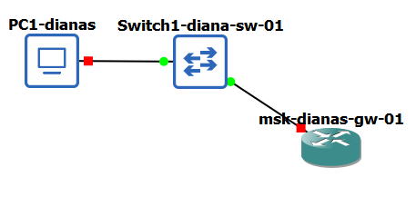

##

3. Измените отображаемые названия устройств. Коммутатору присвойте название по принципу msk-user-sw-0x, маршрутизатору — по принципу msk-user-gw-0x, VPCS — по принципу PCx-user, где вместо user укажите имя вашей учётной записи, вместо x — порядковый номер устройства.

##

4. Включите захват трафика на соединении между коммутатором и маршрутизатором.

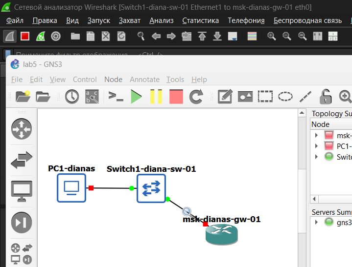

##

5. Запустите все устройства проекта. Откройте консоль всех устройств проекта.

##

6. Настройте IP-адресацию для интерфейса узла PC1:

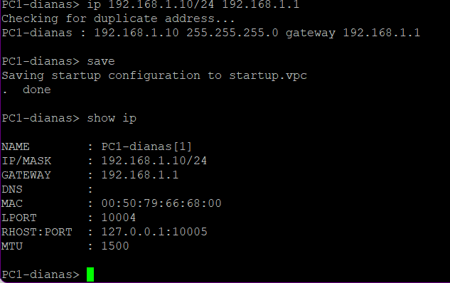

## Результаты

- Построяли простейшие моделей сети на базе коммутатора и маршрутизаторов FRR в GNS3, проаналищировали трафика посредством Wireshark.

