---
## Front matter
title: "Лабораторная работа № 6."
subtitle: "Адресация IPv4 и IPv6. Двойной стек"
author: "Диана Алексеевна Садова"

## Generic otions
lang: ru-RU
toc-title: "Содержание"

## Bibliography
bibliography: bib/cite.bib
csl: pandoc/csl/gost-r-7-0-5-2008-numeric.csl

## Pdf output format
toc: true # Table of contents
toc-depth: 2
lof: true # List of figures
lot: true # List of tables
fontsize: 12pt
linestretch: 1.5
papersize: a4
documentclass: scrreprt
## I18n polyglossia
polyglossia-lang:
  name: russian
  options:
	- spelling=modern
	- babelshorthands=true
polyglossia-otherlangs:
  name: english
## I18n babel
babel-lang: russian
babel-otherlangs: english
## Fonts
mainfont: PT Serif
romanfont: PT Serif
sansfont: PT Sans
monofont: PT Mono
mainfontoptions: Ligatures=TeX
romanfontoptions: Ligatures=TeX
sansfontoptions: Ligatures=TeX,Scale=MatchLowercase
monofontoptions: Scale=MatchLowercase,Scale=0.9
## Biblatex
biblatex: true
biblio-style: "gost-numeric"
biblatexoptions:
  - parentracker=true
  - backend=biber
  - hyperref=auto
  - language=auto
  - autolang=other*
  - citestyle=gost-numeric
## Pandoc-crossref LaTeX customization
figureTitle: "Рис."
tableTitle: "Таблица"
listingTitle: "Листинг"
lofTitle: "Список иллюстраций"
lotTitle: "Список таблиц"
lolTitle: "Листинги"
## Misc options
indent: true
header-includes:
  - \usepackage{indentfirst}
  - \usepackage{float} # keep figures where there are in the text
  - \floatplacement{figure}{H} # keep figures where there are in the text
---

# Цель работы

Изучение принципов распределения и настройки адресного пространства на устройствах сети.

# Задания для выполнения

## Разбиение сети на подсети

### Разбиение IPv4-сети на подсети

1. Задана IPv4-сеть 172.16.20.0/24. Для заданной сети определите префикс, маску, broadcast-адрес, число возможных подсетей, диапазон адресов узлов. Разбейте сеть на 3 подсети с максимально возможным числом адресов узлов 126, 62, 62 соответственно.

**Исходная сеть: 172.16.20.0/24**

*Характеристика сети*

| Параметр | Значение |
|----------|----------|
| Адрес сети | 172.16.20.0 |
| Префикс | /24 |
| Маска | 255.255.255.0 |
| Broadcast-адрес | 172.16.20.255 |
| Диапазон узлов | 172.16.20.1 – 172.16.20.254 |
| Количество узлов | 254 |
| Возможное число подсетей | 1 (без разбиения) |

*Разбиение сети на 3 подсети (VLSM)*

**Требуется:**
- 126 узлов
- 62 узла
- 62 узла

*Определение префиксов*

| Требуемые узлы | Минимальный префикс | Маска |
|----------------|---------------------|--------|
| 126 | /25 | 255.255.255.128 |
| 62 | /26 | 255.255.255.192 |
| 62 | /26 | 255.255.255.192 |

*Итоговое разбиение*

Подсеть 1 (126 узлов)

| Параметр | Значение |
|----------|----------|
| Адрес сети | 172.16.20.0/25 |
| Маска | 255.255.255.128 |
| Диапазон узлов | 172.16.20.1 – 172.16.20.126 |
| Broadcast | 172.16.20.127 |
| Число узлов | 126 |

Подсеть 2 (62 узла)

| Параметр | Значение |
|----------|----------|
| Адрес сети | 172.16.20.128/26 |
| Маска | 255.255.255.192 |
| Диапазон узлов | 172.16.20.129 – 172.16.20.190 |
| Broadcast | 172.16.20.191 |
| Чиcло узлов | 62 |

Подсеть 3 (62 узла)

| Параметр | Значение |
|----------|----------|
| Адрес сети | 172.16.20.192/26 |
| Маска | 255.255.255.192 |
| Диапазон узлов | 172.16.20.193 – 172.16.20.254 |
| Broadcast | 172.16.20.255 |
| Число узлов | 62 |

2. Задана сеть 10.10.1.64/26. Для заданной сети определите префикс, маску, broadcast-адрес, число возможных подсетей, диапазон адресов узлов. Выделите в этой сети подсеть на 30 узлов. Запишите характеристики для выделенной подсети.

**Исходная сеть: 10.10.1.64/26**

*Характеристика сети*

| Параметр | Значение |
|----------|----------|
| Адрес сети | 10.10.1.64 |
| Префикс | /26 |
| Маска | 255.255.255.192 |
| Broadcast | 10.10.1.127 |
| Диапазон узлов | 10.10.1.65 – 10.10.1.126 |
| Число узлов | 62 |
| Возможное число подсетей | 1 |

Выделение подсети на 30 узлов.Определение префикса

Для 30 узлов требуется минимум /27:

| Префикс | Маска | Узлов |
|---------|--------|--------|
| /27 | 255.255.255.224 | 30 |

**Выделенная подсеть**

| Параметр | Значение |
|----------|----------|
| Адрес сети | 10.10.1.64/27 |
| Маска | 255.255.255.224 |
| Диапазон узлов | 10.10.1.65 – 10.10.1.94 |
| Broadcast | 10.10.1.95 |
| Число узлов | 30 |

3. Задана сеть 10.10.1.0/26. Для этой сети определите префикс, маску, broadcast-адрес, число возможных подсетей, диапазон адресов узлов. Выделите в этой сети подсеть на 14 узлов. Запишите характеристики для выделенной подсети.

**Исходная сеть: 10.10.1.0/26**

*Характеристика сети*

| Параметр | Значение |
|----------|----------|
| Адрес сети | 10.10.1.0 |
| Префикс | /26 |
| Маска | 255.255.255.192 |
| Broadcast | 10.10.1.63 |
| Диапазон узлов | 10.10.1.1 – 10.10.1.62 |
| Число узлов | 62 |
| Возможное число подсетей | 1 |

Выделение подсети на 14 узлов. Определение префикса

| Префикс | Маска | Узлов |
|---------|--------|--------|
| /28 | 255.255.255.240 | 14 |

*Выделенная подсеть*

| Параметр | Значение |
|----------|----------|
| Адрес сети | 10.10.1.0/28 |
| Маска | 255.255.255.240 |
| Диапазон узлов | 10.10.1.1 – 10.10.1.14 |
| Broadcast | 10.10.1.15 |
| Число узлов | 14 |

### Разбиение IPv6-сети на подсети

Задана сеть 2001:db8:c0de::/48. Охарактеризуйте адрес, определите маску, префикс, диапазон адресов для узлов сети (краевые значения). Разбейте сеть на 2 подсети двумя способами — с использованием идентификатора подсети и с использованием идентификатора интерфейса. Поясните предложенные вами варианты разбиения.

1. Характеристика сети `2001:db8:c0de::/48`

| Параметр | Значение |
|----------|----------|
| IPv6-адрес сети | `2001:db8:c0de::/48` |
| Длина префикса | `/48` |
| Маска сети | `ffff:ffff:ffff::` |
| Формат адреса | Global Unicast |
| Идентификатор сети | `2001:db8:c0de` |
| Идентификатор интерфейса | Последние 64 бита |
| Минимальный адрес узла | `2001:db8:c0de:0000:0000:0000:0000:0000` |
| Максимальный адрес узла | `2001:db8:c0de:ffff:ffff:ffff:ffff:ffff` |

**Примечание:** В IPv6 отсутствуют широковещательные адреса, весь диапазон доступен для узлов.

2.  Разбиение на 2 подсети (способ 1 — по идентификатору подсети)

Используется 4-й хекстет (Subnet ID).
Префикс увеличивается: `/48` -> `/49`.

| Подсеть | Префикс | Диапазон адресов |
|---------|---------|-------------------|
| Подсеть 1 | `2001:db8:c0de:::/49` | `2001:db8:c0de:::` – `2001:db8:c0de:7fff:ffff:ffff::` |
| Подсеть 2 | `2001:db8:c0de:800::/49` | `2001:db8:c0de:800::` – `2001:db8:c0de:ffff:ffff:ffff::` |

3. Разбиение на 2 подсети (способ 2 — по идентификатору интерфейса)

Разделение производится в последних 64 битах (Interface ID).

| Подсеть | Префикс | Диапазон адресов |
|---------|---------|-------------------|
| Подсеть 1 | `2001:db8:c0de::/65` | `2001:db8:c0de::` `2001:db8:c0de:0:7fff:ffff::` |
| Подсеть 2 | `2001:db8:c0de:0:800::/65` | `2001:db8:c0de:0:800::` `2001:db8:c0de:ffff:ffff::` |

*Метод теоретически возможен, но практически не используется, так как нарушает принципы иерархической маршрутизации IPv6.*

Задана сеть 2a02:6b8::/64. Охарактеризуйте адрес, определите маску, префикс, диапазон адресов для узлов сети (краевые значения). Разбейте сеть на 2 подсети двумя способами — с использованием идентификатора подсети и с использованием идентификатора интерфейса. Поясните предложенные вами варианты разбиения.

1. Сеть Характеристика сети `2a02:6b8::/64`

| Параметр | Значение |
|----------|----------|
| IPv6-адрес сети | `2a02:6b8::/64` |
| Длина префикса | `/64` |
| Маска сети | `ffff:ffff:ffff:ffff::` |
| Тип адреса | Global Unicast |
| Идентификатор сети | `2a02:6b8:0:0` |
| Идентификатор интерфейса | Последние 64 бита |
| Минимальный адрес узла | `2a02:6b8::` |
| Максимальный адрес узла | `2a02:6b8:0:0:ffff:ffff:ffff:ffff` |

2. Разбиение на 2 подсети (способ 1 — по идентификатору подсети)

Разбиение выполняется за счёт расширения префикса: `/64` -> `/65`.

| Подсеть | Префикс | Диапазон адресов |
|---------|---------|-------------------|
| Подсеть 1 | `2a02:6b8::/65` | `2a02:6b8::` - `2a02:6b8:0:0:7fff:ffff::` |
| Подсеть 2 | `2a02:6b8:0:0:800::/65` | `2a02:6b8:0:0:800::` – `2a02:6b8:0:0:ffff:ffff::` |

3. Разбиение на 2 подсети (способ 2 — по идентификатору интерфейса)

Используется деление Interface ID.

| Подсеть | Префикс | Диапазон адресов |
|---------|---------|-------------------|
| Подсеть 1 | 2a02:6b8::/65 | `2a02:6b8::` – `2a02:6b8:0:0:7fff:ffff::` |
| Подсеть 2 | `2a02:6b8:0:0:800::/65` | `2a02:6b8:0:0:800::` – `2a02:6b8:0:0:ffff:ffff::` |

## Настройка двойного стека адресации IPv4 и IPv6 в локальной сети

### Постановка задачи

Задана топология сети с двумя локальными подсетями. Для первой подсети выделено адресное пространство c адресами IPv4, для второй - адресное пространство с адресами IPv6 

Требуется:

- реализовать топологию сети в GNS3;
- настроить IPv4-адресацию на устройствах первой подсети и проверить подключение между устройствами этой подсети;
- настроить IPv6-адресацию на устройствах второй подсети и проверить подключение между устройствами этой подсети;
- проанализировать захваченный на соединении сервера двойного стека адресации с коммутатором трафик ARP, ICMP, ICMPv6.

### Порядок выполнения работы

1. Запустите GNS3 VM и GNS3. Создайте новый проект.(рис. [-@fig:001])

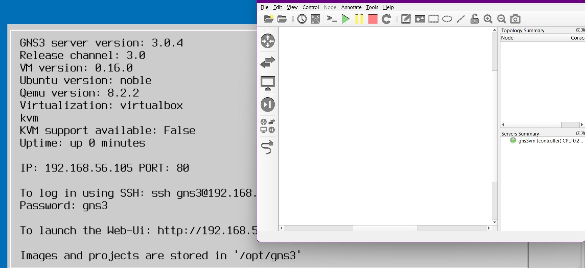{#fig:001 width=90%}

2. В рабочем пространстве разместите и соедините устройства в соответствии с топологией. Для подсети IPv4 используйте маршрутизатор FRR, а для подсети с IPv6 — маршрутизатор VyOS.

3. Измените отображаемые названия устройств. Коммутаторам присвойте названия по принципу msk-user-sw-0x, маршрутизаторам — по принципу msk-user-gw-0x, VPCS — по принципу PCx-user, где вместо user укажите имя вашей учётной записи, вместо x — порядковый номер устройства.(рис. [-@fig:002])

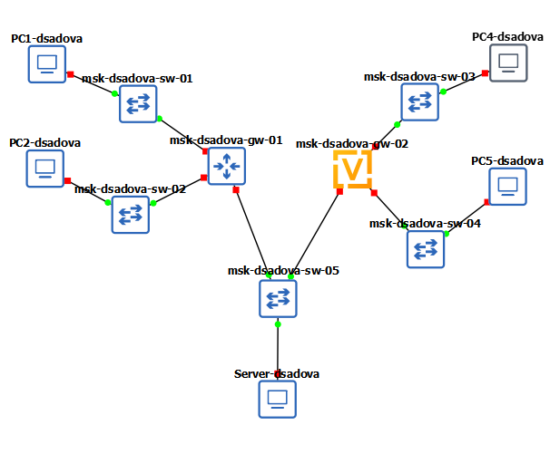{#fig:002 width=90%}

4. Включите захват трафика на соединении между сервером двойного стека адресации и ближайшим к нему коммутатором.

5. Руководствуясь табл. 6.6, настройте IPv4-адресацию для интерфейсов узлов PC1, PC2, Server:(рис. [-@fig:003]),(рис. [-@fig:004]),(рис. [-@fig:005])

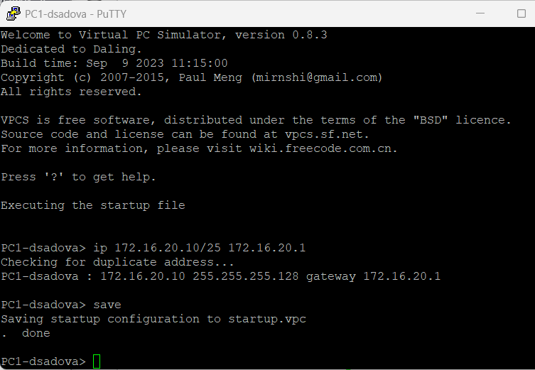{#fig:003 width=90%}

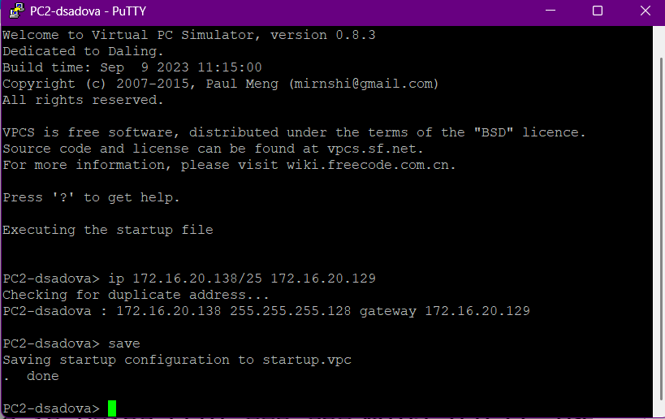{#fig:004 width=90%}

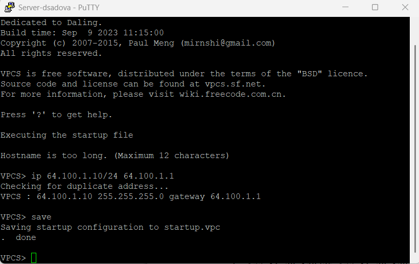{#fig:005 width=90%}

– Посмотрите на PC1 и PC2 конфигурацию IPv4 и IPv6

6. Руководствуясь табл. 6.6, настройте IPv4-адресацию для интерфейсов локальной сети маршрутизатора FRR msk-user-gw-01:(рис. [-@fig:008])

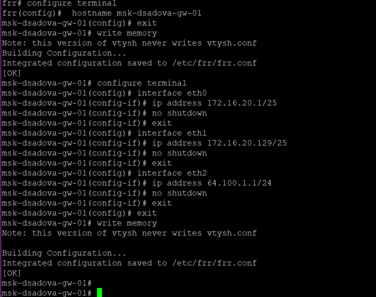{#fig:008 width=90%}

7. Проверьте конфигурацию маршрутизатора и настройки IPv4-адресации:(рис. [-@fig:009]),(рис. [-@fig:010])

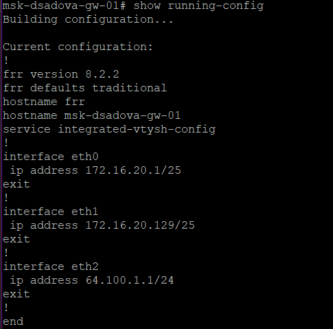{#fig:009 width=90%}

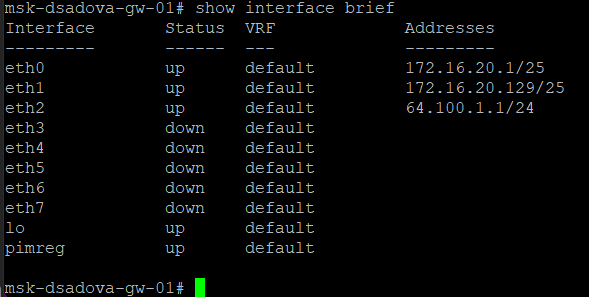{#fig:010 width=90%}

8. Проверьте подключение с помощью команд ping и trace. Узлы PC1 и PC2 должны успешно отправлять эхо-запросы друг другу и на сервер с двойным стеком (Dual Stack Server).(рис. [-@fig:011]),(рис. [-@fig:012])

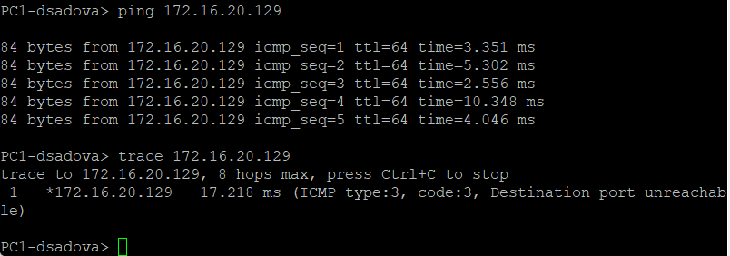{#fig:011 width=90%}

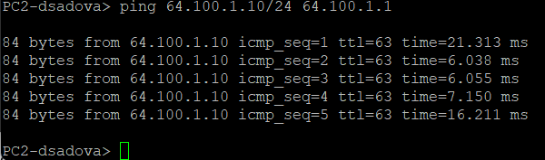{#fig:012 width=90%}

9. Руководствуясь табл. 6.6, настройте IPv6-адресацию для интерфейсов узлов PC5, PC4, Server:

– PC4:(рис. [-@fig:013])

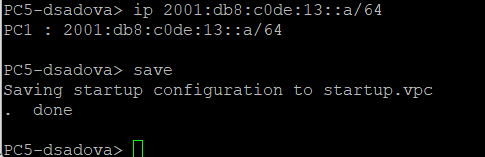{#fig:013 width=90%}

– PC5:(рис. [-@fig:014])

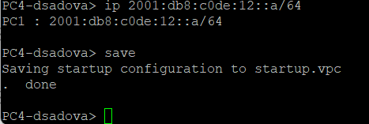{#fig:014 width=90%}

– Server:(рис. [-@fig:015])

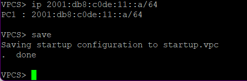{#fig:015 width=90%}

10. Посмотрите на PC5 и PC4 конфигурацию IPv4 и IPv6:(рис. [-@fig:016]),(рис. [-@fig:017]),(рис. [-@fig:018])

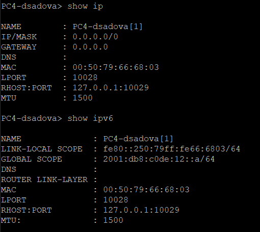{#fig:016 width=90%}

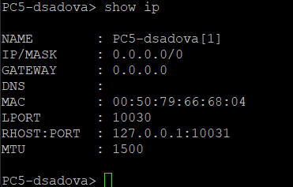{#fig:017 width=90%}

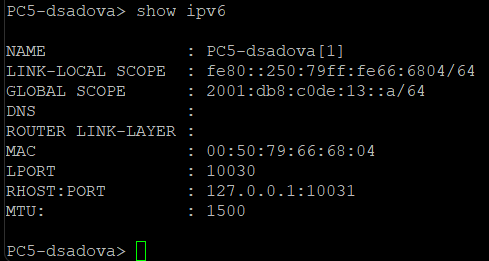{#fig:018 width=90%}

11. Руководствуясь табл. 6.6, настройте IPv6-адресацию для интерфейсов локальной сети маршрутизатора VyOS msk-user-gw-02:

– Перейдите в режим конфигурирования, измените имя устройства:(рис. [-@fig:019])

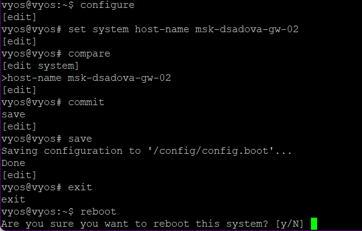{#fig:019 width=90%}

– Назначьте IPv6-адреса маршрутизатору msk-user-gw-02:(рис. [-@fig:020]),(рис. [-@fig:021])

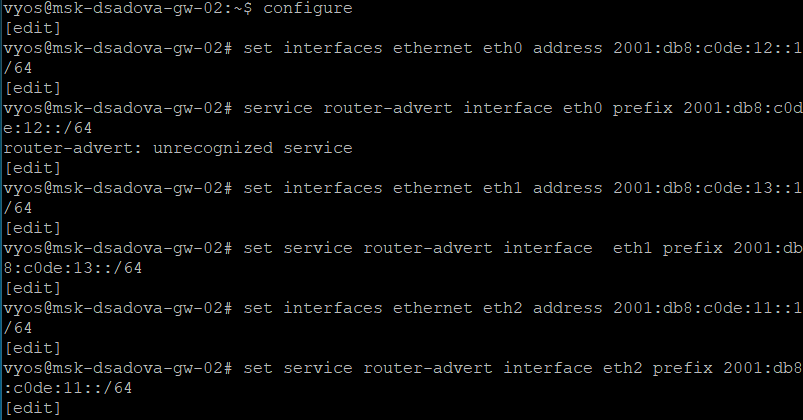{#fig:020 width=90%}

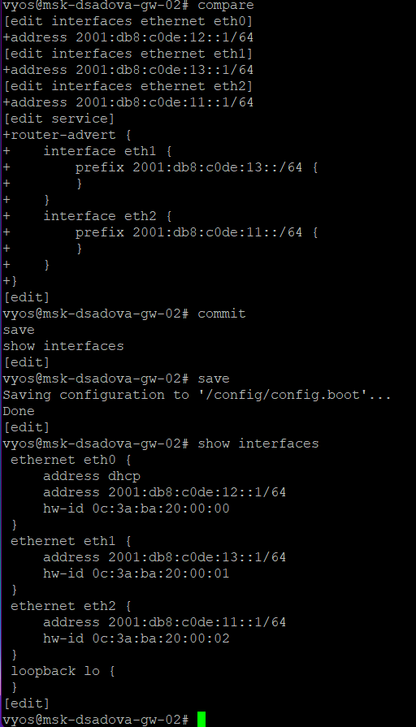{#fig:021 width=90%}

12. Проверьте подключение с помощью команд ping и trace. Проверяем узел PC5, он должн успешно отправлять эхо-запросы друг другу и на сервер с двойным стеком (Dual Stack Server).(рис. [-@fig:022])

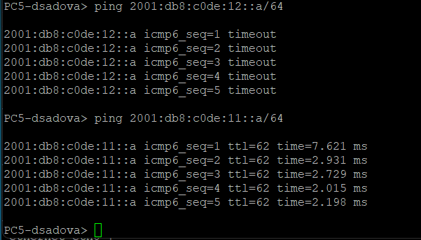{#fig:022 width=90%}

13. Убедитесь, что устройства из подсети IPv4 не доступны для устройств из подсети IPv6 и наоборот. Только сервер двойного стека может обращаться к устройствам обеих подсетей.(рис. [-@fig:024]),(рис. [-@fig:025]),(рис. [-@fig:026]),(рис. [-@fig:027])

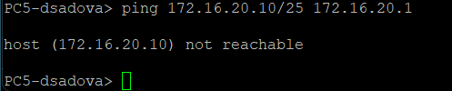{#fig:024 width=90%}

С PC5 пытаемся передать покеты к PC1. Покеты не передаются. Все работает коректно.

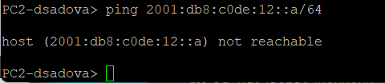{#fig:025 width=90%}

С PC2 пытаемся передать покеты к PC4. Покеты не передаются. Все работает коректно.

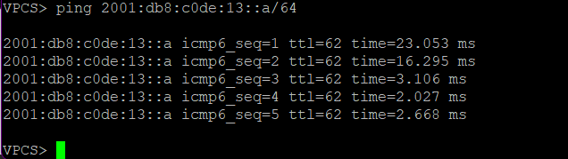{#fig:026 width=90%}

Покеты успешно передались.

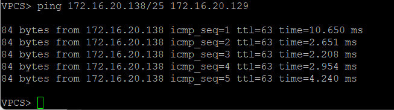{#fig:027 width=90%}

Покеты успешно передались.

14. Посмотрите захваченный на соединении сервера двойного стека адресации с коммутатором трафик ARP, ICMP, ICMPv6. В отчёте поясните, какую информацию можно извлечь из перехваченных пакетов.(рис. [-@fig:028]),(рис. [-@fig:029]),(рис. [-@fig:030])

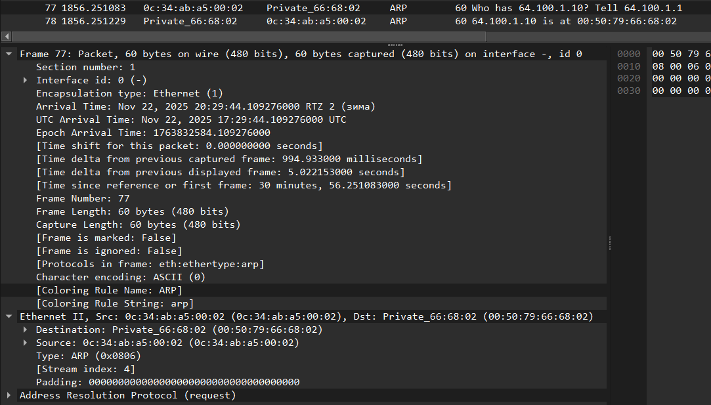{#fig:028 width=90%}

Источник: 64.109.1.10 (PC2)

Назначение:  172.16.20.138 (Server)

Запрос (Echo request) и ответ (Echo reply) проходят успешно, но дальше он не проходят.

IPv4-маршрутизация работает корректно, сервер доступен по IPv4.

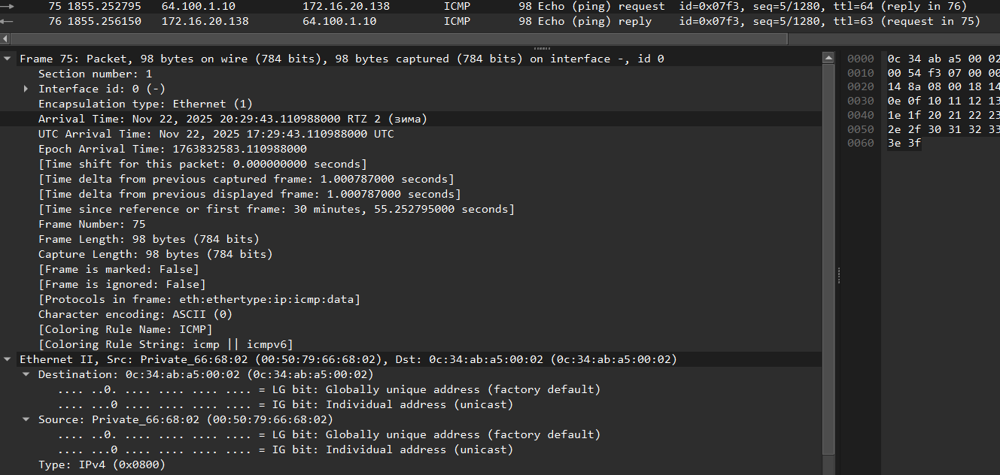{#fig:029 width=90%}

Источник: 2001:db8:c0de:11::a (PC5)
Назначение: 2001:db8:c0de:13::a (Server)

Запрос (Echo request) и ответ (Echo reply) проходят успешно, но дальше он не проходят.

IPv6-маршрутизация работает корректно, сервер доступен по IPv6.

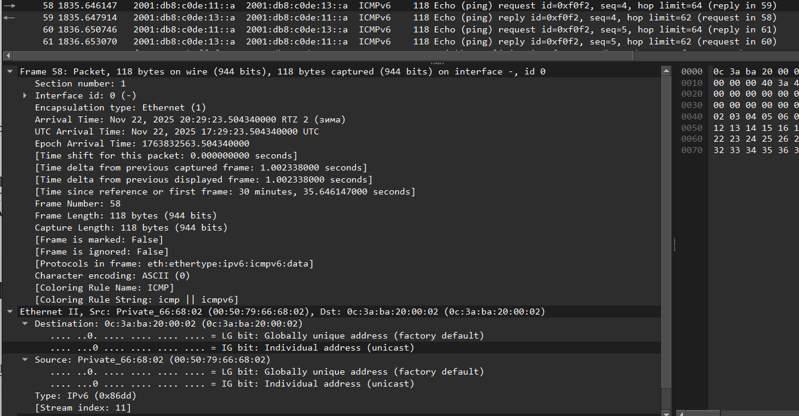{#fig:030 width=90%}

## Задание для самостоятельного выполнения

Задана топология сети.(рис. [-@fig:031])

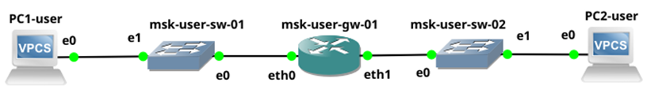{#fig:031 width=90%}

Предполагается, что маршрутизатор разбивает сеть на две подсети с адресами
IPv4 и IPv6:
– подсеть 1: 10.10.1.96/27; 2001:DB8:1:1::/64;
– подсеть 2: 10.10.1.16/28; 2001:DB8:1:4::/64.

Требуется:
1. Охарактеризовать подсети, указать, какие адреса в них входят.

*Подсеть 1*

1. IPv4: 10.10.1.96/27

| Параметр | Значение |
|----------|----------|
| Адрес сети | 10.10.1.96 |
| Маска | 255.255.255.224 |
| Префикс | /27 |
| Первый адрес узла | 10.10.1.97 |
| Последний адрес узла | 10.10.1.126 |
| Broadcast | 10.10.1.127 |
| Количество узлов | 30 |

2. IPv6: 2001:DB8:1:1::/64

| Параметр | Значение |
|----------|----------|
| Адрес сети | 2001:DB8:1:1:: |
| Префикс | /64 |
| Минимальный адрес | 2001:DB8:1:1:: |
| Максимальный адрес | 2001:DB8:1:1:ffff:ffff:ffff:ffff |

*Подсеть 2*

1. IPv4: 10.10.1.16/28

| Параметр | Значение |
|----------|----------|
| Адрес сети | 10.10.1.16 |
| Маска | 255.255.255.240 |
| Префикс | /28 |
| Первый адрес узла | 10.10.1.17 |
| Последний адрес узла | 10.10.1.30 |
| Broadcast | 10.10.1.31 |
| Количество узлов | 14 |

2. IPv6: 2001:DB8:1:4::/64

| Параметр | Значение |
|----------|----------|
| Адрес сети | 2001:DB8:1:4:: |
| Префикс | /64 |
| Минимальный адрес | 2001:DB8:1:4:: |
| Максимальный адрес | 2001:DB8:1:4:ffff:ffff:ffff:ffff |

2. Предложить вариант таблицы адресации для заданной топологии и адресного пространства, причём для интерфейсов маршрутизатора выбрать наименьший адрес в подсети.

*Таблица адресации*

| Устройство | Интерфейс | IPv4 | IPv6 |
|------------|-----------|------|------|
| Router | eth0 | 10.10.1.97/27 | 2001:DB8:1:1::1/64 |
| Router | eth1 | 10.10.1.17/28 | 2001:DB8:1:4::1/64 |
| PC1 | eth0 | 10.10.1.98/27 | 2001:DB8:1:1::10/64 |
| PC2 | eth0 | 10.10.1.18/28 | 2001:DB8:1:4::10/64 |

3. Настроить IP-адресацию на маршрутизаторе VyOS и оконечных устройствах, причём на интерфейсах маршрутизатора установить наименьший адрес в подсети. 

4. Проверить подключение между устройствами подсети с помощью команд ping и trace.

# Выводы

Изучили принципы распределения и настройки адресного пространства на устройствах сети.

# Список литературы{.unnumbered}

::: {#refs}
:::
