---
## Front matter
lang: ru-RU
title: Лабораторная работа № 7.
subtitle: Адресация IPv4 и IPv6. Настройка DHCP
author:
  - Cадова Д. А.
institute:
  - Российский университет дружбы народов, Москва, Россия

## i18n babel
babel-lang: russian
babel-otherlangs: english
## Fonts
mainfont: PT Serif
romanfont: PT Serif
sansfont: PT Sans
monofont: PT Mono
mainfontoptions: Ligatures=TeX
romanfontoptions: Ligatures=TeX
sansfontoptions: Ligatures=TeX,Scale=MatchLowercase
monofontoptions: Scale=MatchLowercase,Scale=0.9

## Formatting pdf
toc: false
toc-title: Содержание
slide_level: 2
aspectratio: 169
section-titles: true
theme: metropolis
header-includes:
 - \metroset{progressbar=frametitle,sectionpage=progressbar,numbering=fraction}
 - '\makeatletter'
 - '\beamer@ignorenonframefalse'
 - '\makeatother'
---

# Информация

## Докладчик

:::::::::::::: {.columns align=center}
::: {.column width="70%"}

  * Садова Диана Алексеевна
  * студент бакалавриата
  * Российский университет дружбы народов
  * [113229118@pfur.ru]
  * <https://DianaSadova.github.io/ru/>

:::
::::::::::::::

# Вводная часть

## Актуальность

- Важно получить опыт с работой с адресами IPv4 и IPv6 и особености настройки службы DHCP с разными топологиями.

## Цели и задачи

- Получение навыков настройки службы DHCP на сетевом оборудовании для распределения адресов IPv4 и IPv6.

## Материалы и методы

- Текст лабороторной работы № 7
- Интернет для исправления ошибок 

# Настройка DHCP в случае IPv4

## Постановка задачи

Задана топология сети и сведения по адресному пространству сети

Требуется настроить на маршрутизаторе, имеющим адрес 10.0.0.1, DHCP-сервис по распределению IPv4-адресов из диапазона 10.0.0.2 – 10.0.0.253, настроить получение адреса по DHCP на узле (PC), а также исследовать пакеты DHCP.

## Порядок выполнения работы

1. Запустите GNS3 VM и GNS3. Создайте новый проект.

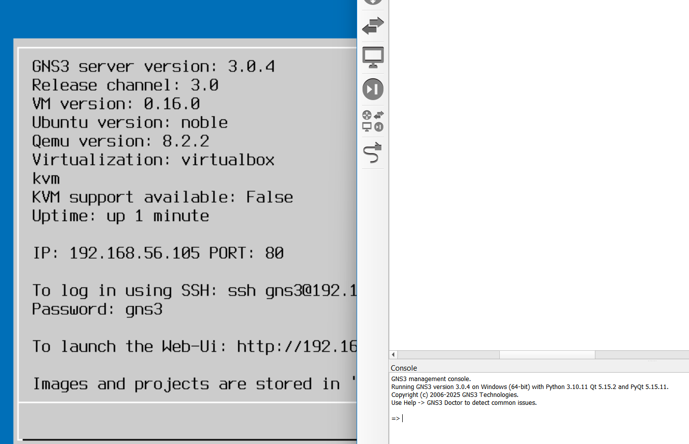

##

2. В рабочем пространстве разместите и соедините устройства в соответствии с топологией, приведённой на рис. 7.1. Используйте маршрутизатор VyOS и хост (клиент) VPCS.

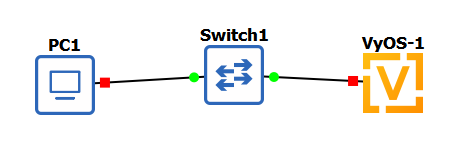

##

3. Измените отображаемые названия устройств. Коммутаторам присвойте названия по принципу username-sw-0x, маршрутизаторам — по принципу username-gw-0x, VPCS — по принципу PCx-username, где вместо username укажите имя вашей учётной записи, вместо x — порядковый номер устройства.

##

4. Включите захват трафика на соединении между коммутатором sw-01 и маршрутизатором gw-01.

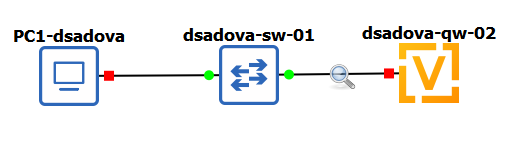

##

5. Настройте образ VyOS (для входа в систему используйте логин vyos и пароль vyos):

На маршрутизаторах перейдите в режим конфигурирования, измените имя устройства и доменное имя, замените системного пользователя, заданного по умолчанию, на вашего пользователя (вместо username укажите имя вашей учётной записи, вместо <mysecurepassword> — пароль для доступа к устройству, например 123456 или любой другой): 

##

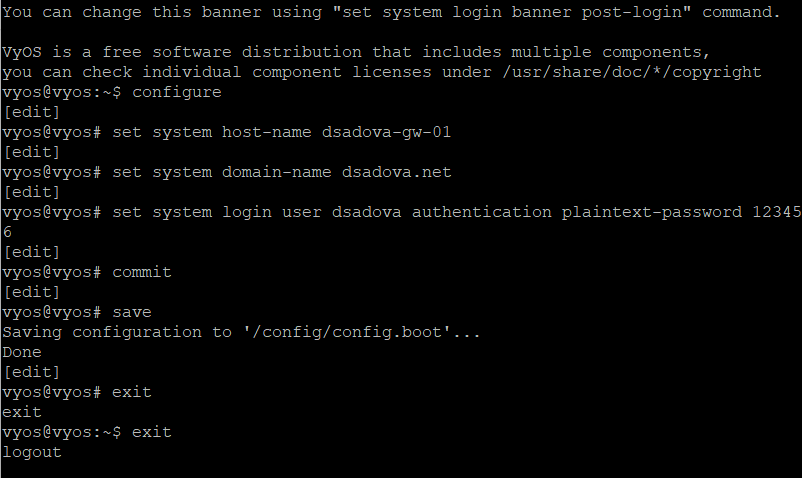

##

6. На маршрутизаторе под созданным пользователем перейдите в режим конфигурирования и настройте адресацию IPv4:

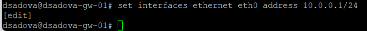

##

7. Добавьте конфигурацию DHCP-сервера на маршрутизаторе: 

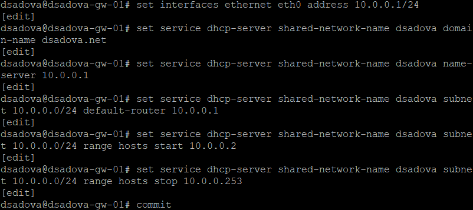

##

8. Для просмотра статистики DHCP-сервера и выданных адресов используйте команды:

##

9. Настройте оконечное устройство PC1:

##

##

10. Проверьте конфигурацию IPv4 на узле, пропингуйте маршрутизатор:

##

11. На маршрутизаторе вновь посмотрите статистику DHCP-сервера и выданные адреса, в отчёте поясните полученную информацию:

##

На фотографии 1-я команда:

- Pool: dsadova

- Size: 252 адреса – общее количество IP-адресов в пуле.

- Leases: 1 – количество выданных в данный момент адресов (активных аренд).

- Available: 251 – количество свободных адресов в пуле.

- Usage: 0% – процент использования пула (1 из 252 ≈ 0,4%, округлено до 0%).

##

На фотографии 2-я команда:

- IP address: 10.0.0.2

- Hardware address (MAC): 00:50:79:66:68:00

- State: active – аренда активна.

- Lease start: 2025/12/06 10:38:28 – время начала аренды.

##

- Lease expiration: 2025/12/07 10:38:28 – время окончания аренды (срок – 24 часа).

- Remaining: 23:58:23 – оставшееся время аренды (почти полные сутки).

- Pool: dsadova – имя пула, из которого выдан адрес.

- Hostname: PCI-dsadova – имя хоста, полученное от клиента DHCP.

##

12. На маршрутизаторе посмотрите журнал работы DHCP-сервера:

##

# Настройка DHCP в случае IPv6

## Постановка задачи

Задана топология сети и сведения по адресному пространству.

Требуется:
- на интерфейсе марштрутизатора eth1 настроить DHCPv6 без отслеживания состояния;
- на интерфейсе марштрутизатора eth2 настроить DHCPv6 с учётом отслеживания состояния.

## Порядок выполнения работы

1. В предыдущем проекте в рабочем пространстве дополните сеть, разместив и соединив устройства в соответствии с топологией. Используйте хост (клиент) Kali Linux CLI (добавьте образ Kali Linux CLI в перечень устройств в GNS3), поскольку клиент VPCS не поддерживает DHCPv6.

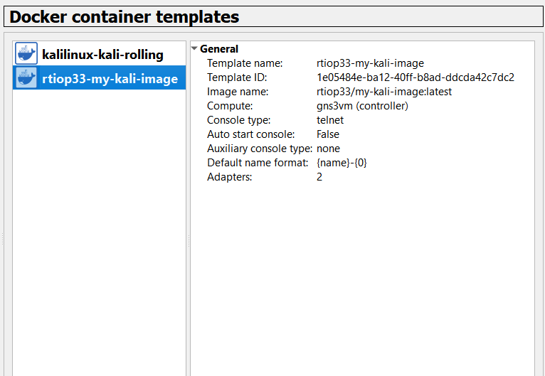

##

2. Измените отображаемые названия устройств. Коммутаторам присвойте названия по принципу username-sw-0x, маршрутизаторам — по принципу username-gw-0x, VPCS — по принципу PCx-username, где вместо username укажите имя вашей учётной записи, вместо x — порядковый номер устройства.

##

##

3. Включите захват трафика на соединениях между маршрутизатором gw-01 и коммутаторами sw-02 и sw-03.

##

4. Настройте адресацию IPv6 на маршрутизаторе:

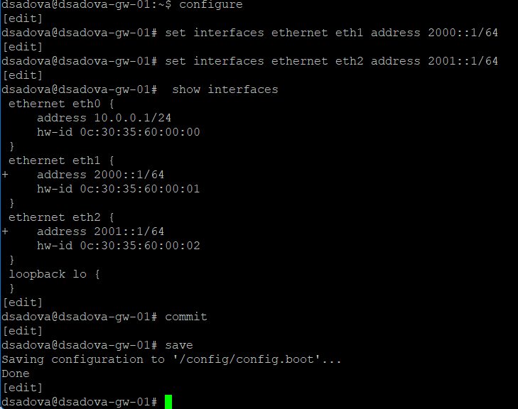

##

5. На маршрутизаторе настройте DHCPv6 без отслеживания состояния (DHCPv6 Stateless configuration):

- Настройка объявления о маршрутизаторах (Router Advertisements, RA) на интерфейсе eth1:

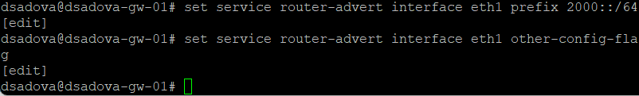

##

- Добавление конфигурации DHCP-сервера:

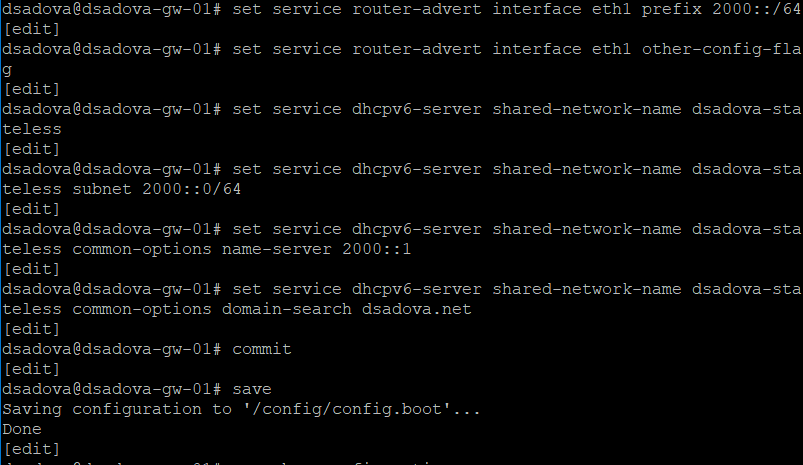

##

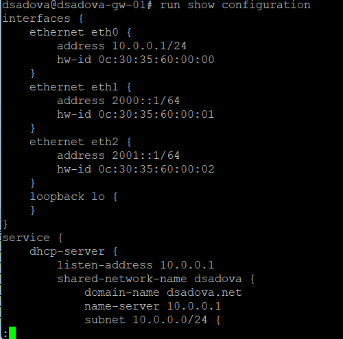

##

6. На узле PC2 проверьте настройки сети:

##

##

7. На узле PC2 пропингуйте маршрутизатор:

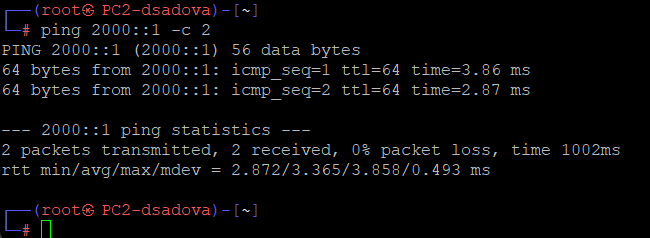

##

8. На узле PC2 проверьте настройки DNS.

9. На узле PC2 получите адрес по DHCPv6:

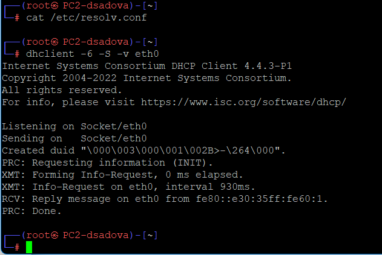

##

10. Вновь пропингуйте от узла PC2 маршрутизатор, проверьте настройки DNS:

##

11. На маршрутизаторе посмотрите статистику DHCP-сервера и выданные адреса

##

12. В отчёте поясните выведенную на маршрутизаторе и PC2 информацию, а также проанализируйте захваченные анализатором трафика пакеты, относящиеся к работе DHCPv6 и назначению адреса устройству.

##

PC2 успешно отправил покеты. PC2 имеет работающий IPv6-адрес в сети 2000::/64, маршрут до шлюза 2000::1 настроен корректно. Эхо-запрос это подтверждает. Пакеты 16-17: Ping с PC2 (2000::42:3eff:fe2d:b400) на шлюз (2000::1). Успешный обмен подтверждает связность.

У нас не выводит информацию об этих покетах при запросе у DHCP-сервера, так как в режиме Stateless DHCPv6 сервер не выдаёт адреса, а только предоставляет опции (DNS, домен и т.д.). Следовательно, таблица аренд (leases) пуста, что является ожидаемым и корректным поведением.

##

13. На маршрутизаторе настройте DHCPv6 с отслеживанием состояния (DHCPv6 Stateful configuration):

- На интерфейсе eth2 маршрутизатора настройте объявления о маршрутизаторах (Router Advertisements, RA):

##

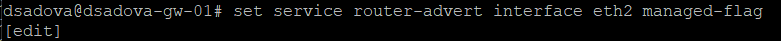

##

- Добавьте конфигурацию DHCP-сервера на маршрутизаторе:

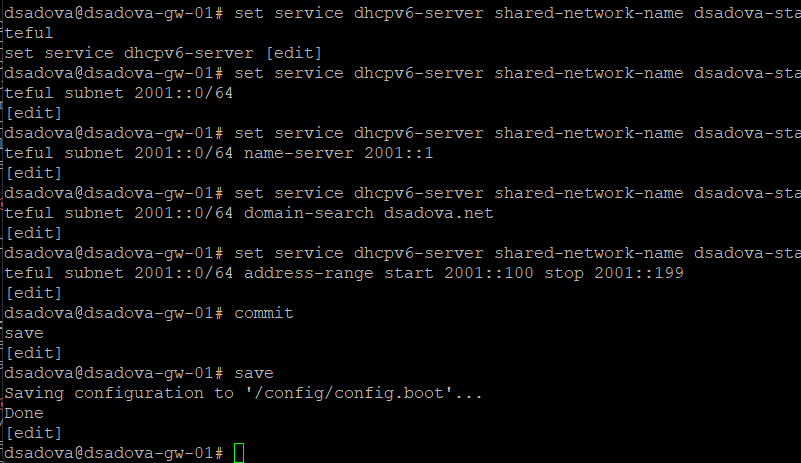

##

14. На маршрутизаторе посмотрите статистику DHCP-сервера и выданные адреса:

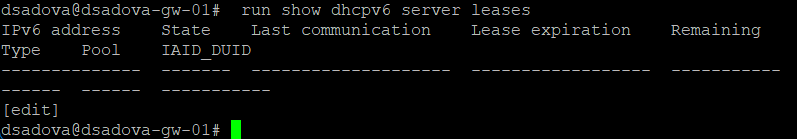

##

15. Подключитесь к узлу PC3 и проверьте настройки сети:

##

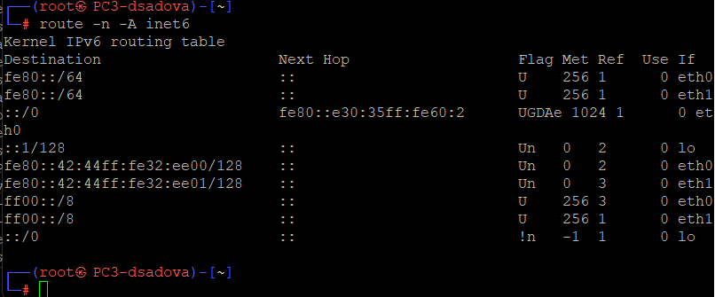

##

16. На узле PC3 проверьте настройки DNS:

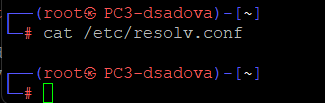

##

17. На узле PC3 получите адрес по DHCPv6:

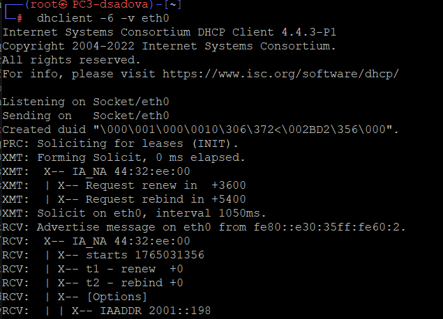

##

18. Вновь на узле PC3 проверьте настройки сети, пропингуйте маршрутизатор, проверьте настройки DNS:

##

##

19. На маршрутизаторе посмотрите статистику DHCP-сервера и выданные адреса:

##

20. В отчёте поясните выведенную на маршрутизаторе и PC3 информацию, а также проанализируйте захваченные анализатором трафика пакеты, относящиеся к работе DHCPv6 и назначению адреса устройству.

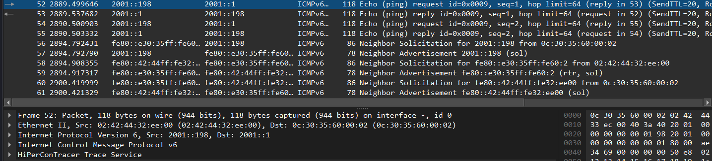

##

PC3 имеет работоспособный IPv6-адрес 2001::198 (подтверждается захватом трафика), маршрут до шлюза 2001::1 настроен. Пакеты 52-53 и 54-55: Ping с PC3 (2001::198) на шлюз (2001::1) подтверждают успешный обмен.

Пакеты Neighbor Solicitation и Advertisement для 2001::198. Маршрутизатор (fe80::e30:35ff:fe60:2) разрешает MAC-адрес PC3 для 2001::198. В результате PC3 отвечает своим MAC (02:42:44:32:e0:00).

При проверке статистики DHCP-сервера мы видим ответ характерный для нашей настройки DHCPv6 с отслеживанием состояния и сервер успешно выдал адрес 2001::198 клиенту PC3 и отслеживает состояние аренды.

##

- Адрес клиента: 2001::198 

- Состояние: active — аренда активна.

- Время аренды: С 14:15:41 до 16:20:41 

- Тип аренды: non-temporary 

- Пул: dsadova-stateful 

## Результаты

- Получили навыки настройки службы DHCP на сетевом оборудовании для распределения адресов IPv4 и IPv6. Познакомились с способом добавления и настройки хоста Kali Linux CLI.

