---
## Front matter
title: "Лабораторная работа № 7."
subtitle: "Адресация IPv4 и IPv6. Настройка DHCP"
author: "Диана Алексеевна Садова"

## Generic otions
lang: ru-RU
toc-title: "Содержание"

## Bibliography
bibliography: bib/cite.bib
csl: pandoc/csl/gost-r-7-0-5-2008-numeric.csl

## Pdf output format
toc: true # Table of contents
toc-depth: 2
lof: true # List of figures
lot: true # List of tables
fontsize: 12pt
linestretch: 1.5
papersize: a4
documentclass: scrreprt
## I18n polyglossia
polyglossia-lang:
  name: russian
  options:
	- spelling=modern
	- babelshorthands=true
polyglossia-otherlangs:
  name: english
## I18n babel
babel-lang: russian
babel-otherlangs: english
## Fonts
mainfont: PT Serif
romanfont: PT Serif
sansfont: PT Sans
monofont: PT Mono
mainfontoptions: Ligatures=TeX
romanfontoptions: Ligatures=TeX
sansfontoptions: Ligatures=TeX,Scale=MatchLowercase
monofontoptions: Scale=MatchLowercase,Scale=0.9
## Biblatex
biblatex: true
biblio-style: "gost-numeric"
biblatexoptions:
  - parentracker=true
  - backend=biber
  - hyperref=auto
  - language=auto
  - autolang=other*
  - citestyle=gost-numeric
## Pandoc-crossref LaTeX customization
figureTitle: "Рис."
tableTitle: "Таблица"
listingTitle: "Листинг"
lofTitle: "Список иллюстраций"
lotTitle: "Список таблиц"
lolTitle: "Листинги"
## Misc options
indent: true
header-includes:
  - \usepackage{indentfirst}
  - \usepackage{float} # keep figures where there are in the text
  - \floatplacement{figure}{H} # keep figures where there are in the text
---

# Цель работы

Получение навыков настройки службы DHCP на сетевом оборудовании для распределения адресов IPv4 и IPv6.

## Настройка DHCP в случае IPv4

### Постановка задачи

Задана топология сети и сведения по адресному пространству сети

Требуется настроить на маршрутизаторе, имеющим адрес 10.0.0.1, DHCP-сервис по распределению IPv4-адресов из диапазона 10.0.0.2 – 10.0.0.253, настроить получение адреса по DHCP на узле (PC), а также исследовать пакеты DHCP.

### Порядок выполнения работы

1. Запустите GNS3 VM и GNS3. Создайте новый проект.(рис. [-@fig:001])

{#fig:001 width=90%}

2. В рабочем пространстве разместите и соедините устройства в соответствии с топологией, приведённой на рис. 7.1. Используйте маршрутизатор VyOS и хост (клиент) VPCS.(рис. [-@fig:002])

{#fig:002 width=90%}

3. Измените отображаемые названия устройств. Коммутаторам присвойте названия по принципу username-sw-0x, маршрутизаторам — по принципу username-gw-0x, VPCS — по принципу PCx-username, где вместо username укажите имя вашей учётной записи, вместо x — порядковый номер устройства.(рис. [-@fig:003])

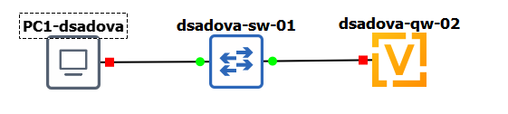{#fig:003 width=90%}

4. Включите захват трафика на соединении между коммутатором sw-01 и маршрутизатором gw-01.(рис. [-@fig:004])

{#fig:004 width=90%}

5. Настройте образ VyOS (для входа в систему используйте логин vyos и пароль vyos):

На маршрутизаторах перейдите в режим конфигурирования, измените имя устройства и доменное имя, замените системного пользователя, заданного по умолчанию, на вашего пользователя (вместо username укажите имя вашей учётной записи, вместо <mysecurepassword> — пароль для доступа к устройству, например 123456 или любой другой): (рис. [-@fig:005]),(рис. [-@fig:006])

{#fig:005 width=90%}

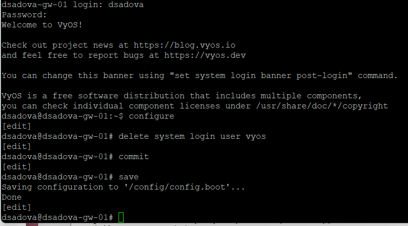{#fig:006 width=90%}

6. На маршрутизаторе под созданным пользователем перейдите в режим конфигурирования и настройте адресацию IPv4:(рис. [-@fig:007])

{#fig:007 width=90%}

7. Добавьте конфигурацию DHCP-сервера на маршрутизаторе: (рис. [-@fig:008])

{#fig:008 width=90%}

8. Для просмотра статистики DHCP-сервера и выданных адресов используйте команды:(рис. [-@fig:009])

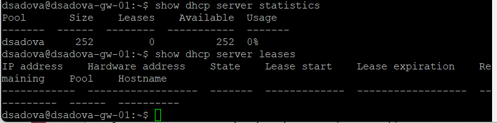{#fig:009 width=90%}

9. Настройте оконечное устройство PC1:(рис. [-@fig:010]),(рис. [-@fig:011])

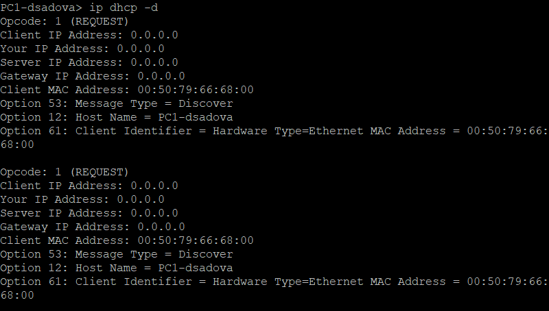{#fig:010 width=90%}

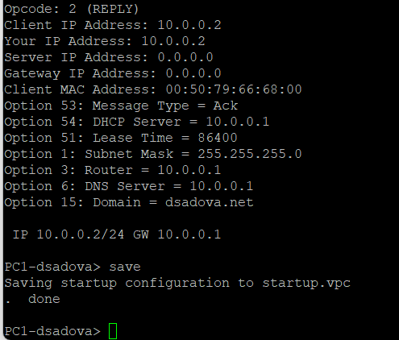{#fig:011 width=90%}

10. Проверьте конфигурацию IPv4 на узле, пропингуйте маршрутизатор:(рис. [-@fig:012])

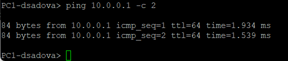{#fig:012 width=90%}

11. На маршрутизаторе вновь посмотрите статистику DHCP-сервера и выданные адреса, в отчёте поясните полученную информацию:(рис. [-@fig:013])

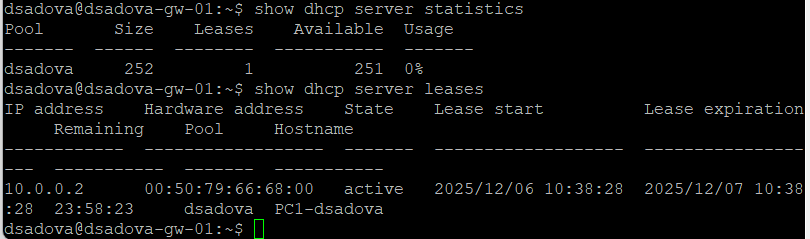{#fig:013 width=90%}

На фотографии 1-я команда:

- Pool: dsadova

- Size: 252 адреса – общее количество IP-адресов в пуле.

- Leases: 1 – количество выданных в данный момент адресов (активных аренд).

- Available: 251 – количество свободных адресов в пуле.

- Usage: 0% – процент использования пула (1 из 252 ≈ 0,4%, округлено до 0%).

На фотографии 2-я команда:

- IP address: 10.0.0.2

- Hardware address (MAC): 00:50:79:66:68:00

- State: active – аренда активна.

- Lease start: 2025/12/06 10:38:28 – время начала аренды.

- Lease expiration: 2025/12/07 10:38:28 – время окончания аренды (срок – 24 часа).

- Remaining: 23:58:23 – оставшееся время аренды (почти полные сутки).

- Pool: dsadova – имя пула, из которого выдан адрес.

- Hostname: PCI-dsadova – имя хоста, полученное от клиента DHCP.

12. На маршрутизаторе посмотрите журнал работы DHCP-сервера:(рис. [-@fig:014]),(рис. [-@fig:015])

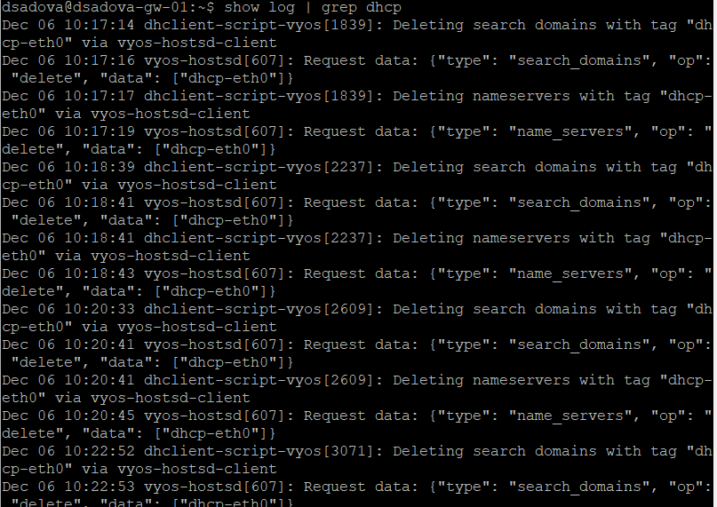{#fig:014 width=90%}

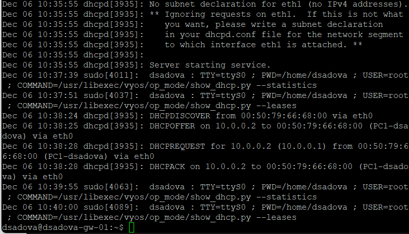{#fig:015 width=90%}

## Настройка DHCP в случае IPv6

### Постановка задачи

Задана топология сети и сведения по адресному пространству.

Требуется:
- на интерфейсе марштрутизатора eth1 настроить DHCPv6 без отслеживания состояния;
- на интерфейсе марштрутизатора eth2 настроить DHCPv6 с учётом отслеживания состояния.

### Порядок выполнения работы

1. В предыдущем проекте в рабочем пространстве дополните сеть, разместив и соединив устройства в соответствии с топологией. Используйте хост (клиент) Kali Linux CLI (добавьте образ Kali Linux CLI в перечень устройств в GNS3), поскольку клиент VPCS не поддерживает DHCPv6.(рис. [-@fig:100])

{#fig:100 width=90%}

Перед началом работы, нам небходимо было установить хост Kali Linux CLI. В системе GNS3 перейти в preferences, далее ищем Docker и выбераем New. Вводим команду для загрузки последней версии с покетами (возможно и использование других команд, но у меня получилось установить Kali Linux с важными для работы покетами, только с ней) rtiop33/my-kali-image:latest. Далее выбираем следующие настройки:

- Adapters: 2 

- Console type: telnet

- Auto start console: False

Сохранить настройки. 

2. Измените отображаемые названия устройств. Коммутаторам присвойте названия по принципу username-sw-0x, маршрутизаторам — по принципу username-gw-0x, VPCS — по принципу PCx-username, где вместо username укажите имя вашей учётной записи, вместо x — порядковый номер устройства.(рис. [-@fig:016])

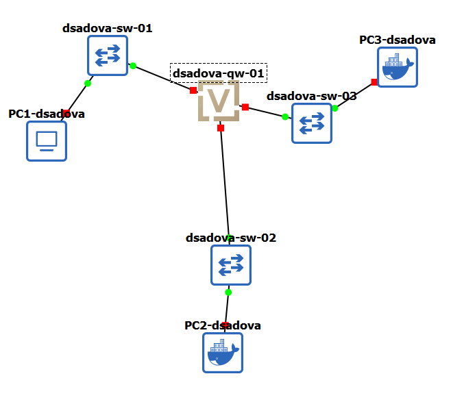{#fig:016 width=90%}

3. Включите захват трафика на соединениях между маршрутизатором gw-01 и коммутаторами sw-02 и sw-03.(рис. [-@fig:017])

{#fig:017 width=90%}

4. Настройте адресацию IPv6 на маршрутизаторе:(рис. [-@fig:018])

{#fig:018 width=90%}

5. На маршрутизаторе настройте DHCPv6 без отслеживания состояния (DHCPv6 Stateless configuration):

- Настройка объявления о маршрутизаторах (Router Advertisements, RA) на интерфейсе eth1:(рис. [-@fig:019])

{#fig:019 width=90%}

- Добавление конфигурации DHCP-сервера:(рис. [-@fig:020]),(рис. [-@fig:021])

{#fig:020 width=90%}

{#fig:021 width=90%}

6. На узле PC2 проверьте настройки сети:(рис. [-@fig:022]),(рис. [-@fig:022])

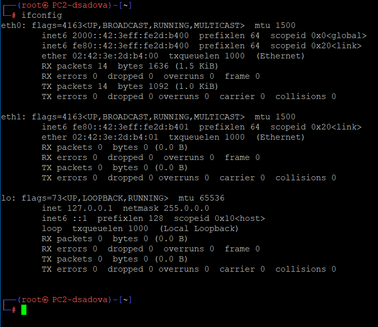{#fig:022 width=90%}

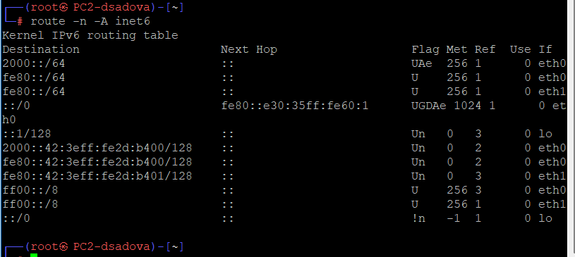{#fig:023 width=90%}

7. На узле PC2 пропингуйте маршрутизатор:(рис. [-@fig:024])

{#fig:024 width=90%}

8. На узле PC2 проверьте настройки DNS.

9. На узле PC2 получите адрес по DHCPv6:(рис. [-@fig:025])

{#fig:025 width=90%}

10. Вновь пропингуйте от узла PC2 маршрутизатор, проверьте настройки DNS:(рис. [-@fig:030])

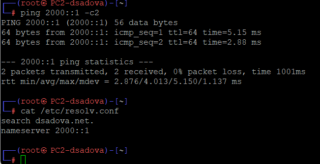{#fig:030 width=90%}

11. На маршрутизаторе посмотрите статистику DHCP-сервера и выданные адреса(рис. [-@fig:031])

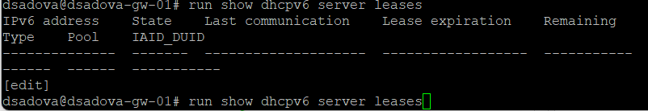{#fig:031 width=90%}

12. В отчёте поясните выведенную на маршрутизаторе и PC2 информацию, а также проанализируйте захваченные анализатором трафика пакеты, относящиеся к работе DHCPv6 и назначению адреса устройству.(рис. [-@fig:032])

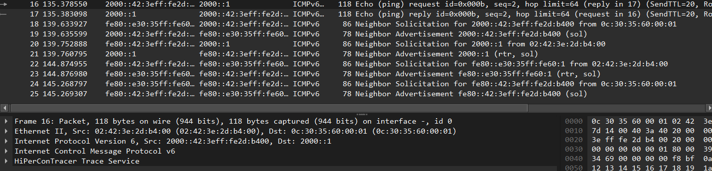{#fig:032 width=90%}

PC2 успешно отправил покеты. PC2 имеет работающий IPv6-адрес в сети 2000::/64, маршрут до шлюза 2000::1 настроен корректно. Эхо-запрос это подтверждает. Пакеты 16-17: Ping с PC2 (2000::42:3eff:fe2d:b400) на шлюз (2000::1). Успешный обмен подтверждает связность.

У нас не выводит информацию об этих покетах при запросе у DHCP-сервера, так как в режиме Stateless DHCPv6 сервер не выдаёт адреса, а только предоставляет опции (DNS, домен и т.д.). Следовательно, таблица аренд (leases) пуста, что является ожидаемым и корректным поведением.

13. На маршрутизаторе настройте DHCPv6 с отслеживанием состояния (DHCPv6 Stateful configuration):

- На интерфейсе eth2 маршрутизатора настройте объявления о маршрутизаторах (Router Advertisements, RA):(рис. [-@fig:033])

{#fig:033 width=90%}

- Добавьте конфигурацию DHCP-сервера на маршрутизаторе:(рис. [-@fig:034])

{#fig:034 width=90%}

14. На маршрутизаторе посмотрите статистику DHCP-сервера и выданные адреса:(рис. [-@fig:035])

{#fig:035 width=90%}

15. Подключитесь к узлу PC3 и проверьте настройки сети:(рис. [-@fig:036]),(рис. [-@fig:037])

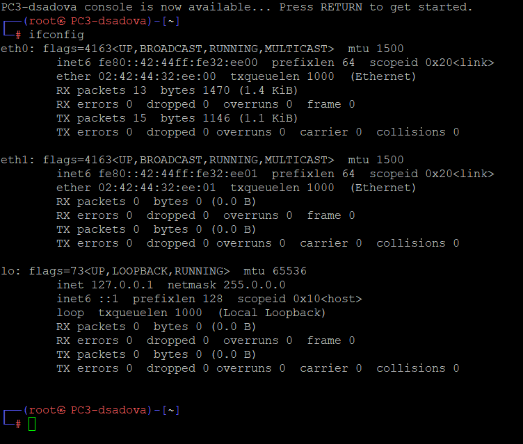{#fig:036 width=90%}

{#fig:037 width=90%}

16. На узле PC3 проверьте настройки DNS:(рис. [-@fig:038])

{#fig:038 width=90%}

17. На узле PC3 получите адрес по DHCPv6:(рис. [-@fig:039])

{#fig:039 width=90%}

18. Вновь на узле PC3 проверьте настройки сети, пропингуйте маршрутизатор, проверьте настройки DNS:(рис. [-@fig:040]),(рис. [-@fig:041])

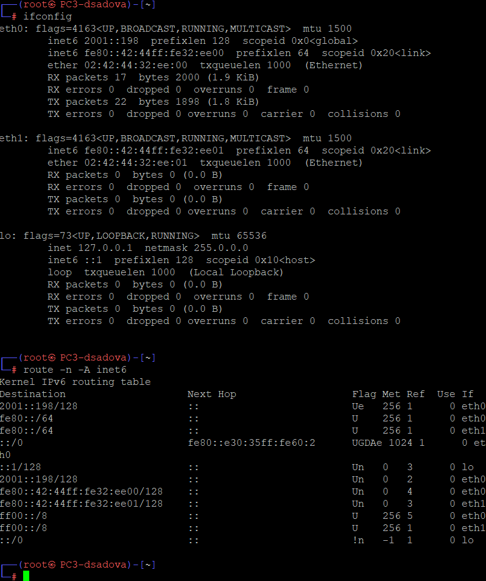{#fig:040 width=90%}

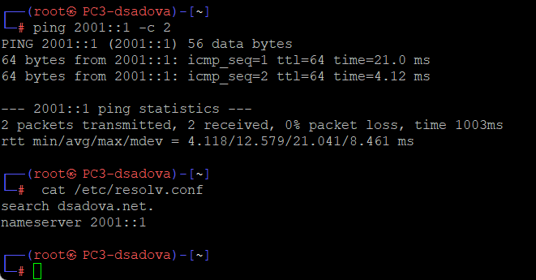{#fig:041 width=90%}

19. На маршрутизаторе посмотрите статистику DHCP-сервера и выданные адреса:(рис. [-@fig:042])

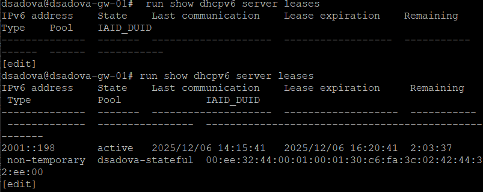{#fig:042 width=90%}

20. В отчёте поясните выведенную на маршрутизаторе и PC3 информацию, а также проанализируйте захваченные анализатором трафика пакеты, относящиеся к работе DHCPv6 и назначению адреса устройству.(рис. [-@fig:043])

{#fig:043 width=90%}

PC3 имеет работоспособный IPv6-адрес 2001::198 (подтверждается захватом трафика), маршрут до шлюза 2001::1 настроен. Пакеты 52-53 и 54-55: Ping с PC3 (2001::198) на шлюз (2001::1) подтверждают успешный обмен.

Пакеты Neighbor Solicitation и Advertisement для 2001::198. Маршрутизатор (fe80::e30:35ff:fe60:2) разрешает MAC-адрес PC3 для 2001::198. В результате PC3 отвечает своим MAC (02:42:44:32:e0:00).

При проверке статистики DHCP-сервера мы видим ответ характерный для нашей настройки DHCPv6 с отслеживанием состояния и сервер успешно выдал адрес 2001::198 клиенту PC3 и отслеживает состояние аренды.

- Адрес клиента: 2001::198 

- Состояние: active — аренда активна.

- Время аренды: С 14:15:41 до 16:20:41 

- Тип аренды: non-temporary 

- Пул: dsadova-stateful 

# Выводы

Получили навыки настройки службы DHCP на сетевом оборудовании для распределения адресов IPv4 и IPv6. Познакомились с способом добавления и настройки хоста Kali Linux CLI.

# Список литературы{.unnumbered}

::: {#refs}
:::

