---
## Front matter
lang: ru-RU
title: Лабораторная работа № 8.
subtitle: Адресация IPv4 и IPv6. Настройка маршрутизации
author:
  - Cадова Д. А.
institute:
  - Российский университет дружбы народов, Москва, Россия

## i18n babel
babel-lang: russian
babel-otherlangs: english
## Fonts
mainfont: PT Serif
romanfont: PT Serif
sansfont: PT Sans
monofont: PT Mono
mainfontoptions: Ligatures=TeX
romanfontoptions: Ligatures=TeX
sansfontoptions: Ligatures=TeX,Scale=MatchLowercase
monofontoptions: Scale=MatchLowercase,Scale=0.9

## Formatting pdf
toc: false
toc-title: Содержание
slide_level: 2
aspectratio: 169
section-titles: true
theme: metropolis
header-includes:
 - \metroset{progressbar=frametitle,sectionpage=progressbar,numbering=fraction}
 - '\makeatletter'
 - '\beamer@ignorenonframefalse'
 - '\makeatother'
---

# Информация

## Докладчик

:::::::::::::: {.columns align=center}
::: {.column width="70%"}

  * Садова Диана Алексеевна
  * студент бакалавриата
  * Российский университет дружбы народов
  * [113229118@pfur.ru]
  * <https://DianaSadova.github.io/ru/>

:::
::::::::::::::

# Вводная часть

## Актуальность

- В связи с исчерпанием адресного пространства IPv4 многие организации и интернет-провайдеры активно внедряют IPv6. Знание принципов работы IPv6, включая маршрутизацию и туннелирование, становится обязательным требованием для сетевых инженеров.

## Цели и задачи

- Изучение принципов маршрутизации в IPv4- и IPv6-сетях и принципов настройки сетевого оборудования.

## Материалы и методы

- Текст лабороторной работы № 8
- Интернет для исправления ошибок 

# Настройка динамической маршрутизации в сетях IPv4 и IPv6

## Постановка задачи

Задана сеть, адреса сегментов сети, адреса, назначаемые интерфейсам устройств. Требуется настроить динамическую маршрутизацию по протоколам RIP, OSPF.

## Топология моделируемой сети.

1. Запустите GNS3 VM и GNS3. Создайте новый проект.

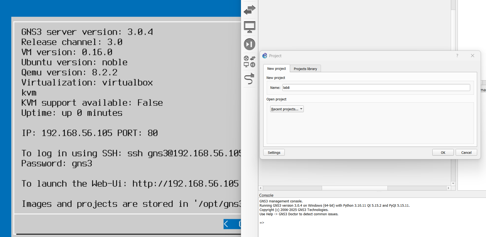

##

2. В рабочем пространстве разместите и соедините устройства в соответствии с топологией, приведённой на рис. 8.4. Используйте маршрутизаторы FRR.

##

3. Измените отображаемые названия устройств. Коммутаторам присвойте названия по принципу msk-user-sw-0x, маршрутизаторам — по принципу msk-user-gw-0x, VPCS — по принципу PCx-user, где вместо user укажите имя вашей учётной записи, вместо x — порядковый номер устройства.

##

##

4. Включите захват трафика на соединении между коммутатором sw-01 и маршрутизатором gw-01, а также между коммутатором sw-02 и маршрутизатором gw-03.

5. Присвойте IPv4-адреса оконечным устройствам PC1 и PC2 в соответствии с данными в табл. 8.2:

##

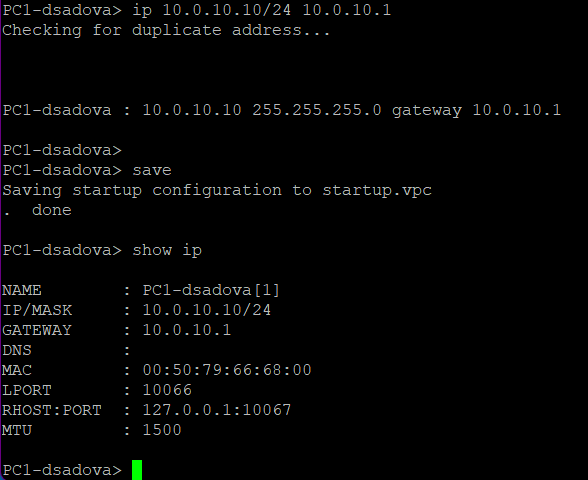

##

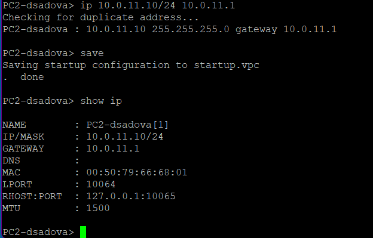

##

6. Настройте IPv4-адреса на интерфейсах маршрутизаторов: 

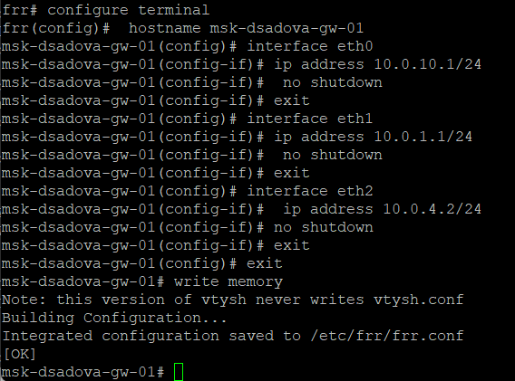

##

##

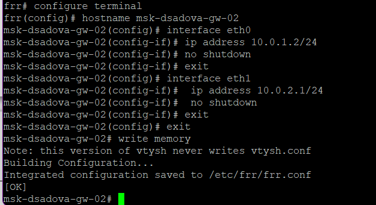

##

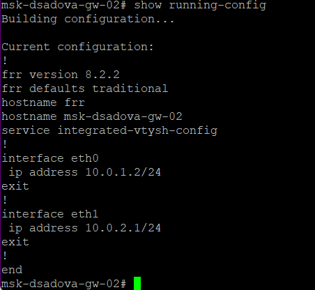

##

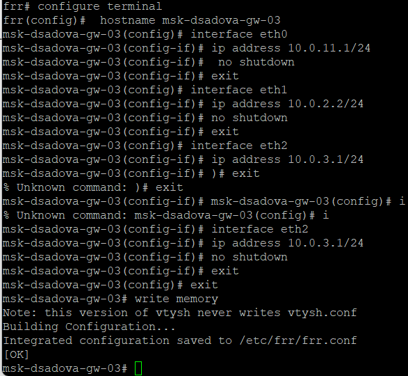

##

##

##

##

7. Присвойте IPv6-адреса оконечным устройствам PC1 и PC2 в соответствии с данными в табл. 8.2:

##

##

8. Настройте IPv6-адреса на интерфейсах маршрутизаторов:

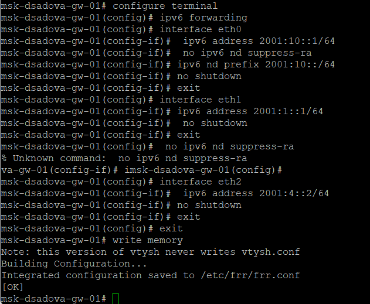

##

##

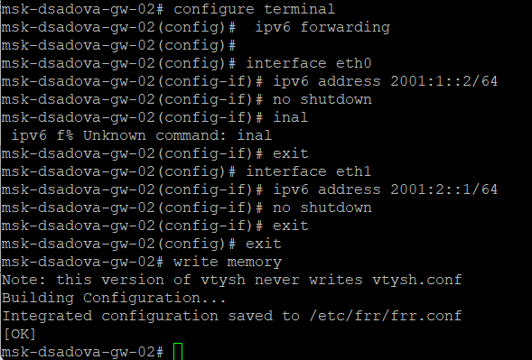

##

##

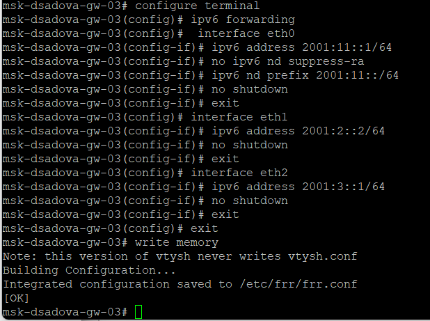

##

##

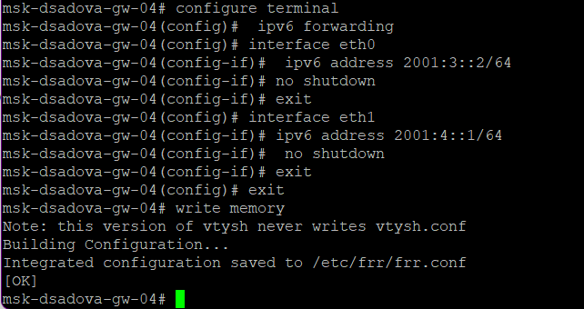

##

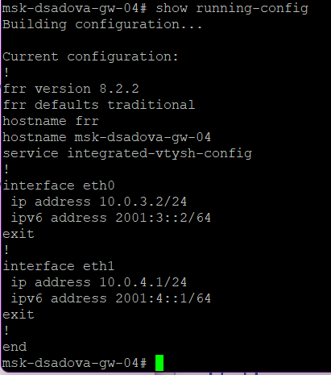

## Настройка динамической маршрутизации по протоколу RIP.

1. На маршрутизаторах настройте RIP в качестве протокола динамической маршрутизации:

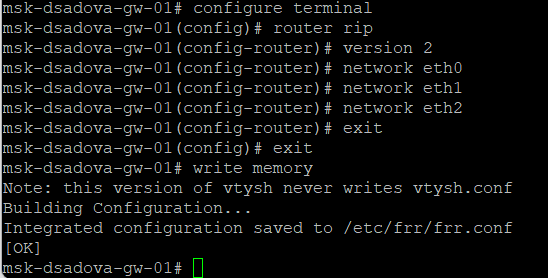

##

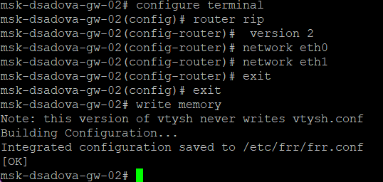

##

##

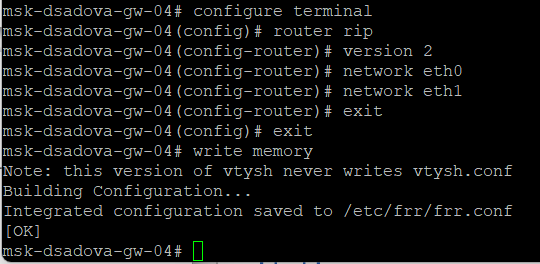

##

2. Убедитесь, что маршрутизация по RIP настроена:

##

##

3. Проверьте пути прохождения пакетов:
– С PC1 пропингуйте PC2 и определите путь следования пакетов:

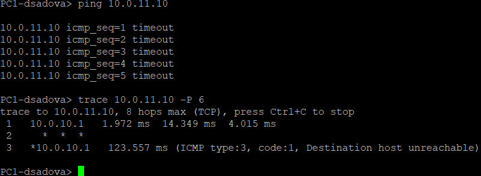

##

– Проверьте метрики протокола RIP:

##

– Предположим, что пакет проходит через маршрутизатор msk-user-gw-02 (в противном случае для дальнейших действий используйте маршрутизатор msk-user-gw-04). Отключите на маршрутизаторе msk-user-gw-02 интерфейс

##

– Проверьте метрики протокола RIP:

##

– С PC1 пропингуйте PC2 и определите путь следования пакетов. Отметьте примерное время, за которое восстановится маршрут.

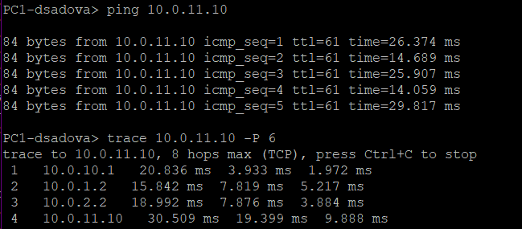

##

– Включите на маршрутизаторе msk-user-gw-02 интерфейс:

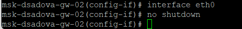

##

– С PC1 пропингуйте PC2 и определите путь следования пакетов.

##

– Посмотрите захваченный на соединениях трафик. В отчёте поясните, какую информацию можно извлечь из перехваченных пакетов.

##

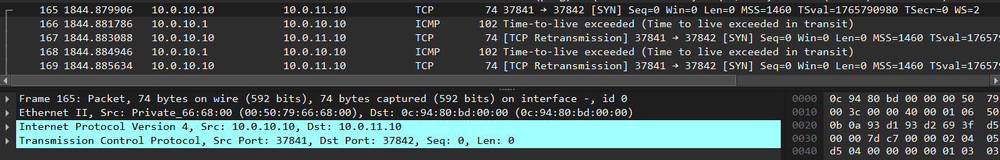

##

##

##

##

- ICMP-запросы (ping) не получают ответа — маршрут отсутствует.

При отсутствии маршрута трафик не проходит дальше первого маршрутизатора, который возвращает ICMP-ошибки.

##

4. На маршрутизаторах настройте RIPng для сетей IPv6

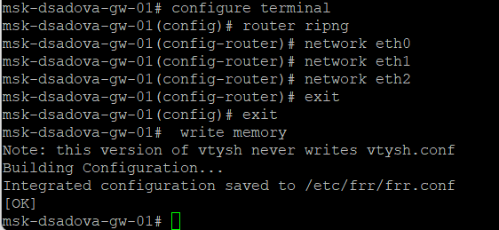

##

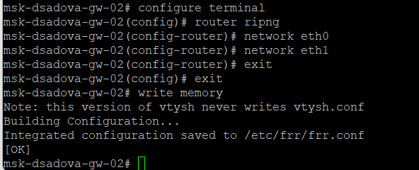

##

##

##

5. Проверьте пути прохождения пакетов:
– С PC1 пропингуйте PC2 и определите путь следования пакетов:

##

– Проверьте метрики протокола RIPng:

##

– Предположим, что пакет проходит через маршрутизатор msk-user-gw-02 (в противном случае для дальнейших действий используйте маршрутизатор msk-user-gw-04). Отключите на маршрутизаторе msk-user-gw-02 интерфейс:

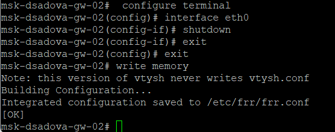

##

– Проверьте метрики протокола RIPng:

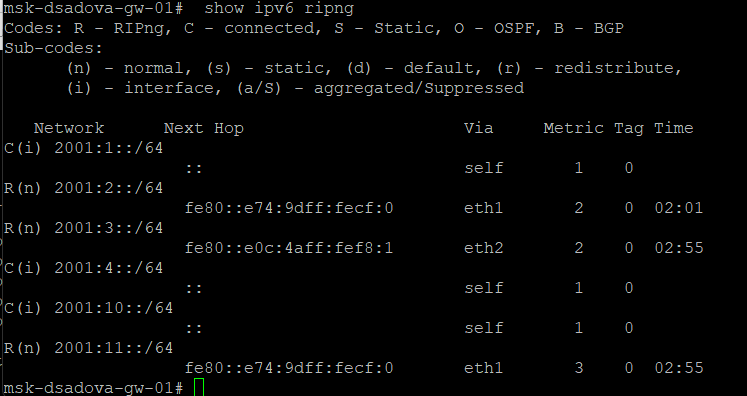

##

– С PC1 пропингуйте PC2 и определите путь следования пакетов.

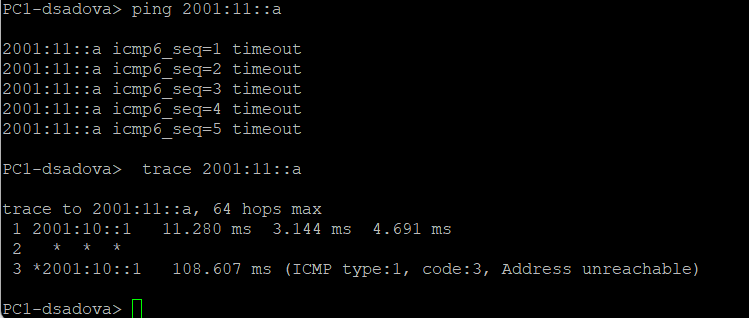

##

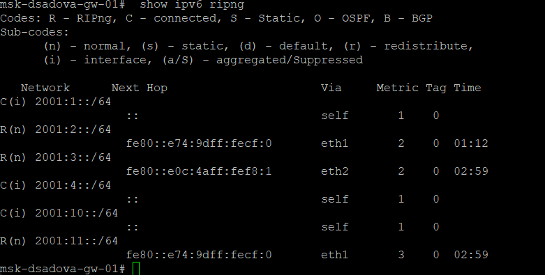

Первый пинг не проходит (адрес недоступен), но последующие успешны. Это указывает на быстрое восстановление маршрута после включения интерфейса.

##

– Отметьте примерное время, за которое восстановится маршрут.

Время восстановления: ≈ 1-2 секунды.

##

– Включите на маршрутизаторе msk-user-gw-02 интерфейс:

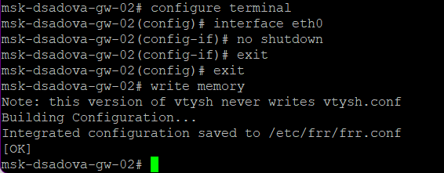

##

Интерфейс успешно включён, сохранена конфигурация.

– С PC1 пропингуйте PC2 и определите путь следования пакетов

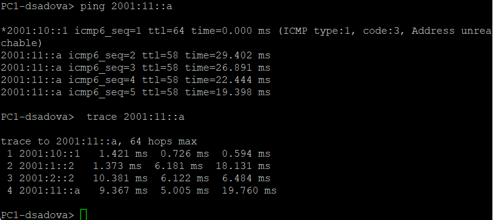

##

Traceroute показывает путь через три маршрутизатора 2001:10::1, 2001:1::2, 2001:2::2, 2001:11::a (PC2)

Всё работает корректно.

##

– Посмотрите захваченный на соединениях трафик. В отчёте поясните, какую информацию можно извлечь из перехваченных пакетов.

##

##

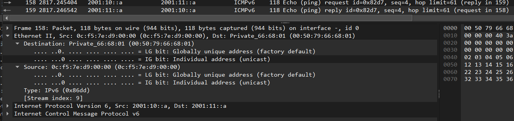

##

## Настройка динамической маршрутизации по протоколу OSPF.

1. На маршрутизаторах настройте OSPFv2 для сетей IPv4:

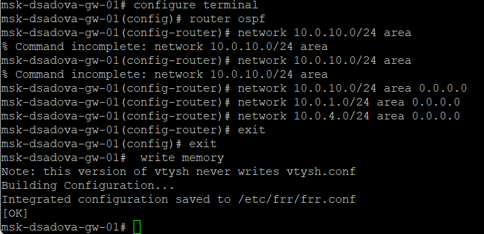

##

##

##

##

2. С PC1 пропингуйте PC2 и определите путь следования пакетов:

##

3. Проверьте таблицу маршрутизации протокола OSPFv2:

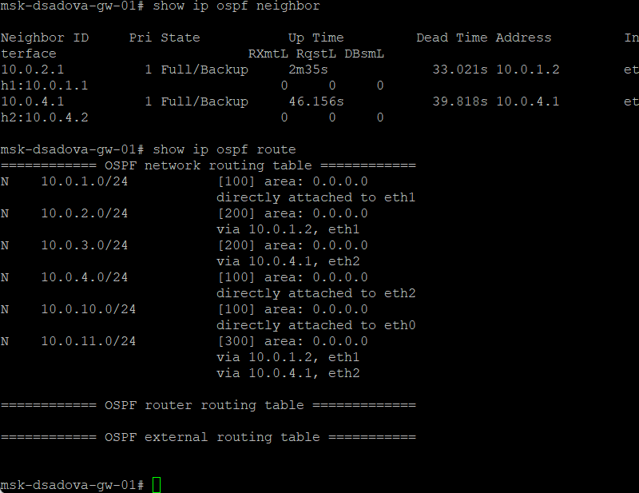

##

4. Предположим, что пакет проходит через маршрутизатор msk-user-gw-02 (в противном случае для дальнейших действий используйте маршрутизатор msk-user-gw-04). Отключите на маршрутизаторе msk-user-gw-02 интерфейс:

##

5. Проверьте таблицу маршрутизации протокола OSPFv2:

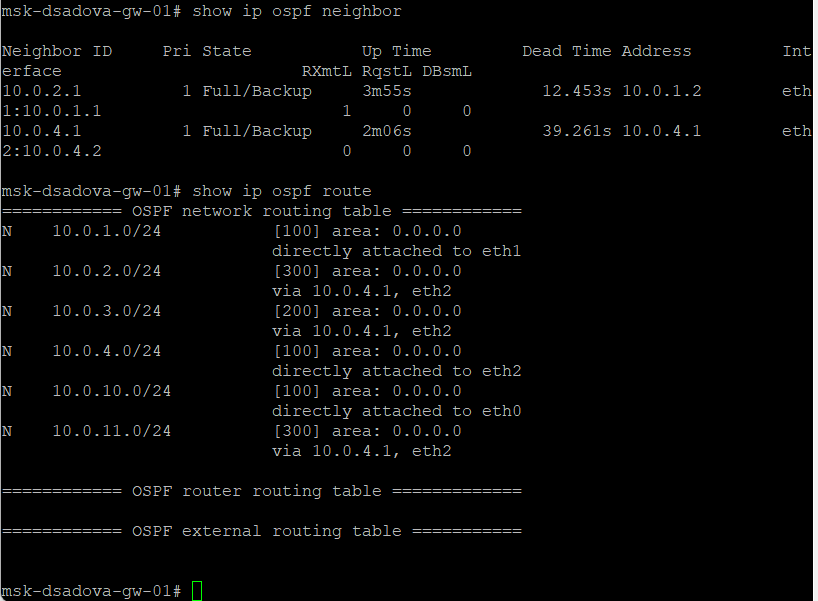

##

6. С PC1 пропингуйте PC2 и определите путь следования пакетов. Отметьте примерное время, за которое восстановится маршрут.

##

Ping успешен, среднее время ~14 мс. 

Traceroute показывает альтернативный путь через 10.0.4.1, 10.0.3.1. Маршрут восстановился быстро

##

7. Включите на маршрутизаторе msk-user-gw-02 интерфейс:

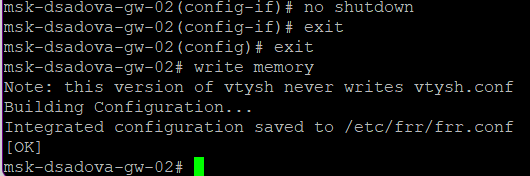

##

8. С PC1 пропингуйте PC2 и определите путь следования пакетов.

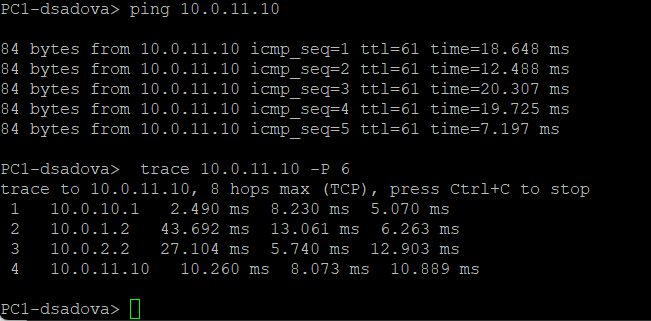

##

Ping успешен, среднее время ~16 мс. Traceroute показывает путь через 10.0.1.2, 10.0.2.2 (первоначальный маршрут).

##

9. Посмотрите захваченный на соединениях трафик. В отчёте поясните, какую информацию можно извлечь из перехваченных пакетов.

##

##

##

##

##

##

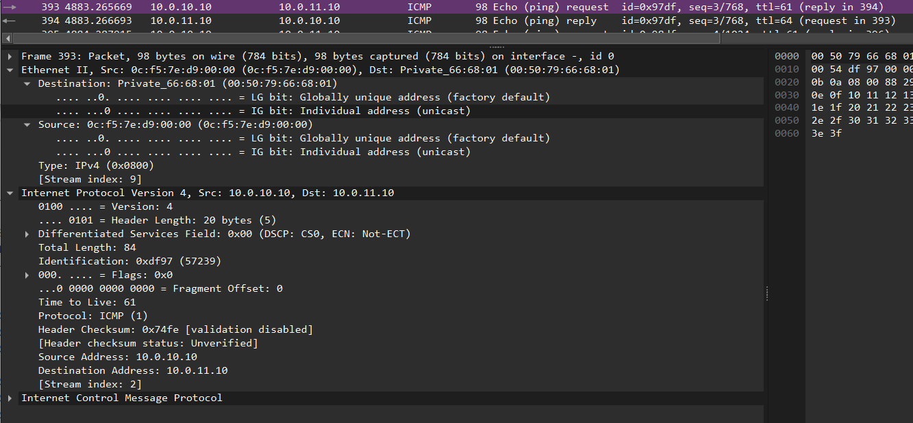

##

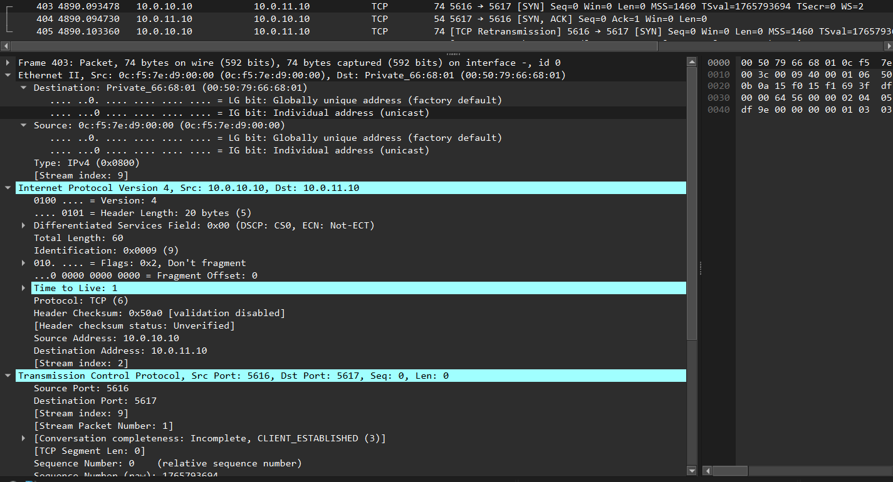

##

Успешный ICMP-обмен (запрос-ответ) с TTL=61/64.

Пакеты с TTL=1 не проходят дальше первого маршрутизатора.

TCP-сессии устанавливаются успешно (SYN, SYN-ACK).

Видна инкапсуляция и маршрутизация на уровне L3.

##

10. На маршрутизаторах настройте OSPFv3 для сетей IPv6:

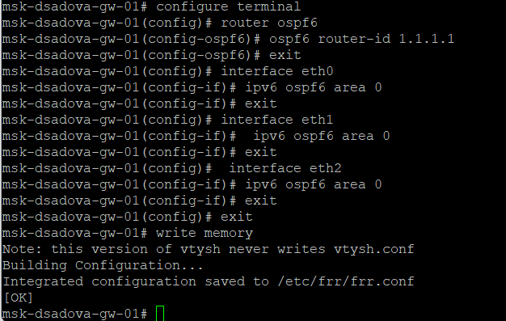

##

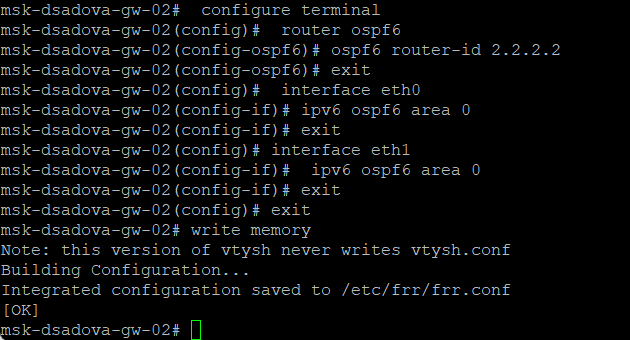

##

##

##

11. С PC1 пропингуйте PC2 и определите путь следования пакетов:

##

12. Проверьте таблицу маршрутизации протокола OSPFv3:

##

13. Предположим, что пакет проходит через маршрутизатор msk-user-gw-02 (в противном случае для дальнейших действий используйте маршрутизатор msk-user-gw-04). Отключите на маршрутизаторе msk-user-gw-02 интерфейс:

##

14. Проверьте таблицу маршрутизации протокола OSPFv3:

##

15. С PC1 пропингуйте PC2 и определите путь следования пакетов. Отметьте примерное время, за которое восстановится маршрут.

##

Traceroute показывает путь через маршрутизаторы: 2001:10::1, 2001:4::1, 2001:3::1,  2001:11::a

Время отклика: 10-30 мс.

##

16. Включите на маршрутизаторе msk-user-gw-02 интерфейс:

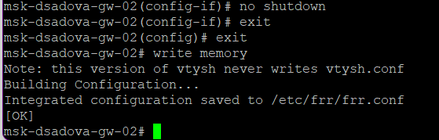

##

17. С PC1 пропингуйте PC2 и определите путь следования пакетов.

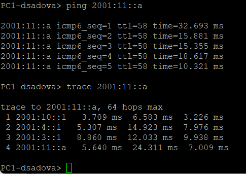

##

18. Посмотрите захваченный на соединениях трафик. В отчёте поясните, какую информацию можно извлечь из перехваченных пакетов.

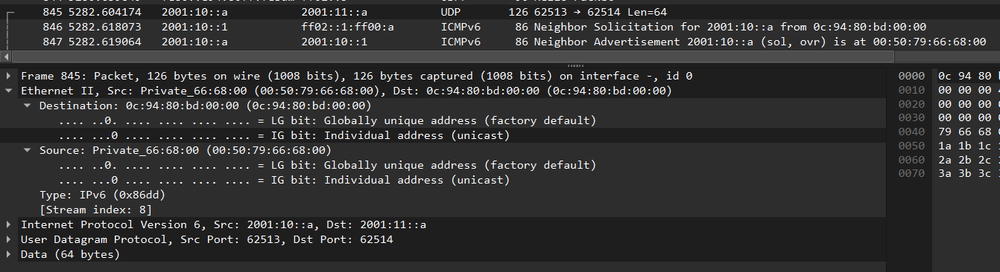

##

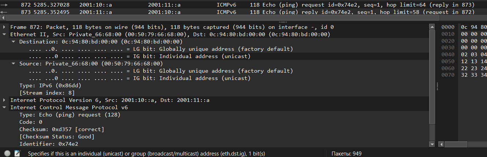

##

##

##

##

Успешный обмен ICMPv6.

TCP-сессии устанавливаются.

TTL/HL корректно уменьшаются.

Видна работа двойного стека (IPv4 и IPv6).

# Построение туннеля IPv6–IPv4

## Постановка задачи

Заданы две IPv6-сети и IPv4-сеть. Требуется организовать туннель IPv6 поверх IPv4, позволяющий передавать данные из одной IPv6-сети в другую IPv6-сеть через сеть IPv4. Назначаемые устройствам сети адреса указаны в табл. 8.3

При организации туннеля IPv6 поверх IPv4 трафик 6in4 отправляется внутри пакетов IPv4, в заголовках которых номер протокола IP имеет значение 41. Накладные расходы инкапсуляции состоят в том, что размер заголовка IPv4 имеет размер 20 байт, соответственно при MTU в 1500 байт IPv6-пакеты размером 1480 байт можно отправлять без фрагментации.

## Порядок выполнения работы

1. Создайте новый проект в GNS3.

2. В рабочем пространстве разместите и соедините устройства в соответствии с топологией, приведённой на рис. 8.5. Используйте маршрутизаторы VyOS.

##

3. Измените отображаемые названия устройств. Коммутаторам присвойте названия по принципу msk-user-sw-0x, маршрутизаторам — по принципу msk-user-gw-0x, VPCS — по принципу PCx-user, где вместо user укажите имя вашей учётной записи, вместо x — порядковый номер устройства.

##

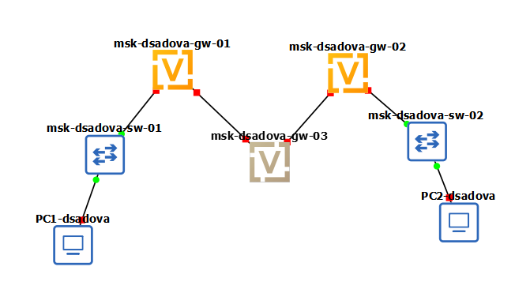

##

4. На соединении между первым и третьим маршрутизаторами подключите анализатор трафика.

##

5. Присвойте адреса оконечным устройствам PC1 и PC2 в соответствии с данными в табл. 8.3:

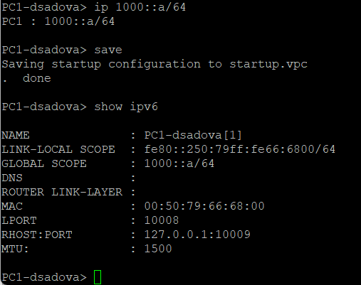

##

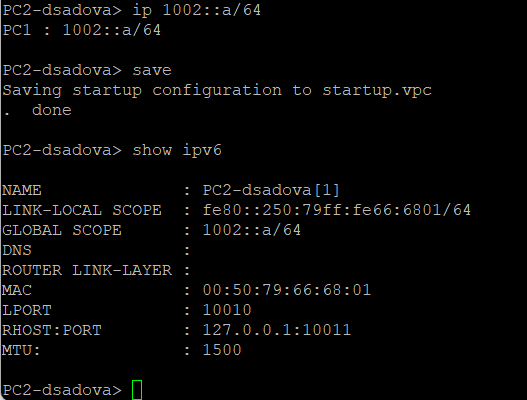

##

6. Установите систему на маршрутизаторы VyOS.

7. На маршрутизаторах перейдите в режим конфигурирования, измените имя устройства (вместо user укажите имя вашей учётной записи, вместо x - порядковый номер устройства):

##

##

##

##

8. Настройте адреса на интерфейсах маршрутизаторов:

##

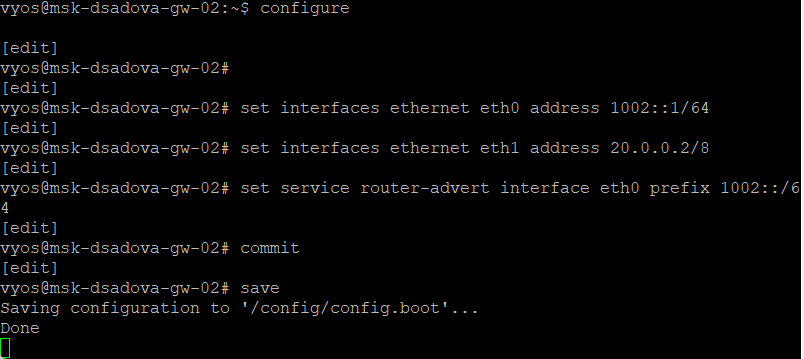

##

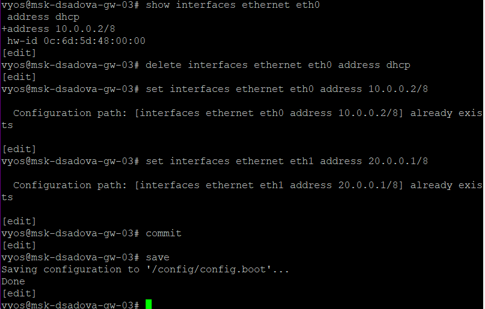

##

9. Убедитесь, что на PC появились адреса ближайших к ним маршрутизаторов: 

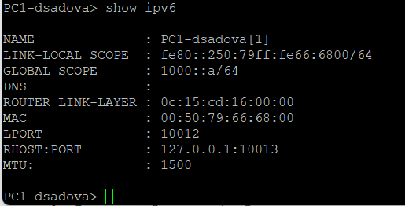

##

10. Проверьте маршруты с маршрутизатора R1:

##

В отчёте поясните результат проверки, в том числе с учётом анализа трафика.

##

11. Настройте маршрутизацию IPv4:

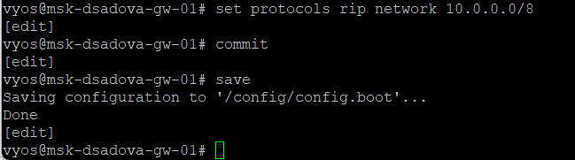

##

##

##

12. Проверьте маршруты:

##

В отчёте поясните результат проверки, в том числе с учётом анализа трафика.

##

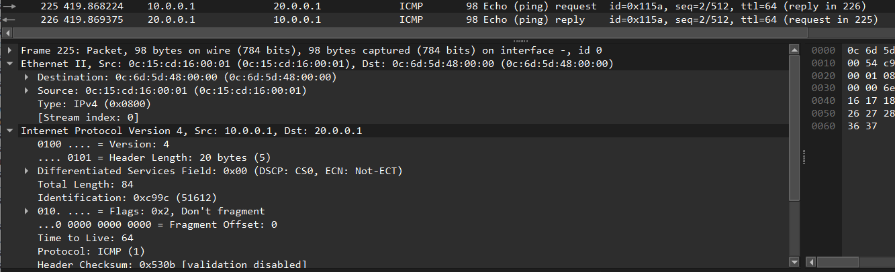

##

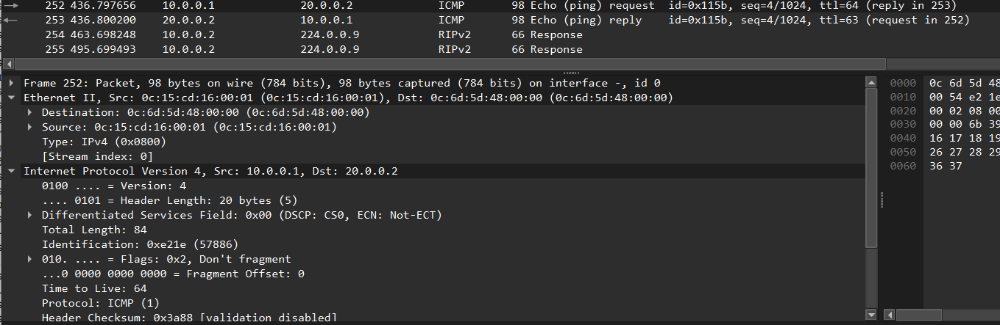

##

Работает только IPv4 маршрутизация. Ping между 10.0.0.1 и 10.0.0.2 успешен

RIPv2-пакеты отправляются на multicast-адрес 224.0.0.9

Периодичность обновлений: примерно каждые 30 секунд

##

13. Создайте туннель IPv6 через сеть IPv4:

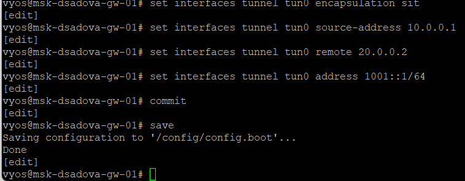

##

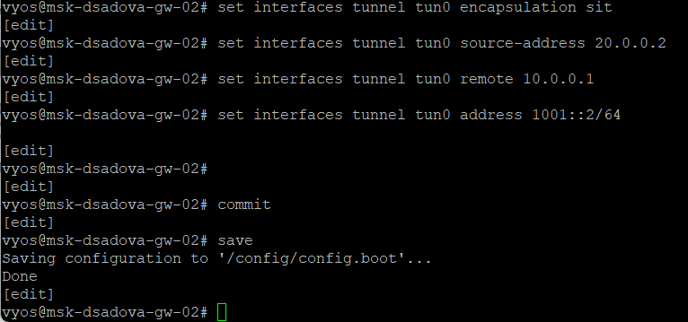

##

14. Настройте статическую маршрутизацию IPv6:

##

##

15. Проверьте доступность оконечных устройств:

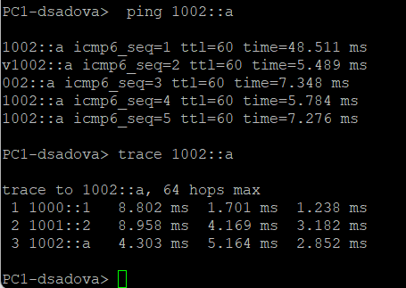

##

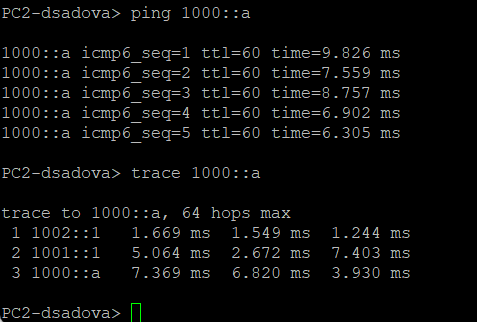

##

В отчёте поясните результат проверки. Используя данные, собранные анализатором трафика, поясните, где и в каком виде содержится информация о прохождении пакетов по туннелю.

##

##

Инкапсуляция IPv6 в IPv4: Виден успешный обмен ICMPv6 ping-пакетами между 1002::a (PC2) и 1000::a (PC1)

Протокол 41: В заголовке IPv4 указан протокол 41, что подтверждает инкапсуляцию IPv6

TTL/Hop Limit:
- Внешний IPv4 заголовок: TTL=64
- Внутренний IPv6 заголовок: Hop Limit уменьшается с 63 до 61

Адреса туннеля:
- Исходный: 10.0.0.1 (R1)
- Конечный: 20.0.0.2 (R3)

## Задание для самостоятельного выполнения

Заданы топология сети и адреса сегментов сети. 

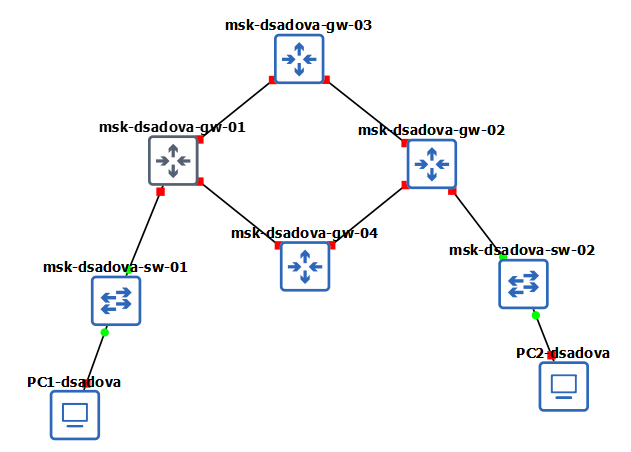

##

Требуется:
– задокументировать моделируемую сеть: схемы L1, L3, заполнить таблицы адресации;

##

1. L1-схема (физический уровень)

**Устройства:**
- PC1-user (VPCS)
- PC2-user (VPCS) 
- msk-user-sw-01, msk-user-sw-02 (L2-коммутаторы)
- msk-user-gw-01
- msk-user-gw-02
- msk-user-gw-03
- msk-user-gw-04

##

**Соединения (L1):**

| Устройство 1 | Интерфейс | Устройство 2 | Интерфейс |
|--------------|-----------|--------------|-----------|
| PC1          | eth0      | sw-01        | eth0      |
| sw-01        | eth1      | gw-01        | Gi0/0     |
| gw-01        | Gi0/1     | gw-03        | Gi0/0     |
| gw-01        | Gi0/2     | gw-04        | Gi0/0     |
| gw-03        | Gi0/1     | gw-02        | Gi0/0     |
| gw-04        | Gi0/1     | gw-02        | Gi0/1     |
| gw-02        | Gi0/2     | sw-02        | eth0      |
| sw-02        | eth1      | PC2          | eth0      |

##

2. Таблица сетей

| Устройства       | Сеть IPv4       | Сеть IPv6          |
|------------------|-----------------|-------------------|
| PC1–gw-01        | 10.10.1.96/27   | 2001:db8:1:1::/64 |
| PC2–gw-02        | 10.10.1.64/28   | 2001:db8:1:6::/64 |
| gw-01–gw-03      | 10.10.1.4/30    | 2001:db8:1:2::/64 |
| gw-01–gw-04      | 10.10.1.8/30    | 2001:db8:1:3::/64 |
| gw-03–gw-02      | 10.10.1.16/30   | 2001:db8:1:4::/64 |
| gw-04–gw-02      | 10.10.1.32/30   | 2001:db8:1:5::/64 |

##

3.  Таблица адресации интерфейсов

#### PC1
| Параметр | Значение |
|----------|----------|
| IPv4     | 10.10.1.97/27 |
| Шлюз     | 10.10.1.96 |
| IPv6     | 2001:db8:1:1::10/64 |
| Шлюз IPv6 | 2001:db8:1:1::1 |

##

#### PC2
| Параметр | Значение |
|----------|----------|
| IPv4     | 10.10.1.65/28 |
| Шлюз     | 10.10.1.64 |
| IPv6     | 2001:db8:1:6::10/64 |
| Шлюз IPv6 | 2001:db8:1:6::1 |

##

#### gw-01
| Интерфейс | IPv4           | IPv6                  |
|-----------|----------------|-----------------------|
| Gi0/0     | 10.10.1.96/27  | 2001:db8:1:1::1/64   |
| Gi0/1     | 10.10.1.5/30   | 2001:db8:1:2::1/64   |
| Gi0/2     | 10.10.1.9/30   | 2001:db8:1:3::1/64   |

##

#### gw-03
| Интерфейс | IPv4           | IPv6                  |
|-----------|----------------|-----------------------|
| Gi0/0     | 10.10.1.6/30   | 2001:db8:1:2::2/64   |
| Gi0/1     | 10.10.1.17/30  | 2001:db8:1:4::1/64   |

##

#### gw-04
| Интерфейс | IPv4           | IPv6                  |
|-----------|----------------|-----------------------|
| Gi0/0     | 10.10.1.10/30  | 2001:db8:1:3::2/64   |
| Gi0/1     | 10.10.1.33/30  | 2001:db8:1:5::1/64   |

##

#### gw-02
| Интерфейс | IPv4           | IPv6                  |
|-----------|----------------|-----------------------|
| Gi0/0     | 10.10.1.18/30  | 2001:db8:1:4::2/64   |
| Gi0/1     | 10.10.1.34/30  | 2001:db8:1:5::2/64   |
| Gi0/2     | 10.10.1.64/28  | 2001:db8:1:6::1/64   |

##

– настроить двойной стек IPv4 и IPv6, проверить соединения;

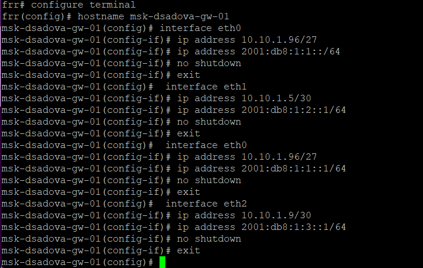

##

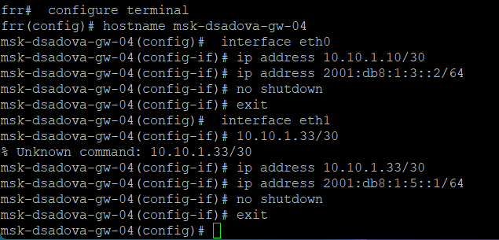

##

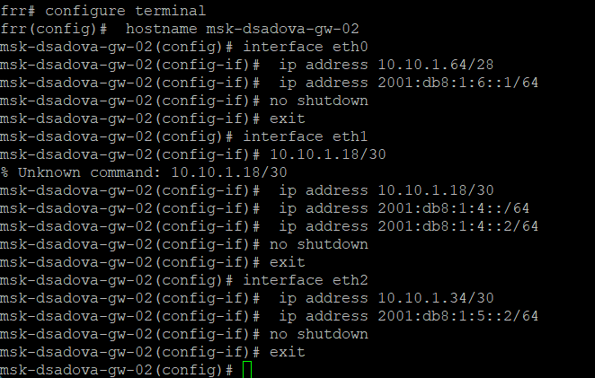

##

– настроить динамическую маршрутизацию сетей IPv4 и IPv6 для протоколов RIP, OSPF, проверить соединения и маршруты

## Результаты

- Изучили принципы маршрутизации в IPv4- и IPv6-сетях и принципы настройки сетевого оборудования.

