---
## Front matter
title: "Лабораторная работа № 8."
subtitle: "Адресация IPv4 и IPv6. Настройка маршрутизации"
author: "Диана Алексеевна Садова"

## Generic otions
lang: ru-RU
toc-title: "Содержание"

## Bibliography
bibliography: bib/cite.bib
csl: pandoc/csl/gost-r-7-0-5-2008-numeric.csl

## Pdf output format
toc: true # Table of contents
toc-depth: 2
lof: true # List of figures
lot: true # List of tables
fontsize: 12pt
linestretch: 1.5
papersize: a4
documentclass: scrreprt
## I18n polyglossia
polyglossia-lang:
  name: russian
  options:
	- spelling=modern
	- babelshorthands=true
polyglossia-otherlangs:
  name: english
## I18n babel
babel-lang: russian
babel-otherlangs: english
## Fonts
mainfont: PT Serif
romanfont: PT Serif
sansfont: PT Sans
monofont: PT Mono
mainfontoptions: Ligatures=TeX
romanfontoptions: Ligatures=TeX
sansfontoptions: Ligatures=TeX,Scale=MatchLowercase
monofontoptions: Scale=MatchLowercase,Scale=0.9
## Biblatex
biblatex: true
biblio-style: "gost-numeric"
biblatexoptions:
  - parentracker=true
  - backend=biber
  - hyperref=auto
  - language=auto
  - autolang=other*
  - citestyle=gost-numeric
## Pandoc-crossref LaTeX customization
figureTitle: "Рис."
tableTitle: "Таблица"
listingTitle: "Листинг"
lofTitle: "Список иллюстраций"
lotTitle: "Список таблиц"
lolTitle: "Листинги"
## Misc options
indent: true
header-includes:
  - \usepackage{indentfirst}
  - \usepackage{float} # keep figures where there are in the text
  - \floatplacement{figure}{H} # keep figures where there are in the text
---

# Цель работы

Изучение принципов маршрутизации в IPv4- и IPv6-сетях и принципов настройки сетевого оборудования.

# Задания для выполнения

## Настройка динамической маршрутизации в сетях IPv4 и IPv6

### Постановка задачи

Задана сеть, адреса сегментов сети, адреса, назначаемые интерфейсам устройств. Требуется настроить динамическую маршрутизацию по протоколам RIP, OSPF.

### Порядок выполнения работы

*Документирование моделируемой сети.*

1. Продублируйте в отчёте таблицы адресации.

*Таблица адресов сетей*

| Устройства       | Сеть IPv4      | Сеть IPv6       |
|------------------|----------------|-----------------|
| PC1 – gw-01      | 10.0.10.0/24   | 2001:10::/64    |
| PC2 – gw-03      | 10.0.11.0/24   | 2001:11::/64    |
| gw-01 – gw-02    | 10.0.1.0/24    | 2001:1::/64     |
| gw-02 – gw-03    | 10.0.2.0/24    | 2001:2::/64     |
| gw-03 – gw-04    | 10.0.3.0/24    | 2001:3::/64     |
| gw-04 – gw-01    | 10.0.4.0/24    | 2001:4::/64     |

*Таблица адресации*

| Устройство | Интерфейс | Адрес IP/префикс | Шлюз по умолчанию | Следующее устройство |
|------------|-----------|------------------|-------------------|-----------------------|
| gw-01      | eth0      | 10.0.10.1/24     | n/a               | PC1                   |
| gw-01      | eth0      | 2001:10::1/64    | n/a               | PC1                   |
| gw-01      | eth1      | 10.0.1.1/24      | n/a               | gw-02                 |
| gw-01      | eth1      | 2001:1::1/64     | n/a               | gw-02                 |
| gw-01      | eth2      | 10.0.4.2/24      | n/a               | gw-04                 |
| gw-01      | eth2      | 2001:4::2/64     | n/a               | gw-04                 |
| gw-02      | eth0      | 10.0.1.2/24      | n/a               | gw-01                 |
| gw-02      | eth0      | 2001:1::2/64     | n/a               | gw-01                 |
| gw-02      | eth1      | 10.0.2.1/24      | n/a               | gw-03                 |
| gw-02      | eth1      | 2001:2::1/64     | n/a               | gw-03                 |
| gw-03      | eth0      | 10.0.11.1/24     | n/a               | PC2                   |
| gw-03      | eth0      | 2001:11::1/64    | n/a               | PC2                   |
| gw-03      | eth1      | 10.0.2.2/24      | n/a               | gw-02                 |
| gw-03      | eth1      | 2001:2::2/64     | n/a               | gw-02                 |
| gw-03      | eth2      | 10.0.3.1/24      | n/a               | gw-04                 |
| gw-03      | eth2      | 2001:3::1/64     | n/a               | gw-04                 |
| gw-04      | eth0      | 10.0.3.2/24      | n/a               | gw-03                 |
| gw-04      | eth0      | 2001:3::2/64     | n/a               | gw-03                 |
| gw-04      | eth1      | 10.0.4.1/24      | n/a               | gw-01                 |
| gw-04      | eth1      | 2001:4::1/64     | n/a               | gw-01                 |
| PC1        | NIC       | 10.0.10.10/24    | 10.0.10.1         | gw-01                 |
| PC1        | NIC       | 2001:10::a/64    | n/a               | gw-01                 |
| PC2        | NIC       | 10.0.11.10/24    | 10.0.11.1         | gw-03                 |
| PC2        | NIC       | 2001:11::a/64    | n/a               | gw-03                 |

2. В любом графическом редакторе (например, DIA) схематично изобразите моделируемую сеть. Разработайте схемы L1 и L3 (см. например рис. 8.1, 8.3), ориентируясь на данные из таблиц адресации. Схемы добавьте в отчёт.(рис. [-@fig:200]),(рис. [-@fig:201]),(рис. [-@fig:202])

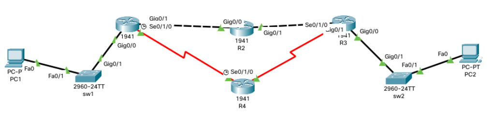{#fig:200 width=90%}

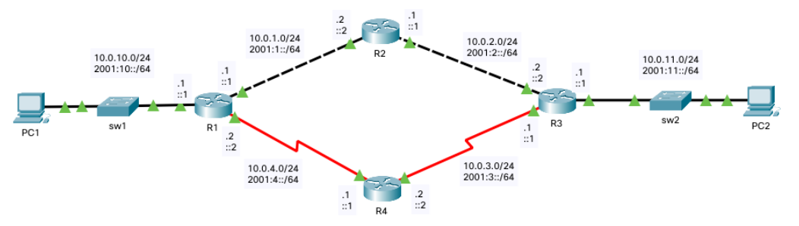{#fig:201 width=90%}

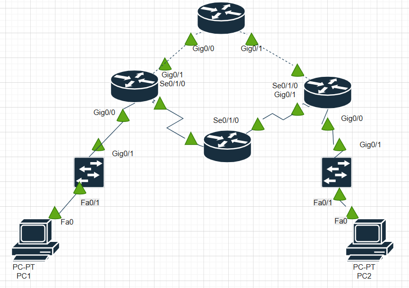{#fig:202 width=90%}

*Топология моделируемой сети.*

1. Запустите GNS3 VM и GNS3. Создайте новый проект.(рис. [-@fig:001])

{#fig:001 width=90%}

2. В рабочем пространстве разместите и соедините устройства в соответствии с топологией, приведённой на рис. 8.4. Используйте маршрутизаторы FRR.

3. Измените отображаемые названия устройств. Коммутаторам присвойте названия по принципу msk-user-sw-0x, маршрутизаторам — по принципу msk-user-gw-0x, VPCS — по принципу PCx-user, где вместо user укажите имя вашей учётной записи, вместо x — порядковый номер устройства.(рис. [-@fig:002])

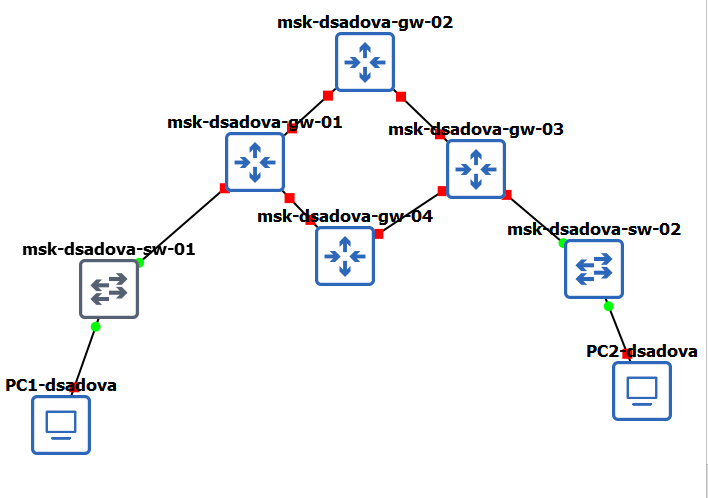{#fig:002 width=90%}

4. Включите захват трафика на соединении между коммутатором sw-01 и маршрутизатором gw-01, а также между коммутатором sw-02 и маршрутизатором gw-03.

5. Присвойте IPv4-адреса оконечным устройствам PC1 и PC2 в соответствии с данными в табл. 8.2:((рис. [-@fig:003]), (рис. [-@fig:004])

{#fig:003 width=90%}

{#fig:004 width=90%}

6. Настройте IPv4-адреса на интерфейсах маршрутизаторов: (рис. [-@fig:005]), (рис. [-@fig:006]), (рис. [-@fig:007]), (рис. [-@fig:008]), (рис. [-@fig:009]), (рис. [-@fig:010]), (рис. [-@fig:011]), (рис. [-@fig:012])

{#fig:005 width=90%}

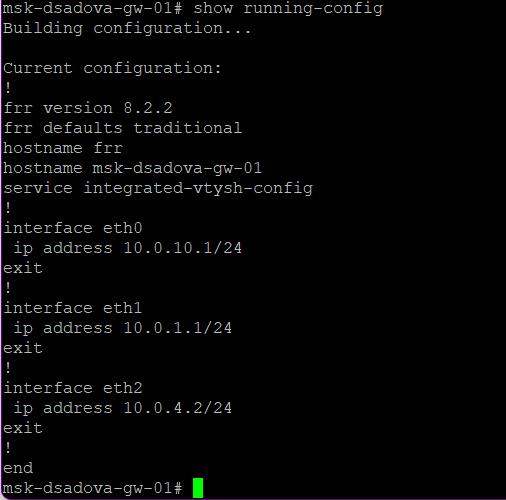{#fig:006 width=90%}

{#fig:007 width=90%}

{#fig:008 width=90%}

{#fig:009 width=90%}

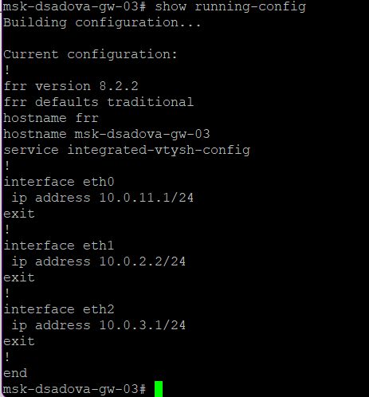{#fig:010 width=90%}

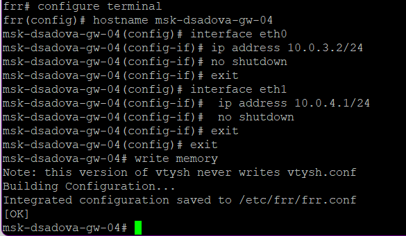{#fig:011 width=90%}

{#fig:012 width=90%}

7. Присвойте IPv6-адреса оконечным устройствам PC1 и PC2 в соответствии с данными в табл. 8.2:(рис. [-@fig:013]), (рис. [-@fig:014])

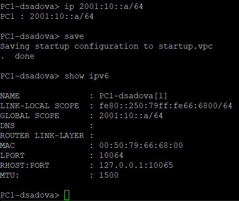{#fig:013 width=90%}

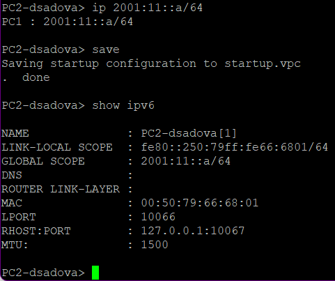{#fig:014 width=90%}

8. Настройте IPv6-адреса на интерфейсах маршрутизаторов:(рис. [-@fig:015]), (рис. [-@fig:016]), (рис. [-@fig:017]), (рис. [-@fig:018]), (рис. [-@fig:019]), (рис. [-@fig:020]), (рис. [-@fig:021]), (рис. [-@fig:022])

{#fig:015 width=90%}

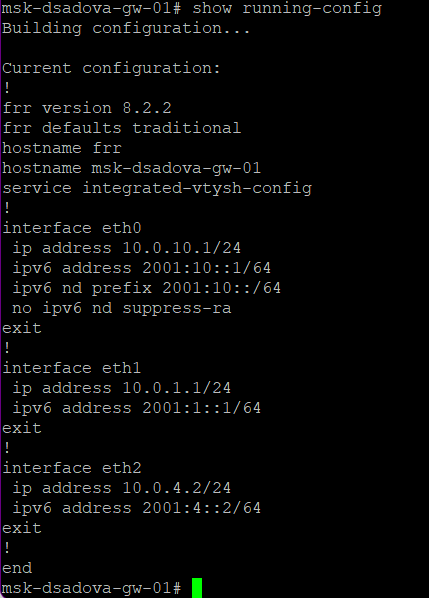{#fig:016 width=90%}

{#fig:017 width=90%}

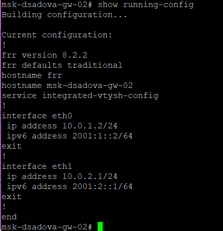{#fig:018 width=90%}

{#fig:019 width=90%}

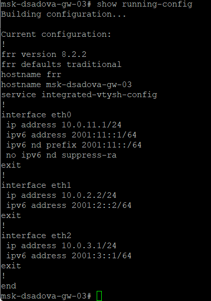{#fig:020 width=90%}

{#fig:021 width=90%}

{#fig:022 width=90%}

*Настройка динамической маршрутизации по протоколу RIP.*

1. На маршрутизаторах настройте RIP в качестве протокола динамической маршрутизации:(рис. [-@fig:023]), (рис. [-@fig:024]), (рис. [-@fig:025]), (рис. [-@fig:026])

{#fig:023 width=90%}

{#fig:024 width=90%}

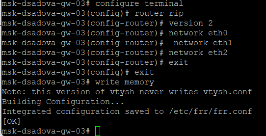{#fig:025 width=90%}

{#fig:026 width=90%}

2. Убедитесь, что маршрутизация по RIP настроена:(рис. [-@fig:027]), (рис. [-@fig:028])

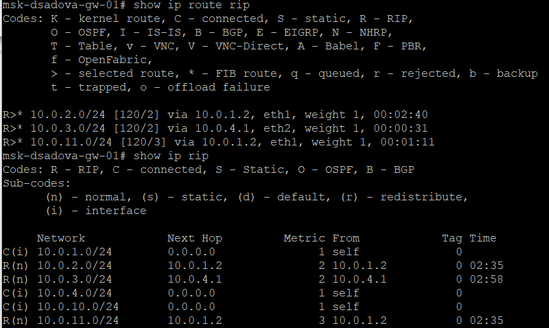{#fig:027 width=90%}

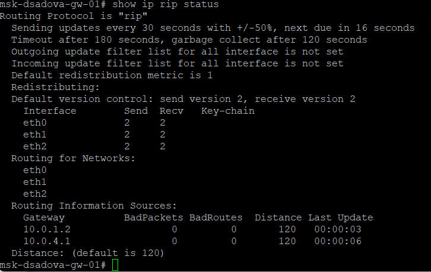{#fig:028 width=90%}

3. Проверьте пути прохождения пакетов:
– С PC1 пропингуйте PC2 и определите путь следования пакетов:(рис. [-@fig:029])

{#fig:029 width=90%}

Из traceroute видно, что пакеты доходят до первого маршрутизатора (10.0.10.1), но дальше не проходят — все последующие хосты не отвечают (*). В конце появляется сообщение «Destination host unreachable» от 10.0.10.1. Это указывает на отсутствие маршрута до сети 10.0.11.0/24.

– Проверьте метрики протокола RIP:(рис. [-@fig:030])

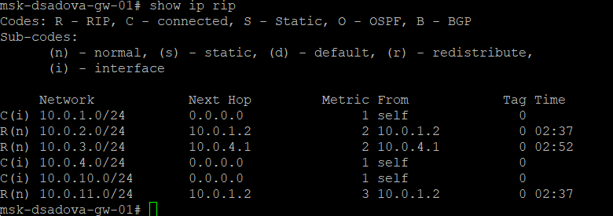{#fig:030 width=90%}

– Предположим, что пакет проходит через маршрутизатор msk-user-gw-02 (в противном случае для дальнейших действий используйте маршрутизатор msk-user-gw-04). Отключите на маршрутизаторе msk-user-gw-02 интерфейс(рис. [-@fig:031])

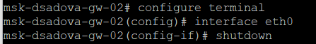{#fig:031 width=90%}

– Проверьте метрики протокола RIP:(рис. [-@fig:032])

{#fig:032 width=90%}

– С PC1 пропингуйте PC2 и определите путь следования пакетов. Отметьте примерное время, за которое восстановится маршрут.(рис. [-@fig:033])

{#fig:033 width=90%}

После восстановления маршрута ping успешно проходит: среднее время отклика ~20 мс. Маршрут восстановился практически мгновенно после включения интерфейса.

– Включите на маршрутизаторе msk-user-gw-02 интерфейс:(рис. [-@fig:034])

{#fig:034 width=90%}

– С PC1 пропингуйте PC2 и определите путь следования пакетов.(рис. [-@fig:035])

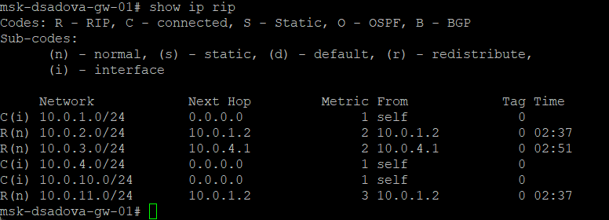{#fig:035 width=90%}

– Посмотрите захваченный на соединениях трафик. В отчёте поясните, какую информацию можно извлечь из перехваченных пакетов.(рис. [-@fig:036]), (рис. [-@fig:037]), (рис. [-@fig:038]), (рис. [-@fig:039]), (рис. [-@fig:040])

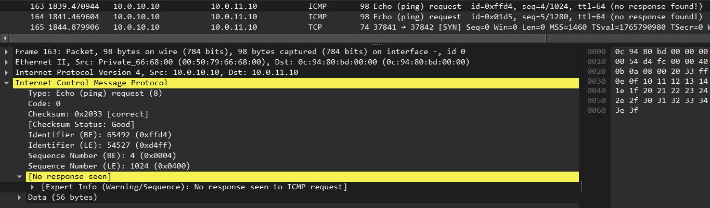{#fig:036 width=90%}

{#fig:037 width=90%}

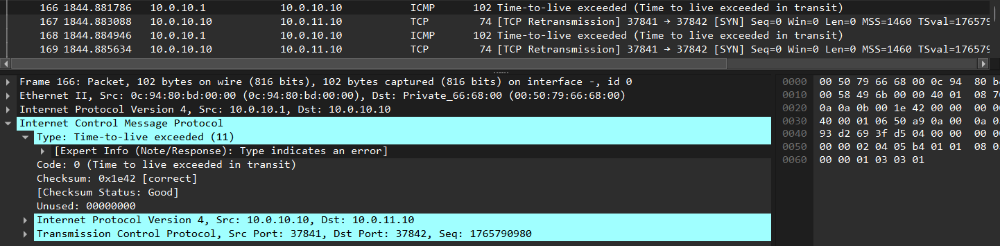{#fig:038 width=90%}

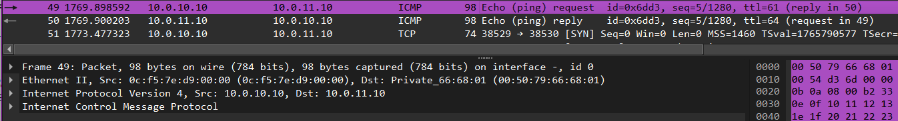{#fig:039 width=90%}

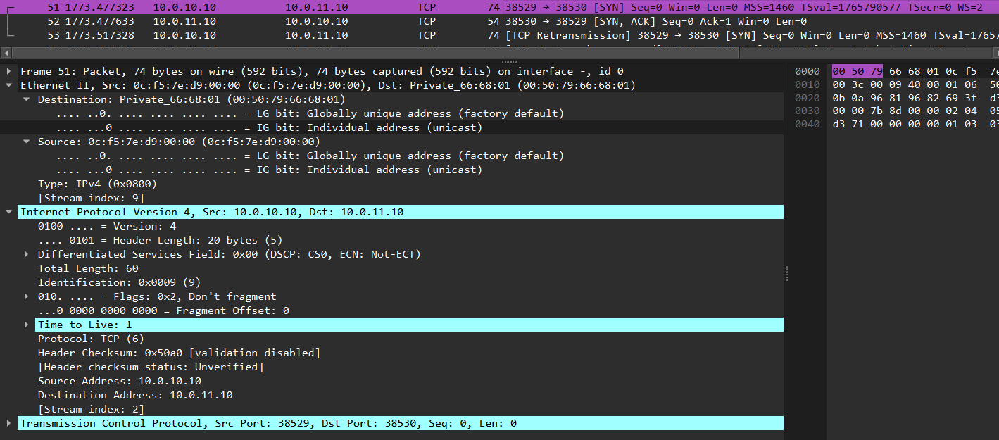{#fig:040 width=90%}

- ICMP-запросы (ping) не получают ответа — маршрут отсутствует.

- ICMP Time-to-live exceeded — пакеты умирают на первом же маршрутизаторе (TTL=1).

- TCP SYN-пакеты не получают SYN-ACK — соединение не устанавливается.

- Ретрансмиссии TCP — клиент пытается повторно отправить SYN.

При отсутствии маршрута трафик не проходит дальше первого маршрутизатора, который возвращает ICMP-ошибки.

4. На маршрутизаторах настройте RIPng для сетей IPv6:(рис. [-@fig:041]), (рис. [-@fig:042]), (рис. [-@fig:043]), (рис. [-@fig:044])

{#fig:041 width=90%}

{#fig:042 width=90%}

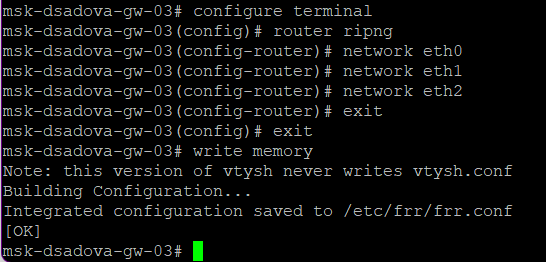{#fig:043 width=90%}

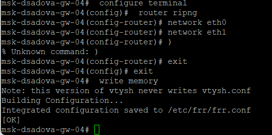{#fig:044 width=90%}

5. Проверьте пути прохождения пакетов:
– С PC1 пропингуйте PC2 и определите путь следования пакетов:(рис. [-@fig:045])

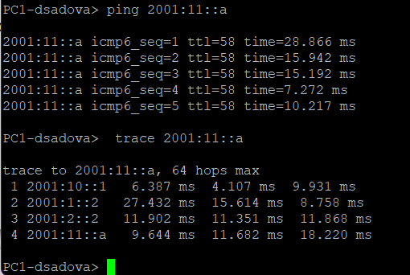{#fig:045 width=90%}

– Проверьте метрики протокола RIPng:(рис. [-@fig:046])

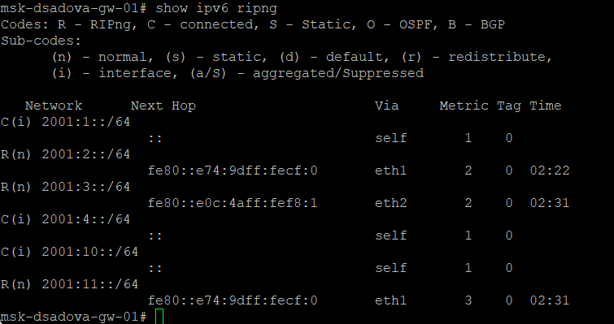{#fig:046 width=90%}

– Предположим, что пакет проходит через маршрутизатор msk-user-gw-02 (в противном случае для дальнейших действий используйте маршрутизатор msk-user-gw-04). Отключите на маршрутизаторе msk-user-gw-02 интерфейс:(рис. [-@fig:047])

{#fig:047 width=90%}

– Проверьте метрики протокола RIPng:(рис. [-@fig:048])

{#fig:048 width=90%}

– С PC1 пропингуйте PC2 и определите путь следования пакетов.(рис. [-@fig:049]), (рис. [-@fig:050])

{#fig:049 width=90%}

{#fig:050 width=90%}

Первый пинг не проходит (адрес недоступен), но последующие успешны. Это указывает на быстрое восстановление маршрута после включения интерфейса.

– Отметьте примерное время, за которое восстановится маршрут.

Время восстановления: ≈ 1-2 секунды.

– Включите на маршрутизаторе msk-user-gw-02 интерфейс:(рис. [-@fig:051])

{#fig:051 width=90%}

Интерфейс успешно включён, сохранена конфигурация.

– С PC1 пропингуйте PC2 и определите путь следования пакетов(рис. [-@fig:052])

{#fig:052 width=90%}

Traceroute показывает путь через три маршрутизатора 2001:10::1, 2001:1::2, 2001:2::2, 2001:11::a (PC2)

Всё работает корректно.

– Посмотрите захваченный на соединениях трафик. В отчёте поясните, какую информацию можно извлечь из перехваченных пакетов.(рис. [-@fig:053]), (рис. [-@fig:054]), (рис. [-@fig:055]), (рис. [-@fig:056])

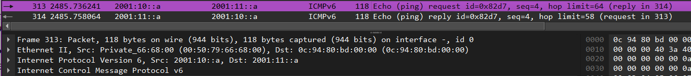{#fig:053 width=90%}

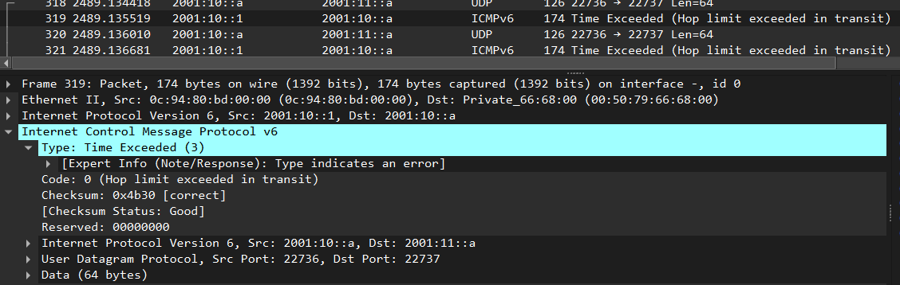{#fig:054 width=90%}

{#fig:055 width=90%}

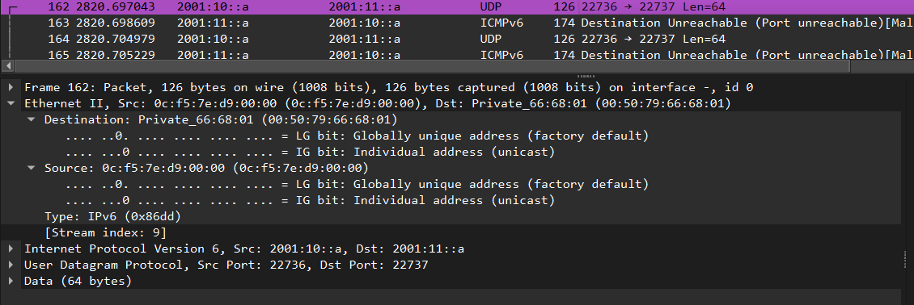{#fig:056 width=90%}

*Настройка динамической маршрутизации по протоколу OSPF.*

1. На маршрутизаторах настройте OSPFv2 для сетей IPv4:(рис. [-@fig:057]), (рис. [-@fig:058]), (рис. [-@fig:059]), (рис. [-@fig:060])

{#fig:057 width=90%}

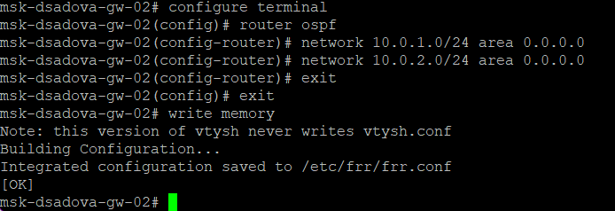{#fig:058 width=90%}

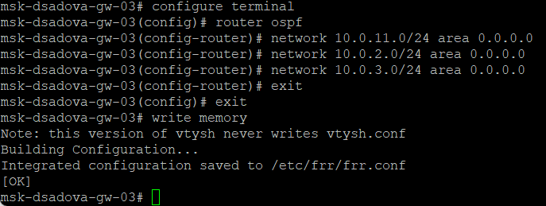{#fig:059 width=90%}

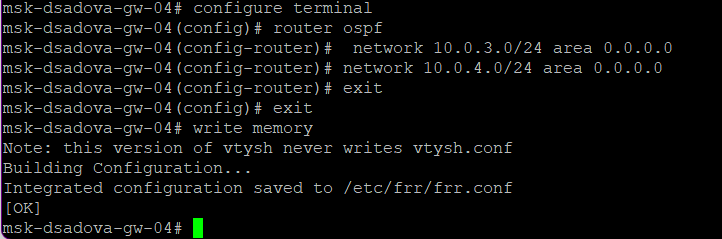{#fig:060 width=90%}

2. С PC1 пропингуйте PC2 и определите путь следования пакетов:(рис. [-@fig:061])

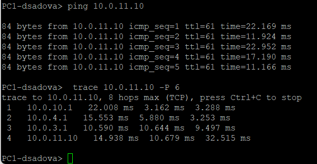{#fig:061 width=90%}

3. Проверьте таблицу маршрутизации протокола OSPFv2:(рис. [-@fig:062])

{#fig:062 width=90%}

4. Предположим, что пакет проходит через маршрутизатор msk-user-gw-02 (в противном случае для дальнейших действий используйте маршрутизатор msk-user-gw-04). Отключите на маршрутизаторе msk-user-gw-02 интерфейс:(рис. [-@fig:063])

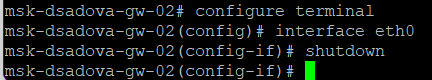{#fig:063 width=90%}

5. Проверьте таблицу маршрутизации протокола OSPFv2:(рис. [-@fig:064])

{#fig:064 width=90%}

6. С PC1 пропингуйте PC2 и определите путь следования пакетов. Отметьте примерное время, за которое восстановится маршрут.(рис. [-@fig:065])

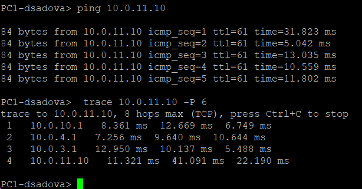{#fig:065 width=90%}

Ping успешен, среднее время ~14 мс. 

Traceroute показывает альтернативный путь через 10.0.4.1, 10.0.3.1. Маршрут восстановился быстро

7. Включите на маршрутизаторе msk-user-gw-02 интерфейс:(рис. [-@fig:066])

{#fig:066 width=90%}

Интерфейс включён, конфигурация сохранена.

8. С PC1 пропингуйте PC2 и определите путь следования пакетов.(рис. [-@fig:067])

{#fig:067 width=90%}

Ping успешен, среднее время ~16 мс. Traceroute показывает путь через 10.0.1.2, 10.0.2.2 (первоначальный маршрут).

9. Посмотрите захваченный на соединениях трафик. В отчёте поясните, какую информацию можно извлечь из перехваченных пакетов.(рис. [-@fig:068]), (рис. [-@fig:069]), (рис. [-@fig:070]), (рис. [-@fig:071]), (рис. [-@fig:072]), (рис. [-@fig:073]), (рис. [-@fig:074]), (рис. [-@fig:075])

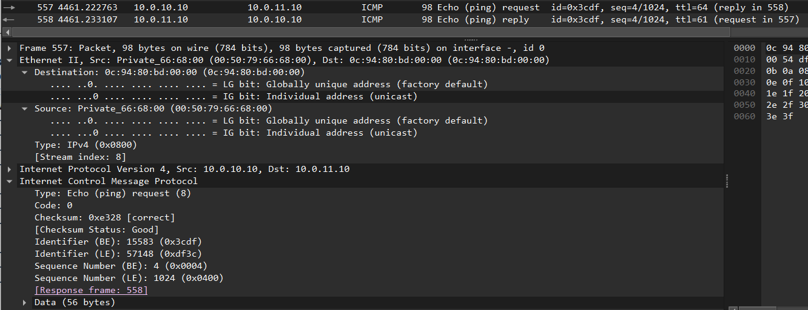{#fig:068 width=90%}

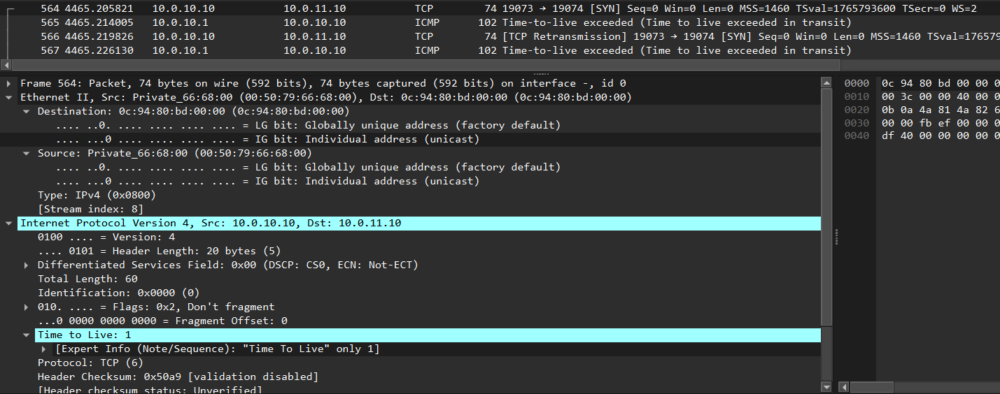{#fig:069 width=90%}

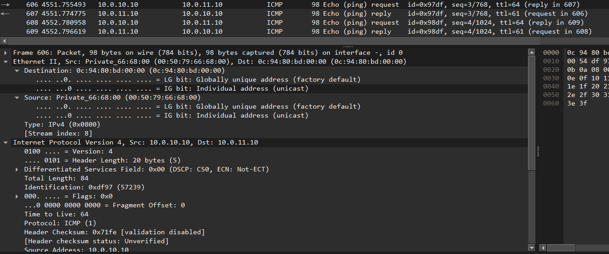{#fig:070 width=90%}

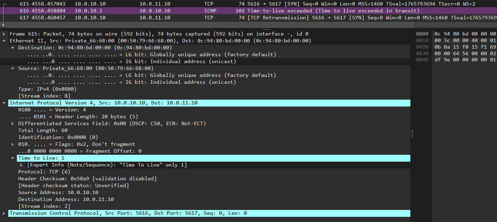{#fig:071 width=90%}

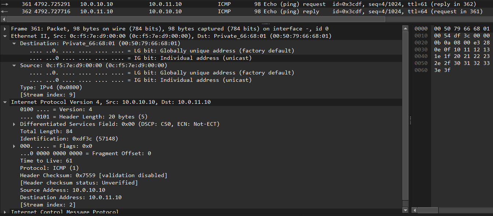{#fig:072 width=90%}

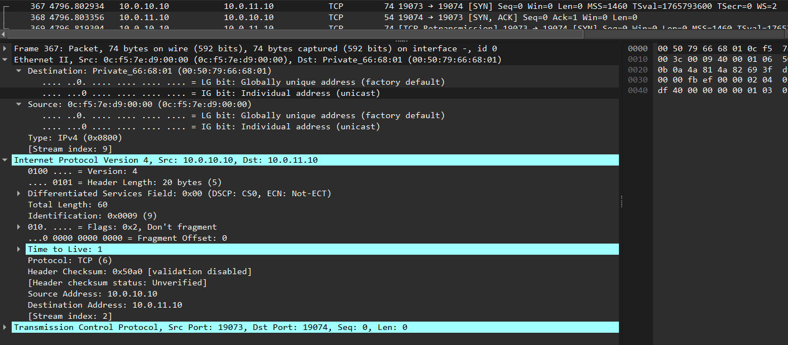{#fig:073 width=90%}

{#fig:074 width=90%}

{#fig:075 width=90%}

Успешный ICMP-обмен (запрос-ответ) с TTL=61/64.

Пакеты с TTL=1 не проходят дальше первого маршрутизатора.

TCP-сессии устанавливаются успешно (SYN, SYN-ACK).

Видна инкапсуляция и маршрутизация на уровне L3.

10. На маршрутизаторах настройте OSPFv3 для сетей IPv6:(рис. [-@fig:076]), (рис. [-@fig:077]), (рис. [-@fig:078]), (рис. [-@fig:079])

{#fig:076 width=90%}

{#fig:077 width=90%}

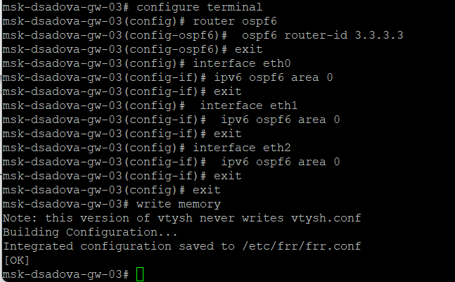{#fig:078 width=90%}

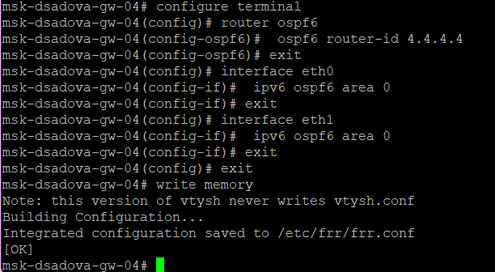{#fig:079 width=90%}

11. С PC1 пропингуйте PC2 и определите путь следования пакетов:(рис. [-@fig:080])

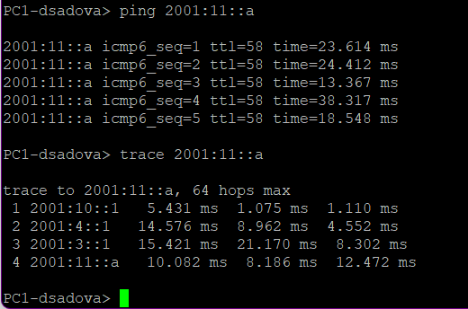{#fig:080 width=90%}

12. Проверьте таблицу маршрутизации протокола OSPFv3:(рис. [-@fig:081])

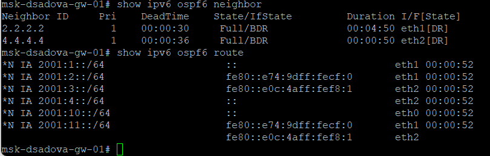{#fig:081 width=90%}

13. Предположим, что пакет проходит через маршрутизатор msk-user-gw-02 (в противном случае для дальнейших действий используйте маршрутизатор msk-user-gw-04). Отключите на маршрутизаторе msk-user-gw-02 интерфейс:(рис. [-@fig:082])

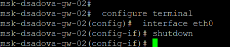{#fig:082 width=90%}

14. Проверьте таблицу маршрутизации протокола OSPFv3:(рис. [-@fig:083])

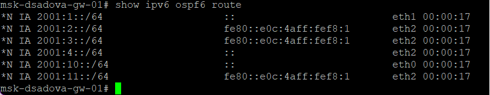{#fig:083 width=90%}

15. С PC1 пропингуйте PC2 и определите путь следования пакетов. Отметьте примерное время, за которое восстановится маршрут.(рис. [-@fig:084])

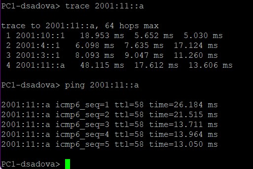{#fig:084 width=90%}

Traceroute показывает путь через маршрутизаторы: 2001:10::1, 2001:4::1, 2001:3::1,  2001:11::a

Время отклика: 10-30 мс.

16. Включите на маршрутизаторе msk-user-gw-02 интерфейс:(рис. [-@fig:085])

{#fig:085 width=90%}

17. С PC1 пропингуйте PC2 и определите путь следования пакетов.(рис. [-@fig:086])

{#fig:086 width=90%}

Успешная маршрутизация IPv6 через OSPFv3

Traceroute показывает путь через маршрутизаторы: 2001:10::1, 2001:4::1, 2001:3::1,  2001:11::a

Время отклика: 10-30 мс.

18. Посмотрите захваченный на соединениях трафик. В отчёте поясните, какую информацию можно извлечь из перехваченных пакетов.(рис. [-@fig:087]), (рис. [-@fig:088]), (рис. [-@fig:089]), (рис. [-@fig:090]), (рис. [-@fig:091]), (рис. [-@fig:092])

{#fig:087 width=90%}

{#fig:088 width=90%}

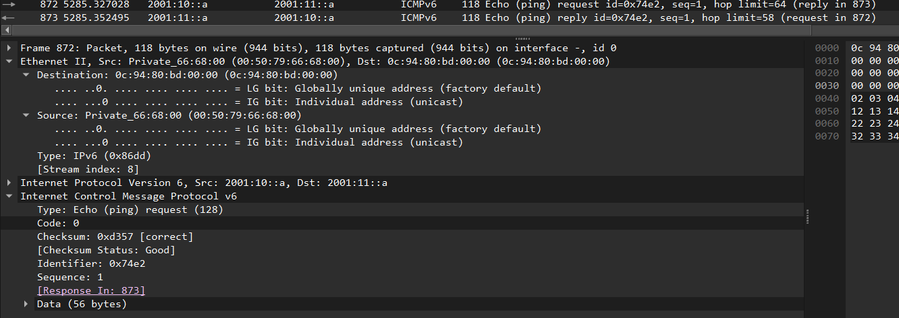{#fig:089 width=90%}

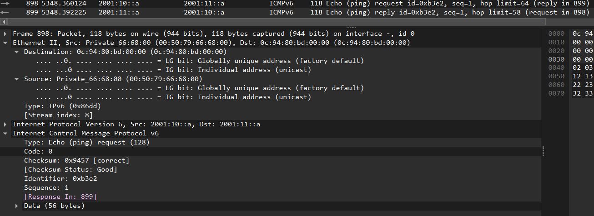{#fig:090 width=90%}

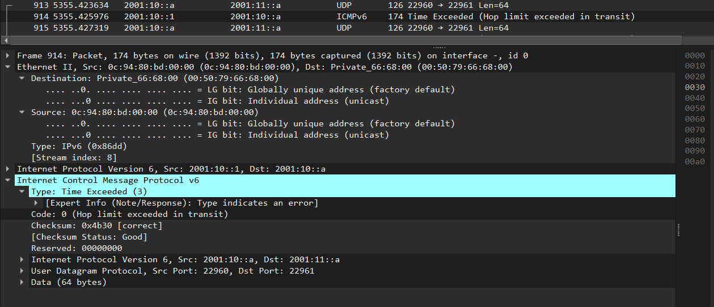{#fig:091 width=90%}

Успешный обмен ICMPv6.

TCP-сессии устанавливаются.

TTL/HL корректно уменьшаются.

Видна работа двойного стека (IPv4 и IPv6).

## Построение туннеля IPv6–IPv4

### Постановка задачи

Заданы две IPv6-сети и IPv4-сеть. Требуется организовать туннель IPv6 поверх IPv4, позволяющий передавать данные из одной IPv6-сети в другую IPv6-сеть через сеть IPv4. Назначаемые устройствам сети адреса указаны в табл. 8.3

При организации туннеля IPv6 поверх IPv4 трафик 6in4 отправляется внутри пакетов IPv4, в заголовках которых номер протокола IP имеет значение 41. Накладные расходы инкапсуляции состоят в том, что размер заголовка IPv4 имеет размер 20 байт, соответственно при MTU в 1500 байт IPv6-пакеты размером 1480 байт можно отправлять без фрагментации.

### Порядок выполнения работы

1. Создайте новый проект в GNS3.

2. В рабочем пространстве разместите и соедините устройства в соответствии с топологией, приведённой на рис. 8.5. Используйте маршрутизаторы VyOS.

3. Измените отображаемые названия устройств. Коммутаторам присвойте названия по принципу msk-user-sw-0x, маршрутизаторам — по принципу msk-user-gw-0x, VPCS — по принципу PCx-user, где вместо user укажите имя вашей учётной записи, вместо x — порядковый номер устройства.(рис. [-@fig:093])

{#fig:093 width=90%}

4. На соединении между первым и третьим маршрутизаторами подключите анализатор трафика.(рис. [-@fig:094])

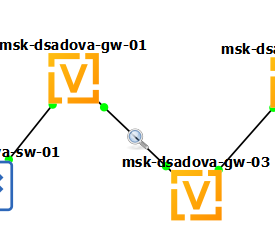{#fig:094 width=90%}

5. Присвойте адреса оконечным устройствам PC1 и PC2 в соответствии с данными в табл. 8.3:(рис. [-@fig:095]), (рис. [-@fig:096])

{#fig:095 width=90%}

{#fig:096 width=90%}

PC2 настроен с IPv6-адресом 1002::a/64

6. Установите систему на маршрутизаторы VyOS.

7. На маршрутизаторах перейдите в режим конфигурирования, измените имя устройства (вместо user укажите имя вашей учётной записи, вместо x - порядковый номер устройства):(рис. [-@fig:097]), (рис. [-@fig:098]), (рис. [-@fig:099])

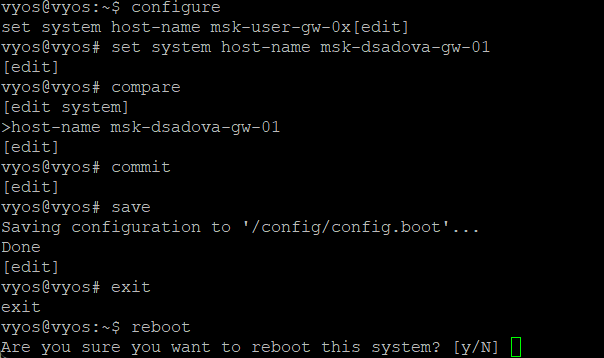{#fig:097 width=90%}

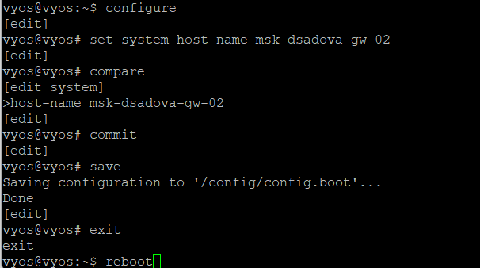{#fig:098 width=90%}

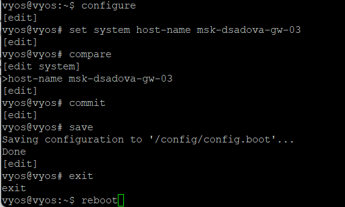{#fig:099 width=90%}

8. Настройте адреса на интерфейсах маршрутизаторов:(рис. [-@fig:100]), (рис. [-@fig:101]), (рис. [-@fig:102])

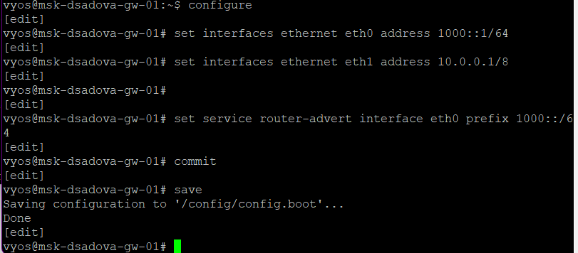{#fig:100 width=90%}

{#fig:101 width=90%}

{#fig:102 width=90%}

9. Убедитесь, что на PC появились адреса ближайших к ним маршрутизаторов: (рис. [-@fig:103])

{#fig:103 width=90%}

10. Проверьте маршруты с маршрутизатора R1:(рис. [-@fig:104])

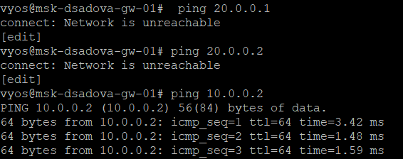{#fig:104 width=90%}

В отчёте поясните результат проверки, в том числе с учётом анализа трафика.(рис. [-@fig:105])

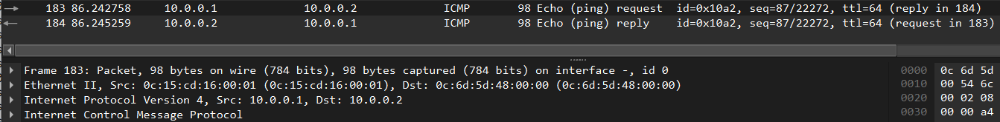{#fig:105 width=90%}

Работает только IPv4 маршрутизация. Ping между 10.0.0.1 и 10.0.0.2 успешен

11. Настройте маршрутизацию IPv4:(рис. [-@fig:106]), (рис. [-@fig:107]), (рис. [-@fig:108])

{#fig:106 width=90%}

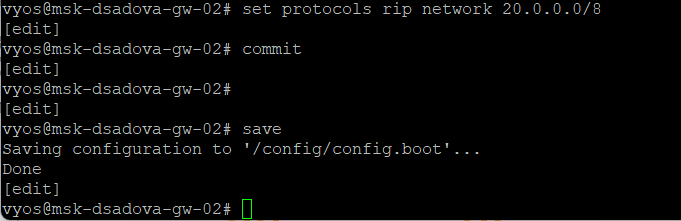{#fig:107 width=90%}

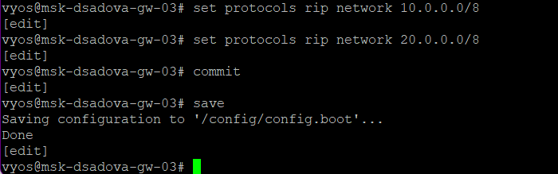{#fig:108 width=90%}

12. Проверьте маршруты:(рис. [-@fig:109])

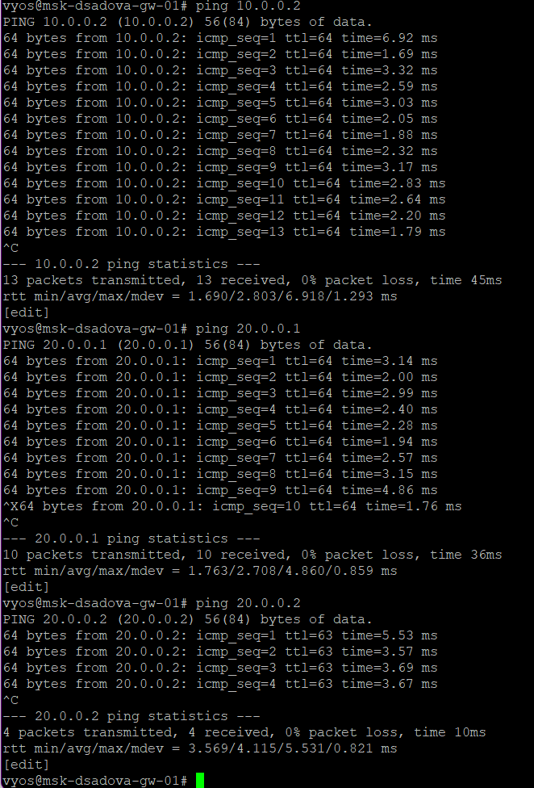{#fig:109 width=90%}

В отчёте поясните результат проверки, в том числе с учётом анализа трафика.(рис. [-@fig:110]), (рис. [-@fig:111]), (рис. [-@fig:112])

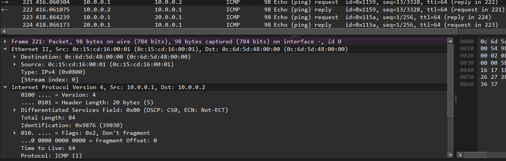{#fig:110 width=90%}

{#fig:111 width=90%}

{#fig:112 width=90%}

Работает только IPv4 маршрутизация. Ping между 10.0.0.1 и 10.0.0.2 успешен

RIPv2-пакеты отправляются на multicast-адрес 224.0.0.9

Периодичность обновлений: примерно каждые 30 секунд

13. Создайте туннель IPv6 через сеть IPv4:(рис. [-@fig:113]), (рис. [-@fig:114])

{#fig:113 width=90%}

{#fig:114 width=90%}

14. Настройте статическую маршрутизацию IPv6:(рис. [-@fig:115]), (рис. [-@fig:116])

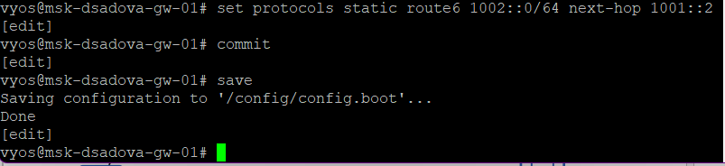{#fig:115 width=90%}

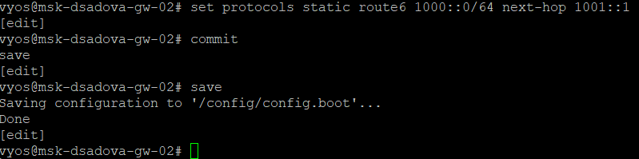{#fig:116 width=90%}

15. Проверьте доступность оконечных устройств:(рис. [-@fig:117]), (рис. [-@fig:118])

{#fig:117 width=90%}

{#fig:118 width=90%}

В отчёте поясните результат проверки. Используя данные, собранные анализатором трафика, поясните, где и в каком виде содержится информация о прохождении пакетов по туннелю.(рис. [-@fig:119]), (рис. [-@fig:120])

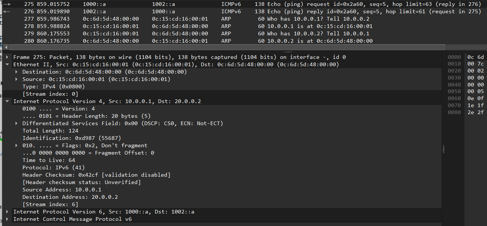{#fig:119 width=90%}

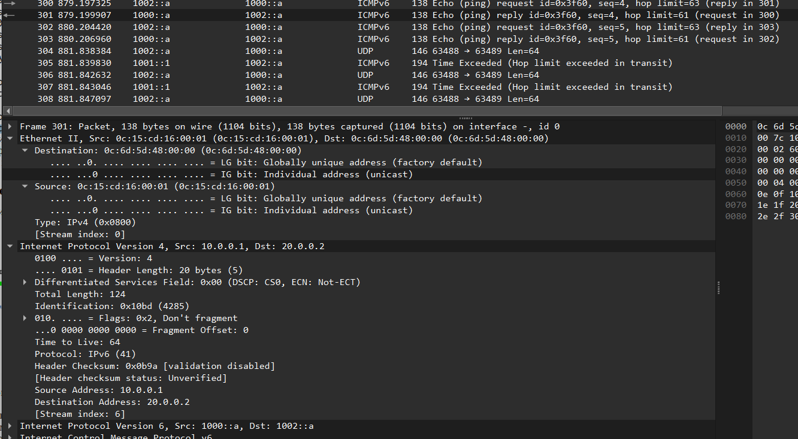{#fig:120 width=90%}

Инкапсуляция IPv6 в IPv4: Виден успешный обмен ICMPv6 ping-пакетами между 1002::a (PC2) и 1000::a (PC1)

Протокол 41: В заголовке IPv4 указан протокол 41, что подтверждает инкапсуляцию IPv6

TTL/Hop Limit:
- Внешний IPv4 заголовок: TTL=64
- Внутренний IPv6 заголовок: Hop Limit уменьшается с 63 до 61

Адреса туннеля:
- Исходный: 10.0.0.1 (R1)
- Конечный: 20.0.0.2 (R3)

## Задание для самостоятельного выполнения

Заданы топология сети и адреса сегментов сети. (рис. [-@fig:121])

{#fig:121 width=90%}

Требуется:
– задокументировать моделируемую сеть: схемы L1, L3, заполнить таблицы адресации;

1. L1-схема (физический уровень)

**Устройства:**
- PC1-user (VPCS)
- PC2-user (VPCS) 
- msk-user-sw-01, msk-user-sw-02 (L2-коммутаторы)
- msk-user-gw-01
- msk-user-gw-02
- msk-user-gw-03
- msk-user-gw-04

**Соединения (L1):**

| Устройство 1 | Интерфейс | Устройство 2 | Интерфейс |
|--------------|-----------|--------------|-----------|
| PC1          | eth0      | sw-01        | eth0      |
| sw-01        | eth1      | gw-01        | Gi0/0     |
| gw-01        | Gi0/1     | gw-03        | Gi0/0     |
| gw-01        | Gi0/2     | gw-04        | Gi0/0     |
| gw-03        | Gi0/1     | gw-02        | Gi0/0     |
| gw-04        | Gi0/1     | gw-02        | Gi0/1     |
| gw-02        | Gi0/2     | sw-02        | eth0      |
| sw-02        | eth1      | PC2          | eth0      |

2. L3-схема (логический уровень)

Сеть построена по схеме двойного стека (Dual Stack):
- IPv4
- IPv6

Все маршрутизаторы выполняют маршрутизацию IPv4 и IPv6.

3. Таблица сетей

| Устройства       | Сеть IPv4       | Сеть IPv6          |
|------------------|-----------------|-------------------|
| PC1–gw-01        | 10.10.1.96/27   | 2001:db8:1:1::/64 |
| PC2–gw-02        | 10.10.1.64/28   | 2001:db8:1:6::/64 |
| gw-01–gw-03      | 10.10.1.4/30    | 2001:db8:1:2::/64 |
| gw-01–gw-04      | 10.10.1.8/30    | 2001:db8:1:3::/64 |
| gw-03–gw-02      | 10.10.1.16/30   | 2001:db8:1:4::/64 |
| gw-04–gw-02      | 10.10.1.32/30   | 2001:db8:1:5::/64 |

4.  Таблица адресации интерфейсов

#### PC1
| Параметр | Значение |
|----------|----------|
| IPv4     | 10.10.1.97/27 |
| Шлюз     | 10.10.1.96 |
| IPv6     | 2001:db8:1:1::10/64 |
| Шлюз IPv6 | 2001:db8:1:1::1 |

#### PC2
| Параметр | Значение |
|----------|----------|
| IPv4     | 10.10.1.65/28 |
| Шлюз     | 10.10.1.64 |
| IPv6     | 2001:db8:1:6::10/64 |
| Шлюз IPv6 | 2001:db8:1:6::1 |

#### gw-01
| Интерфейс | IPv4           | IPv6                  |
|-----------|----------------|-----------------------|
| Gi0/0     | 10.10.1.96/27  | 2001:db8:1:1::1/64   |
| Gi0/1     | 10.10.1.5/30   | 2001:db8:1:2::1/64   |
| Gi0/2     | 10.10.1.9/30   | 2001:db8:1:3::1/64   |

#### gw-03
| Интерфейс | IPv4           | IPv6                  |
|-----------|----------------|-----------------------|
| Gi0/0     | 10.10.1.6/30   | 2001:db8:1:2::2/64   |
| Gi0/1     | 10.10.1.17/30  | 2001:db8:1:4::1/64   |

#### gw-04
| Интерфейс | IPv4           | IPv6                  |
|-----------|----------------|-----------------------|
| Gi0/0     | 10.10.1.10/30  | 2001:db8:1:3::2/64   |
| Gi0/1     | 10.10.1.33/30  | 2001:db8:1:5::1/64   |

#### gw-02
| Интерфейс | IPv4           | IPv6                  |
|-----------|----------------|-----------------------|
| Gi0/0     | 10.10.1.18/30  | 2001:db8:1:4::2/64   |
| Gi0/1     | 10.10.1.34/30  | 2001:db8:1:5::2/64   |
| Gi0/2     | 10.10.1.64/28  | 2001:db8:1:6::1/64   |

– настроить двойной стек IPv4 и IPv6, проверить соединения;(рис. [-@fig:124]), (рис. [-@fig:125]), (рис. [-@fig:126])

{#fig:124 width=90%}

{#fig:125 width=90%}

{#fig:126 width=90%}

– настроить динамическую маршрутизацию сетей IPv4 и IPv6 для протоколов RIP, OSPF, проверить соединения и маршруты

# Выводы

Изучили принципы маршрутизации в IPv4- и IPv6-сетях и принципы настройки сетевого оборудования.

# Список литературы{.unnumbered}

::: {#refs}
:::
