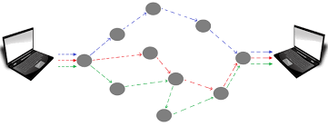
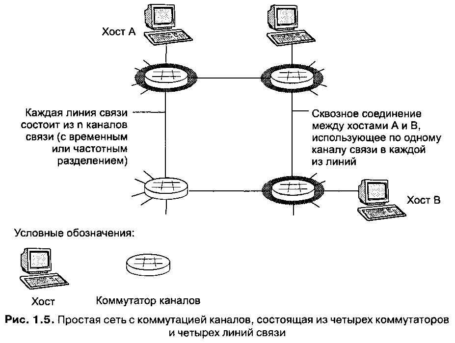
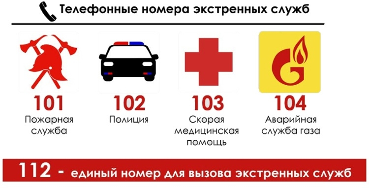
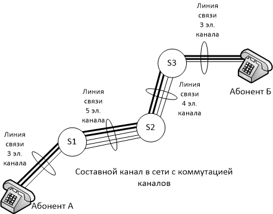

---
## Front matter
lang: ru-RU
title: Доклад
subtitle: Тема «Сети с коммутацией каналов»
author:
  - Cадова Д. А.
  - Кулябов Дмитрий Сергеевич. Доцент по кафедре систем телекоммуникаций. Доктор физико-математических наук по специальности 05.13.18 «Математическое моделирование, численные методы и комплексы программ». Профессор кафедры прикладной информатики и теории вероятностей РУДН. Заведующий сектором Управления информационно-технологического обеспечения, слаботочных и телекоммуникационных систем РУДН (по совместительству). 
institute:
  - Российский университет дружбы народов, Москва, Россия

## i18n babel
babel-lang: russian
babel-otherlangs: english
## Fonts
mainfont: PT Serif
romanfont: PT Serif
sansfont: PT Sans
monofont: PT Mono
mainfontoptions: Ligatures=TeX
romanfontoptions: Ligatures=TeX
sansfontoptions: Ligatures=TeX,Scale=MatchLowercase
monofontoptions: Scale=MatchLowercase,Scale=0.9

## Formatting pdf
toc: false
toc-title: Содержание
slide_level: 2
aspectratio: 169
section-titles: true
theme: metropolis
header-includes:
 - \metroset{progressbar=frametitle,sectionpage=progressbar,numbering=fraction}
 - '\makeatletter'
 - '\beamer@ignorenonframefalse'
 - '\makeatother'
---

## Информация о докладчике

:::::::::::::: {.columns align=center}
::: {.column width="70%"}

  * Садова Диана Алексеевна
  * студент бакалавриата
  * Российский университет дружбы народов
  * [113229118@pfur.ru]
  * <https://DianaSadova.github.io/ru/>
  
:::
::: {.column width="30%"}

:::
::::::::::::::

## Актуальность

- Изучение сетей с коммутацией каналов сохраняет актуальность, поскольку эта технология продолжает использоваться в системах, где критически важны гарантированная полоса пропускания, минимальные задержки и высокая надежность. Понимание принципов коммутации каналов необходимо для работы с телефонными сетями, выделенными линиями, системами экстренной связи, а также для осознания эволюции телекоммуникационных технологий.

## Цели и задачи

- Комплексно исследовать принципы работы, технологии реализации, области применения, достоинства и недостатки сетей с коммутацией каналов, а также определить их современное значение в телекоммуникационной инфраструктуре.

## Материалы и методы

- Материалы находящиеся на просторах Internet

## Введение

- Коммутация каналов представляет собой одну из фундаментальных технологий в истории телекоммуникаций, которая заложила основу для развития современных систем связи. Эта технология, появившаяся еще в эпоху телефонии, продолжает оставаться актуальной несмотря на широкое распространение пакетной коммутации.

## Понятие коммутации каналов

:::::::::::::: {.columns align=center}
::: {.column width="50%"}

**Коммутация каналов** — это вид телекоммуникационной сети, в которой между двумя узлами сети должно быть установлено соединение (канал) прежде, чем они начнут обмен информацией. Данное соединение на протяжении всего сеанса обмена информацией может использоваться только указанными двумя узлами. После завершения обмена соединение должно быть соответствующим образом разорвано.

:::
::: {.column width="50%"}

:::
::::::::::::::

## Принцип работы и фазы связи

 1. Установление канала
 
 2. Передача данных
 
 3. Разъединение канала

## Технологии мультиплексирования

:::::::::::::: {.columns align=center}
::: {.column width="50%"}

- Частотное мультиплексирование (FDM)
Каждому соединению выделяется собственный диапазон частот в общей полосе пропускания линии связи.
 
:::
::: {.column width="50%"}

- Мультиплексирование с разделением времени (TDM)
Канал выделяется каждому соединению на определённый период времени. Применяются два типа TDM:

:::
:::::::::::::: 

## 

:::::::::::::: {.columns align=center}
::: {.column width="50%"}

- Синхронный режим
Доступ всех информационных потоков к каналу синхронизируется таким образом, чтобы каждый поток периодически получал канал в своё распоряжение на фиксированный промежуток времени.

- Асинхронный режим
Каждый пакет занимает канал определённое время, необходимое для его передачи между конечными точками. 
 
:::
::: {.column width="50%"}

:::
:::::::::::::: 
## Области применения

:::::::::::::: {.columns align=center}
::: {.column width="50%"}

- **Традиционные телефонные сети (PSTN)** 

- **Модемный доступ в интернет** 

- **Военные системы связи** 

- **Экстренные службы (101, 102, 103)** 

- **Выделенные линии** 

:::
::: {.column width="50%"}

:::
::::::::::::::

## Достоинства сетей с коммутацией каналов

:::::::::::::: {.columns align=center}
::: {.column width="50%"}

- Гарантированная пропускная способность. 

- Низкий и постоянный уровень задержки.

- Надежность и предсказуемость.
 
:::
::: {.column width="50%"}

:::
::::::::::::::

## Недостатки и ограничения

1. Нерациональное использование пропускной способности. 

2. Обязательная задержка перед передачей данных. 

3. Возможность отказа в обслуживании. 

4. Невозможность динамически изменять пропускную способность. 

5. Ограничения по скорости оборудования. 

## Заключение

Таким образом, понимание принципов коммутации каналов остается важным для специалистов в области телекоммуникаций, позволяя выбирать оптимальные технологические решения для конкретных задач и проектировать эффективные сетевые инфраструктуры.

# Список литературы{.unnumbered}

1. Википедия: "Коммутация каналов" — https://ru.wikipedia.org/wiki/Коммутация_каналов
2. Учебные материалы по компьютерным сетям — https://3uch.ru/textbooks/swhe/jale/hes
3. Лекционные материалы — https://cabs.vagpk.ru/yarguni/wp-content/uploads/sites/19/2023/11/15-лекция.docx
4. Статья на Dealer.su — https://www.dealer.su/articles/45890/
5. Статья на pc.ru — https://pc.ru/docs/network/switching-methods
6. Презентация sss.psuti.ru — https://sss.psuti.ru/wp-content/uploads/2021/09/ssisk-r-lekciya-2-sposoby_kommutacii.pdf
7. Учебные материалы dit.isuct.ru — https://dit.isuct.ru/IVT/sitanov/Literatura/KompSeti/Pages/Glava9_1.htm
 6. Официальный сайт ФСБ России. URL: https://fsb.ru 
